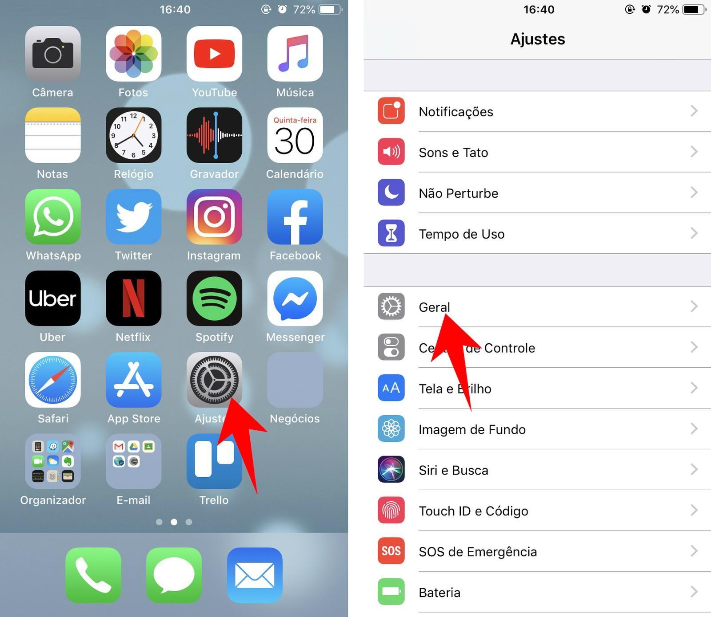
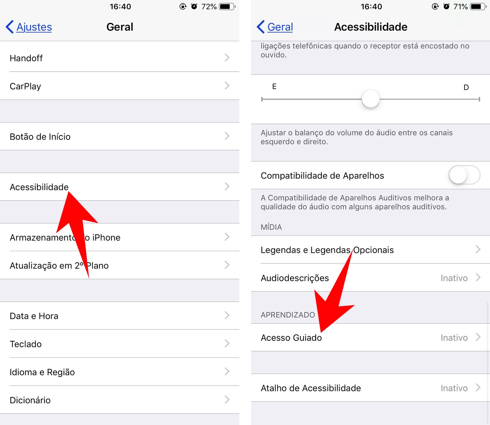
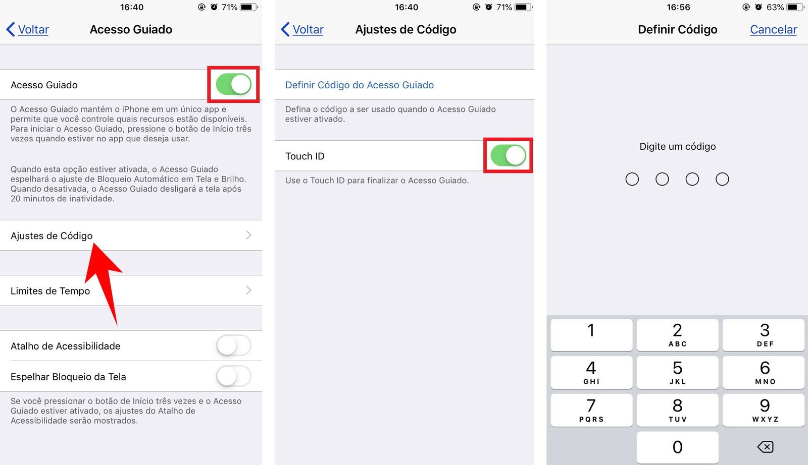
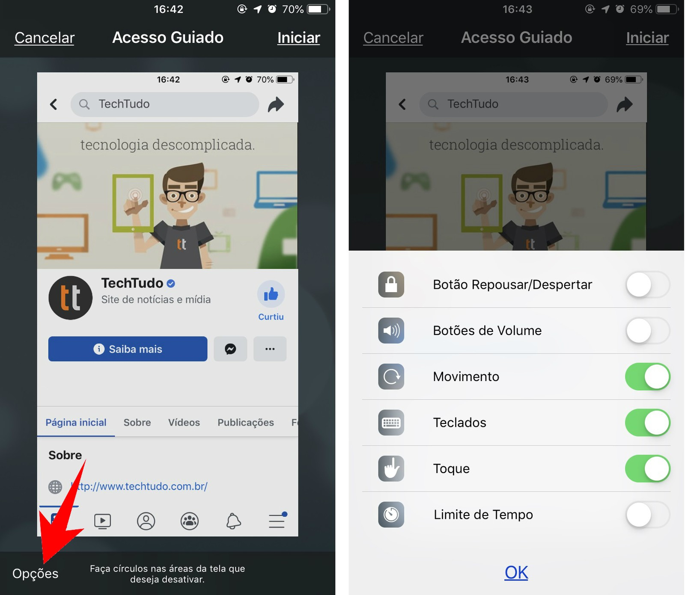
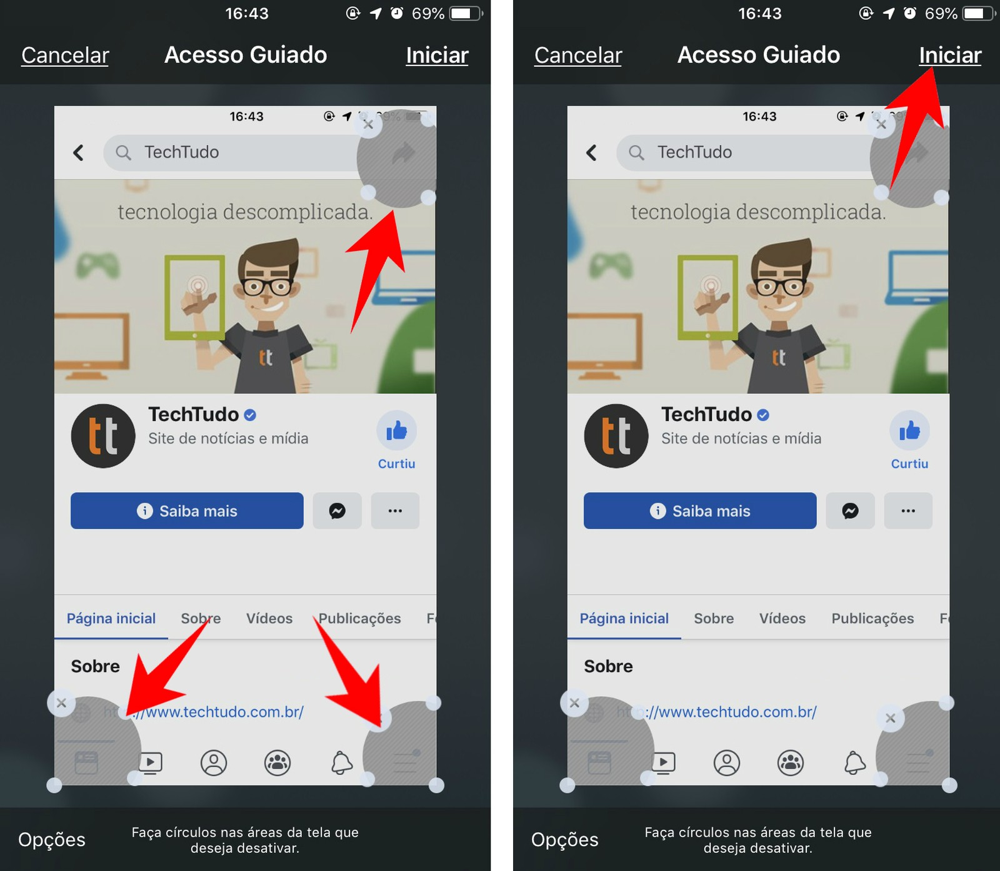

# Acesso Guiado (Bloquear aplicativo na tela)
Algumas vezes podemos querer controlar qual aplicativo o usuário terá acesso dentro do dispositivo.
Nestes casos, utilizamos o *“Acesso Guiado”* para travar um aplicativo na tela, que só poderá ser
fechado após o mesmo informar uma senha pré-definida.

##Configurando

**Passo 1.** Acesse *“Ajustes”* e vá em *“Geral”*.

**Passo 2.** Selecione *“Acessibilidade”*, depois abra a opção *“Acesso Guiado”*.

**Passo 3.** Ative a chave do Acesso Guiado. Em seguida, vá em *“Ajustes de Código”* para criar a senha de quatro dígitos que será solicitada para sair do aplicativo bloqueado. Isso também pode ser feito através do *“Touch ID”*.

##Utilizando

**Passo 1.** Com o recurso ativo, abra o aplicativo que deseja usar — para este exemplo, acionamos o Facebook.
Para iniciar o Acesso Guiado, aperte três vezes o botão de Início.
No iPhone X e superiores, aperte três vezes o botão lateral. A tela de configurações será aberta.

**Passo 2.** Toque em opções para editar os recursos que ficarão ativos na sessão. Em seguida, marque todas as funções que deseja manter ativadas durante o uso do app. Neste menu também é possível determinar o tempo de uso do aplicativo.

**Passo 3.** Faça círculos na tela sobre os recursos que deseja bloquear. Note que eles serão demarcados em cinza. Estas áreas não poderão ser utilizadas durante o uso do aplicativo. Para começar o acesso guiado, toque em *“Iniciar”*. A partir de agora, o celular só rodará este aplicativo e com os recursos que você determinou.

##Desativando
Para sair do Acesso Guiado, aperte novamente botão de Início ou o botão lateral por três vezes. Em seguida, digite a senha que você criou. Finalize a sessão tocando em *“Sair”*.