# E. Cenários de atualização de cliente

É necessário que os dados dos alunos e responsáveis financeiros, ou seja, dos clientes, também estejam sincronizados na plataforma da NetSuite. Para isso também existem cenários que atualizam esses dados, descritos no tópico posteriore.

## Atualização de dados

O fluxo é o mesmo para praticamente todos os casos: graduação / colégio, pós-graduação / PJ e também Shift. A única diferença ocorre especificamente no caso de graduação / colégio, em que, pode ser feito tanto um `UPDATE` como também um `INSERT`. Como a tabela `Educacional` foi criada com o intuito de manter rastreablidade e logs das alterações, também é ṕossível fazer alterações com `INSERTS`, o registro da última alteração é controlado pela coluna `StatusRegistro`. Os fluxos de alteração estão ilustrados no fluxograma da figura abaixo:

