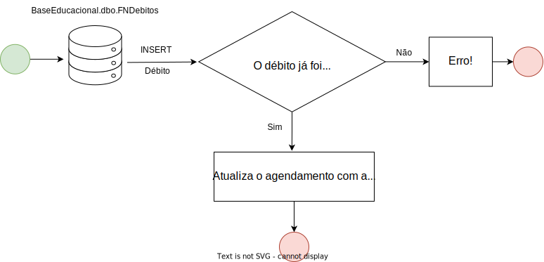

# B. Cenários de importação de pedido de venda

Conforme especificado na [documentação de Fluxos](), cada agendamento de débito representa um débito a ser posteriormente faturado por meio da plataforma da NetSuite. Com isso, é necessário que haja consistência de dados entre os débitos presentes na base de dados da FIAP e os agendamentos de débitos contidos na plataforma da NetSuite. Com isso, é necessário que cada inserção, alteração e inativação de débitos feitas na base de dados da FIAP sejam refletidas para a NetSuite. Os detalhes de como isso foi implementado estão descritos na documentação de [Arquitetura de monitoramento]().

A partir dessas alterações capturadas nas tabelas do banco de dados, são distinguidos diferentes cenários de importação de débito, cada um com uma estratégia diferente, mas que sempre culminam na importação dos débitos para a NetSuite por meio das integrações via API. 

Nos tópicos abaixo estão descritos todos os cenários de importação de pedido de venda e débitos na plataforma da NetSuite. 

### Observações gerais
Antes de descrever os cenários, existem alguns pontos importantes a serem ressaltados:

- Cada pedido de venda possui um `Agrupador`, que é utilizado em quase todos os cenários. Esse `Agrupador` é extraído da coluna `BaseEducacional.dbo.FNDebitos.Agrupador`, em caso de débitos, e da coluna `Shift.dbo.AlunoCompra.Codigo`, em casos de compra Shift. Isso ocorre porque esse é o modo como a FIAP faz esse agrupamento, e no pedido de venda NetSuite isso também deve ocorrer, ou seja, os débitos que pertencerem a um mesmo "grupo" devem ser importados no pedido de venda referente a esse "grupo". 

- Cada cenário foi implementado com uma estratégia de importação diferente, utilizando o padrão de projeto `Strategy Pattern`. As classes referentes a essas estratégias estão incluídas nas descrições dos cenários nos tópicos seguintes.

- Todos os cenários de importação de débito são consumidos pelo consumer `DebitConsumer` e repassados para as devidas estratégias. Este consumer, por sua vez, está linkado com a fila `netsuite_debit_monitoring_queue_fiap`, no ambiente FIAP, e com a fila `netsuite_modulo.BaseEducacional.dbo.FNDebitos`, no ambiente Módulo.

- Os cenários de importação de compra Shift são consumidos pelo consumer `ShiftPurchaseConsumer` e também repassados para as devidas estratégias. Esse consumer está linkado com a fila `netsuite_shift_purchase_queue`.

### **Cenário 1: Importação de Matrícula**: 

- **Strategy**: ImportRegistrationStrategy

- Esse é o fluxo de importação em que o aluno e o responsável financeiro passam a existir no NetSuite, uma vez que, no momento em que uma matrícula é efetuada, débitos passam a existir.

-  Uma matrícula é efetuada logo após a baixa de um débito do tipo `Matrícula`, `Matrícula - Pós`, `Matricula-Integral` ou `Renovação de Matrícula`, ou seja, no momento em que ele constar como pago ou abonado. Isso ocorre quando os campos "ValorPago" ou "Abonado" são devidamente preenchidos. Nesse momento, um novo pedido de venda de matrícula deverá ser criado na plataforma da NetSuite. Além disso, uma vez que, nesse mesmo cenário, as procedures de geração de mensalidades são acionadas, conforme descrito na documentação [Baixando uma Matrícula ou Renovação](http://conhecimento.fiap.com.br/processos/financeiro/Origem%20dos%20Valores%20de%20um%20D%C3%A9bito/valores-dos-debitos/#baixando-uma-matricula-ou-renovacao), resultando na criação de débitos de mensalidades, qualquer inclusão subsequente desses débitos também será monitorada, sendo eles importados conforme o fluxo de [Importação de débitos de pedido de venda de matrícula](). A figura abaixo representa o processo de importação de matrícula.

**Observações**:

- Os débitos de matrícula não serão importados na plataforma da NetSuite, apenas servirão como gatilho para a criação de um pedido de venda no momento em que forem baixados.

### **Cenário 2: Importação de débitos agrupados**

- **Strategy**: ImportGroupedDebitTypesStrategy

- Alguns tipos de débitos são importados apenas pelo seu agrupador. Isto é, assim que o evento de inserção do primeiro débito com um agrupador específico é processado, um novo pedido de venda é criado para ela. Em sequência, quando outros débitos com o mesmo agrupador forem inseridos, eles serão importados nesse mesmo pedido de venda criado previamente. Esse cenário representa a importação desses débitos agrupados e está ilustrado no fluxograma presente na figura abaixo.

### **Cenário 3: Importação de débitos de pedido de venda de matrícula**

- **Strategy**: ImportRegistrationSalesOrderDebitTypeStrategy

- Alguns tipos de débitos devem ser importados restritamente em pedidos de venda de matrícula, para isso também existe uma estratégia de importação para eles, detalhada no fluxograma da figura abaixo.

(TODO: TIRAR DÚVIDAS SOBRE O FLUXO ABAIXO)
### **Cenário 4: Importação de débitos derivados de pedido de venda de matrícula**

- **Strategy**: ImportRegistrationSalesOrderDerivedDebitTypeStrategy

- Alguns tipos de débitos são derivados, ou seja, são originados a partir de outros débitos. Em casos de negociação especial e de aplicação de bolsa FIES, os débitos de destino (que foram gerados a partir da negociação), são originados a partir de débitos que se enquadram em pedidos de venda de matrícula (citados no fluxo anterior). Para isso, também existe uma estratégia de importação para eles, detalhada no fluxograma da figura abaixo.

### **Cenário 5: Importação de débitos do tipo "Outros"**

- **Strategy**: ImportOtherDebitTypeStrategy

- Alguns tipos de débitos diversos não se encaixam em nenhum dos tipos de pedido de venda estabelecidos pela FIAP, por conta disso, existe o tipo de pedido de venda intitulado "Outros" (mais detalhes na [documentação de Fluxos](http://conhecimento.fiap.com.br/dotnet/netsuite/fluxos-netsuite/#tipos_1)). Esse cenário se refere à importação dos débitos que se enquadram a esse tipo de pedido de venda. O fluxograma da figura abaixo ilustra o seu funcionamento.

### **Cenário 6: Importação de alteração de débito**

- **Strategy**: UpdateDebitStrategy

- No cenário em que há a alteração de alguma coluna do débito, também há um fluxo para isso, representado no fluxograma da figura abaixo

### **Cenário 7: Importação de compras Shift**

- **Strategies**: ImportShiftPurchaseStrategy e ImportShitPurchaseWithAssociatedDebitsStrategy

- No cenário em que são efetuadas compras Shift, há a possibilidade que sejam ou não gerados débitos. No caso de compras em que a forma de pagamento foi realizada com boletos parcelados, são gerados de débitos associados a essa compra, porém, com outras formas de pagamento isso não ocorre. Desse modo, existem dois fluxos possíveis para a importação de compras Shift, detalhados no fluxograma da figura abaixo.

**Observação**: Compras Shift com boletos parcelados não estão mais sendo realizadas até a data presente, porém há a possibilidade que voltem no futuro.