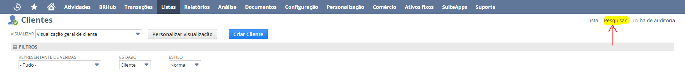
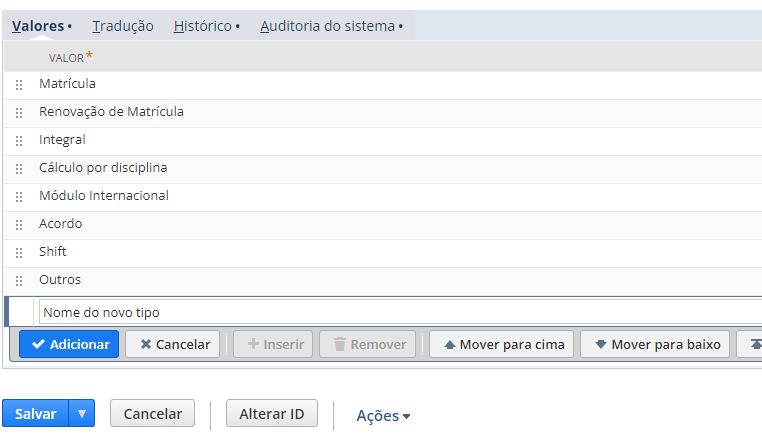
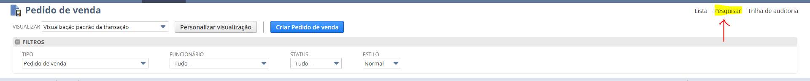
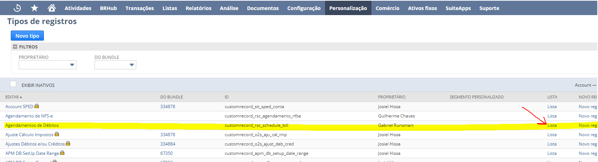
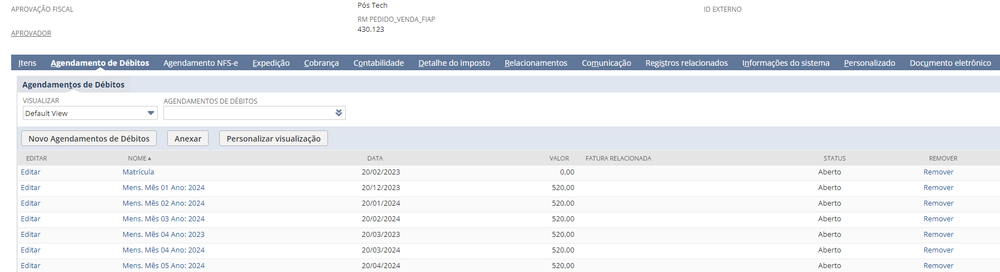

# A. Fluxos

Este documento descreve os três fluxos implementados no projeto NetSuite: Cliente, Pedido de Venda e Agendamento de Débitos. Será detalhado o objetivo de cada um deles, como eles são representados dentro da plataforma da NetSuite. Além disso, também especifica qual o objetivo do projeto NetSuite.


## Objetivo do projeto

O objetivo deste projeto é realizar a sincronização entre os registros do financeiro da FIAP (débitos, compras Shift, entre outros) com o ERP Oracle NetSuite. O ERP em questão será o responsável por centralizar tarefas como emissão de nota fiscal, emissão de boletos e de outras tarefas relacionado ao faturamento desses registros. Para isso, existem três fluxos de importação de registros que devem ser seguidos, descritos no tópico seguinte.


## Fluxos de Importação

### 1 - Cliente
Neste fluxo, os alunos e os responsáveis financeiros são importados na plataforma da NetSuite.

#### Tipos
Atualmente, a FIAP definiu três tipos de registros de cliente que podem ser importados na plataforma NetSuite:

- **Aluno**: Refere-se ao próprio aluno.
- **Aluno Responsável Financeiro**: Refere-se a um aluno que é o seu próprio responsável financeiro.
- **Responsável Financeiro**: Refere-se ao responsável finaceiro de um aluno (que não seja ele mesmo).

#### Inserção de novos tipos de cliente

É possível adicionar novos tipos de clientes diretamente na plataforma NetSuite. Para incluir um novo tipo de cliente, faça o caminho `Configuração > Contabilidade > Listas Contábeis` ou, alternativamente, abra a url abaixo:

```bash
https://7879789-sb1.app.netsuite.com/app/common/otherlists/accountingotherlists.nl?whence=
```

Filtre os tipos de listas contábeis pela opção "Categoria Cliente". Assim, são exibidos todos os tipos de clientes já cadastrados. Para criar um novo tipo clique em "Novo". Será aberta uma tela para inserção do nome do tipo do cliente. Insira o nome desejado e salve.

### Importação manual
Apesar da implementação em .NET utilizar a criação de um cliente exclusivamente via integração, também é possível importá-los manualmente. Para isso, faça o caminho `Listas > Relacionamentos > Clientes > Novo` ou, alternativamente, abra a url abaixo:

```bash
https://7879789-sb1.app.netsuite.com/app/common/entity/custjob.nl?whence=
```

Preencha os campos com as informações do cliente e salve. 

### Consulta manual
Para consultar Alunos e/ou Responsáveis Financeiros (clientes) cadastrados na plataforma da NetSuite, faça o caminho `Listas > Relacionamentos > Clientes ` ou, alternativamente, abra a url abaixo:

```bash
https://7879789-sb1.app.netsuite.com/app/common/entity/custjoblist.nl?Customer_STAGE=CUSTOMER&whence=
```

Caso queira aplicar filtros avançados para buscar um aluno, clique no menu "Pesquisar" no canto superior direito da tela e preencha os filtros desejados.



### 2 - Pedido de venda

Neste processo, são importados pedidos de venda na plataforma NetSuite. Os pedidos de venda representam um agrupamento de débitos do aluno a serem faturados.

#### Tipos
Os pedidos de venda são categorizados por contexto de agrupamento de débito. Para isso, atualmente, a FIAP definiu os seguintes tipos de pedido de venda:

- **Matrícula**
- **Renovação de Matrícula**
- **Integral**
- **Atividade Extra**
- **Cálculo por disciplina**
- **Módulo Internacional**
- **Acordo**
- **Shift**
- **Outros**

#### Inserção de novos tipos de pedido de venda

Assim como é feito em relação aos clientes, também é possível criar manualmente novos tipos de pedido de venda dentro da própria plataforma da NetSuite.

Para incluir um novo tipo de pedido de venda, faça o caminho `Personalização > Listas Registros e campos > Listas`. Após isso, localize a lista "Tipo Pedido de Venda" e clique nela. Alternativamente, abra a url abaixo:

```bash
https://7879789-sb1.app.netsuite.com/app/common/custom/custlist.nl?id=1034&e=T&ord=T
```

Após isso, basta digitar o nome do novo tipos na aba "Valores", clicar no botão "Adicionar" e salvar, conforme a figura abaixo.



####  Consulta manual
Para consultar pedidos de vendas cadastrados na plataforma da NetSuite, faça o caminho `Transações > Vendas > Inserir Pedidos de Venda > Lista` ou, alternativamente, abra a url abaixo:

```bash
https://7879789-sb1.app.netsuite.com/app/accounting/transactions/transactionlist.nl?Transaction_TYPE=SalesOrd&whence=
```

Caso queira aplicar filtros avançados para buscar um aluno, clique no menu "Pesquisar" no canto superior direito da tela e preencha os filtros desejados.



### 3 - Agendamento de Débitos

Neste fluxo, são importados todos os débitos e as suas respectivas alterações na plataforma da NetSuite. Essa importação, assim como a de pedido de vendas, será feita via integração. Para a execução desse fluxo, será necessário que um pedido de venda correspondente ao débito que está sendo monitorado já exista, uma vez que cada agendamento de débito será vinculado ao seu respectivo pedido de venda.

#### Importação

Os débitos são criados e alterados a partir do do monitoramento de alterações dos débitos, feito a partir da tabela `Educacional..FNDebitos`. Será necessário que cada mutação ocorrida num débito seja refletida no seu respectivo agendamento de débito presente na plataforma da NetSuite. Para mais detalhes, consulte a documentação [Cenários de importação de débito]().

### Consulta manual
Para consultar agendamentos de débitos cadastrados na plataforma da NetSuite, faça o caminho `Personalização > Listas, registros e campos > Tipos de Registros`. Após isso, será aberta uma página com todos os tipos personalizados. Localize o tipo "Agendamento de Débitos" e clique em "Lista", conforme a imagem abaixo.




Alternativamente, voce pode abrir a url a seguir:

```bash
https://7879789-sb1.app.netsuite.com/app/common/custom/custrecordentrylist.nl?rectype=926
```


Caso queira aplicar filtros avançados para buscar um agendamento de débito, clique no menu "Pesquisar" no canto superior direito da tela e preencha os filtros desejados.

Também é possível visualizar os agendamentos de débito de um pedido de venda específico entrando na página do pedido (conforme detalhado anteriormente) e indo até a seção "Agendamento de Débitos", conforme a figura abaixo:

