# Devs de conteúdo

O documento tem como objetivo registrar os procedimentos realizados pelos desenvolvedores da equipe de conteúdos para a plataforma FIAP ON.

## Configurações iniciais

Antes de iniciar o desenvolvimento, é necessário realizar algumas configurações:

1. Instalar o NodeJS.

2. Configurar a VPN.

3. Inserir os endereços de navegação utilizados cotidianamente no arquivo 'hosts'.

4. Criar as credenciais de acesso do Gitlab.

5. Modificar os snippets do VSCode.

Com um longo caminho pela frente, os próximos tópicos abordarão cada uma dessas configurações. Do outro lado, quando a conversa sobre os comandos Git começar, nos veremos! 👋

> **Atenção!** ⚠

> Para realizar a configuração inicial do ambiente, incluindo a liberação de acessos, você pode sempre contar com o apoio do HelpDesk: helpdesk@fiap.com.br 

### NodeJS / NPM / NVM

O Node.js é um ambiente de tempo de execução que engloba tudo o que é necessário para executar um programa escrito em JavaScript. É amplamente utilizado para executar scripts no servidor, possibilitando a renderização do conteúdo antes de ser entregue a um navegador da web.

Já o NPM tem duas funcionalidades principais: primeiro, é um repositório online para a publicação de projetos Node.js de código aberto; segundo, é um utilitário de linha de comando (CLI) que interage com esse repositório, auxiliando na instalação de pacotes, gerenciamento de versões e dependências. No [NPM](https://www.npmjs.com/), são publicadas diversas bibliotecas e aplicações Node.js. A instalação de um pacote desejado pode ser feita com uma única linha de comando.

Além disso, temos o NVM, uma ferramenta usada para gerenciar as versões ativas do Node.js. Ele facilita a alternância entre várias versões do Node.js diretamente da linha de comando. **Para o desenvolvimento dos conteúdos FIAP ON, a versão do Node.js recomendada é a 8.11.4**.

Com as informações básicas apresentadas, é hora de seguir para as instalações necessárias!

Para baixar o Node.js, basta acessar o [link](https://nodejs.org/en/download/) e clicar em 'Windows Installer' para obter a última versão disponível.

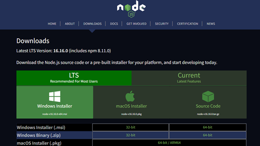

> OBS.: É possível também fazer o download diretamente da versão '8.11.4' e evitar os procedimentos a seguir. No entanto, é recomendado seguir o passo a passo completo para conhecer a ferramenta NVM, que pode ser útil em projetos futuros da equipe.

Ao iniciar o instalador baixado, **'Node.js Setup Wizard'**, siga todas as instruções padrões. Ao concluir essa etapa, o Node.js e o NPM estarão instalados em sua máquina.

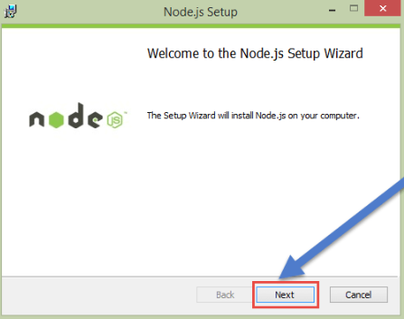

Para verificar se a instalação foi bem-sucedida, abra o prompt de comando e digite '**node -v**' para exibir a versão do Node.js recém-instalada e '**npm -v**' para ver a versão do NPM presente em seu sistema.

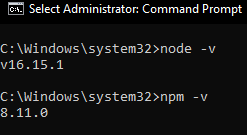

Se tudo ocorreu conforme esperado, é possível prosseguir para a segunda parte do tutorial: a instalação do NVM.

Para acessar a última versão disponível do NVM, basta clicar no [link](https://github.com/coreybutler/nvm-windows/releases). Na seção '**Assets**', procure pelo instalador '**nvm-setup.exe**' e clique para iniciar o download automaticamente.

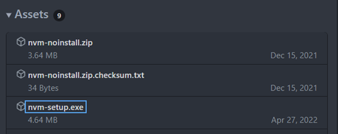

Após baixar o arquivo, execute o '**nvm-setup.exe**' e siga as instruções, clicando em '**next**' várias vezes para avançar com a instalação.

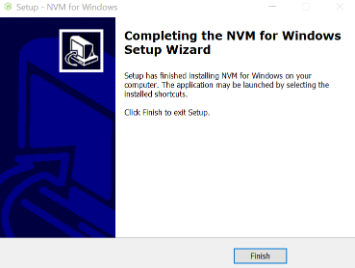

Após a conclusão da instalação, abra o prompt de comando como administrador e digite o comando '**nvm version**' para exibir a versão do NVM que foi instalada recentemente.

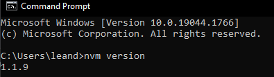

Excelente! A partir de agora, vamos instalar a versão do Node.js 8.11.4 (NPM 5.6.0) utilizando o NVM. E, para facilitar ainda mais, também instalaremos os módulos globalmente, garantindo que não precisaremos baixá-los toda vez que iniciarmos um novo projeto. Estamos quase lá! Vamos seguir com os passos.

No prompt de comando, digite o comando '**nvm install 8.11.4**' para baixar e instalar o Node.js na versão desejada. Agora é só aguardar enquanto o terminal faz o trabalho. 😊

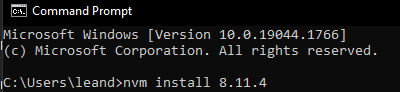

Após concluir a etapa anterior, digite o comando '**nvm list**' para listar todas as versões do Node.js instaladas em sua máquina.

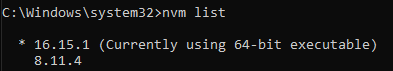

Para mudar para a versão desejada do Node.js, digite o comando '**nvm use 8.11.4**'. Isso permitirá que você utilize a versão 8.11.4 do Node.js em seu ambiente de desenvolvimento.

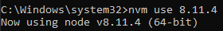

Ótimo trabalho! Agora você tem o Node.js e o NPM prontos para uso. Quanto aos mais de 7000 módulos disponíveis - talvez um pouco menos, 🤔 - precisamos baixá-los e disponibilizá-los ao NPM na raiz do disco onde os capítulos estarão armazenados.

Vamos prosseguir com o processo e garantir que tudo esteja configurado corretamente para o desenvolvimento. Estamos quase lá! 💪

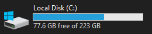

Para assegurar o download e a utilização correta dos módulos, dispomos de duas opções para realizar o procedimento. A primeira, altamente recomendada por assegurar a atualização dos módulos mais recentes, consiste no download (clone) via GitLab. No entanto, caso não tenha acesso a esse grupo, uma alternativa está disponível através do Google Drive, embora a primeira opção seja preferível.

1 - Para baixar os módulos via Gitlab, utilize o [link](https://gitlab.fiap.com.br/ead/outros/node-modules) disponível apenas para membros do grupo 'EAD' com a VPN da FIAP ativada. 

Clone o repositório na raiz do disco onde o projeto será executado (por exemplo, C:/, D:/ etc.):

```bash
git clone git@gitlab.fiap.com.br:ead/outros/node-modules.git node_modules
```

Certifique-se de renomear o diretório do projeto para node_modules (não mantenha o nome padrão node-modules).

Dentro da pasta 'node_modules', realize o checkout para a branch 'grad-mba':

```bash
cd node_modules
git checkout grad-mba
```

2 - Caso não tenha acesso ao grupo 'EAD', utilize o [link alternativo](https://drive.google.com/file/d/1FkHFywUrZwOv7NpZt76w0ejObqAmM8r-/view) para o download dos módulos.

Após baixar o arquivo zipado, extraia a pasta e mova-a para a raiz do disco (C:/, D:/ etc.) onde os projetos serão realizados em seu computador.
  
Certifique-se de que tudo esteja corretamente organizado para prosseguir com o desenvolvimento.

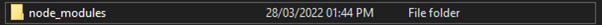

Parabéns! Chegamos ao fim da primeira etapa! Continue seguindo em frente com determinação e entusiasmo! Estamos prontos para avançar para a próxima fase do desenvolvimento. Mantenha o bom trabalho e continue progredindo! Se precisar de mais ajuda, estou aqui para apoiar você em sua jornada. Vamos em frente! 👏

> OBS.: Para saber mais sobre como funciona o NodeJS, você pode acessar o artigo "Node.js - O que é, como funciona e quais as vantagens" no [link](https://www.opus-software.com.br/node-js/). Lá você encontrará informações detalhadas sobre o Node.js e suas vantagens. É uma ótima fonte para aprofundar seus conhecimentos sobre essa poderosa plataforma de tempo de execução JavaScript.

> Para obter mais informações sobre o NPM, você pode acessar o guia "An introduction to the NPM package manager" no [link](https://nodejs.org/en/learn/getting-started/an-introduction-to-the-npm-package-manager). Nesse guia, você encontrará detalhes sobre o NPM, sua funcionalidade e como ele é usado para gerenciar pacotes e dependências no ecossistema do Node.js. É uma leitura recomendada para aprofundar seu entendimento sobre essa importante ferramenta no desenvolvimento com Node.js.

### VPN / Mapeamento de rede

A VPN (Virtual Private Network), ou Rede Virtual Privada, é uma tecnologia de rede que utiliza a internet para conectar um grupo de computadores e garantir a segurança dos dados que transitam entre eles. Sua utilização oferece uma série de benefícios, incluindo:

1. Segurança das informações: a VPN criptografa os dados transmitidos, tornando-os mais seguros contra possíveis ataques e interceptações.

2. Produtividade: ao permitir conexões seguras a partir de locais remotos, a VPN possibilita que os membros de uma equipe trabalhem de forma mais eficiente, mesmo quando estão fora da sede da empresa.

3. Redução de custos: a utilização da VPN pode eliminar a necessidade de redes privadas dedicadas e conexões ponto a ponto, resultando em economias significativas para as empresas.

Graças a esses benefícios, a VPN se tornou uma ferramenta essencial para garantir a privacidade e a segurança das comunicações em ambientes empresariais e pessoais.

Além disso, ao conectar-se à VPN da FIAP, é possível acessar os recursos da infraestrutura local da empresa, como grupos no Gitlab e a unidade de mapeamento de rede (M:/), diretamente da sua casa. Incrível, não é? Então, está pronto para aproveitar todas essas facilidades? Partiu! 😊

O FortiClient VPN pode ser baixado através deste [link](https://bit.ly/2TeZIXr).

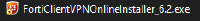

Após baixar o arquivo do FortiClient VPN, execute-o e aceite todas as opções padrões durante o processo de instalação. Isso garantirá uma instalação simples e eficiente do cliente VPN em seu sistema.

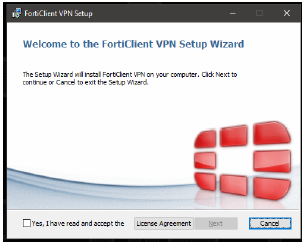

Após concluir a instalação, abra o programa FortiClient VPN, aceite os termos de uso e clique sobre o item '**Configure VPN**', chegando à tela conforme mostrada abaixo:

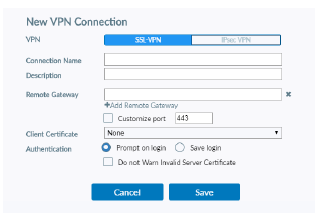

Para configurar o FortiClient VPN, você deve preencher as seguintes informações:

> **VPN**: SSL-VPN

> **Connection Name**: VPN – Lins – Unidade 02 - Ultra

> **Remote Gateway (IPV4)**: 187.109.40.130

> **Customize port**: 10443

> OBS.: As demais configurações não necessitam de alterações.

E/Ou:

> **VPN**: SSL-VPN

> **Connection Name**: VPN – Lins – Unidade 02 – Vivo

> **Remote Gateway (IPV4)**: 187.8.12.130

> **Customize port**: 10443

> OBS.: As demais configurações não necessitam de alterações.

Certifique-se de inserir todas as informações corretamente para que a conexão VPN seja estabelecida com sucesso. 

Clique em '**Save**' para salvar as configurações e você será redirecionado para a tela inicial. Em '**VPN Name**', selecione a configuração que acabamos de criar e, nos campos de usuário e senha, preencha com seus dados (Username: {Seu CL} | Password: {Mesma utilizada nos computadores da FIAP/Teams}).

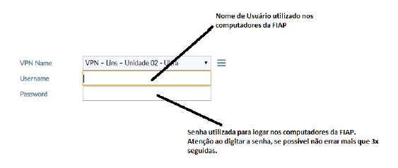

Após clicar em conectar, um alerta de segurança será exibido para confirmar a autenticação no servidor. Essa etapa é importante para garantir a segurança da conexão VPN. Certifique-se de verificar as informações apresentadas no alerta antes de prosseguir com a autenticação. Uma vez confirmada a autenticação, você estará conectado à rede VPN da FIAP com segurança, permitindo o acesso aos recursos da infraestrutura local da empresa diretamente da sua localização remota.

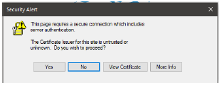

Agora, clique em '**Yes**'. Se tudo ocorrer conforme esperado, o launcher da VPN ficará da seguinte forma: 

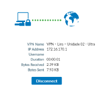

Isso indica que a conexão foi estabelecida com sucesso e você está pronto para utilizar a VPN para acessar os recursos da FIAP de forma segura e remota. Parabéns! Agora você pode aproveitar todos os benefícios da VPN da FIAP.

A partir de agora, o procedimento para mapear a rede da FIAP em sua máquina é bastante simples:

Abra o Explorador de Arquivos do Windows pressionando '**Windows + E**' ou clicando no ícone '**This PC**' no menu de navegação.


Na barra de ferramentas do Explorador de Arquivos, clique em '**Map Network Drive**'.

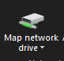

Na tela apresentada, siga a seguinte configuração:

> **Drive**: M:

> **Folder**: \\\fileserver.fiap.com.br\fiap_adm$

> OBS.: Marque a opção 'Connect using different credentials'.

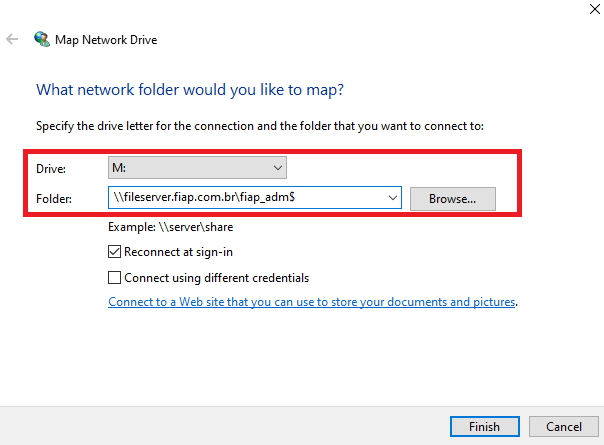

Após configurar as opções de mapeamento, clique em '**Finish**'. Em seguida, uma caixa de diálogo será aberta. Clique em '**Use a different account**' e, em seguida, será solicitado que você insira seu usuário e senha.

Digite seu usuário da seguinte forma: 'fiap\\{seu_CL}' (substituindo '{seu_CL}' pelo seu nome de usuário da FIAP). Insira a mesma senha utilizada nos computadores da FIAP ou no Microsoft Teams.

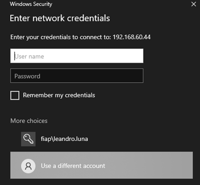

Para facilitar o acesso futuro, marque a opção '**Remember my credentials**' e clique em '**OK**'. Com essa configuração, o Windows lembrará suas credenciais de login, permitindo que você acesse a unidade de rede da FIAP sem precisar digitar suas informações de usuário e senha toda vez que fizer login no computador.

Agora, é só verificar se o disco foi mapeado corretamente.

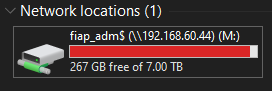

Clicando sobre o disco M:/, você encontrará a pasta 'EAD', conforme demonstrado abaixo:

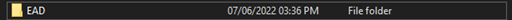

Caso a pasta 'EAD' não seja exibida no disco mapeado, é recomendado entrar em contato com o HelpDesk para solicitar permissão de acesso. Pode ser que seja necessário realizar um novo mapeamento ou ajustes nas configurações para que a pasta fique disponível. No entanto, agora que você já sabe como fazer o mapeamento de unidades de rede, caso seja necessário refazer o processo, estará preparado para fazê-lo de forma rápida e eficiente.

> OBS.: Execute o procedimento introduzido anteriormente para mapear o disco de rede utilizado nos cursos de Pós Tech.

> **Drive**: T:

> **Folder**: \\\FPFSPOSTECH.fiap.com.br\POSTECH$

Parabéns por concluir mais uma etapa com sucesso. O lado positivo é que essas configurações de VPN e mapeamento de rede só precisam ser feitas uma vez, e agora que você já aprendeu como realizar esse processo, estará preparado para enfrentar qualquer desafio que surgir no futuro.

Vamos em frente com força e dedicação! 🚀

> Para obter um manual detalhado de instalação da VPN, você pode acessar o [Manual de Conexão VPN Unidade Lins](https://bit.ly/3yLVfSt). Neste manual, você encontrará instruções passo a passo para realizar a instalação da VPN de forma completa e precisa. Ele é uma fonte confiável de informações para auxiliá-lo em todo o processo de configuração da VPN na unidade Lins. Aproveite essa excelente referência para garantir uma conexão segura e eficiente com a rede da FIAP.

### Hosts

O arquivo hosts é um arquivo de texto simples e local que mapeia servidores ou nomes de host para endereços IP. Ele desempenha um papel importante no processo de resolução de nomes de domínio, permitindo que os computadores traduzam nomes de host em seus respectivos endereços IP sem a necessidade de consultar um servidor DNS.

Um exemplo comum de mapeamento presente em nossas máquinas é o nome 'localhost'. Em vez de acessar o servidor local pelo endereço IP padrão 127.0.0.1, utilizamos o nome associado a ele, 'localhost', em nosso navegador. Esse nome é redirecionado para o endereço IP correspondente, permitindo que a conexão seja estabelecida com o servidor local. Isso torna o acesso e o desenvolvimento de aplicações locais mais práticos e intuitivos. O arquivo hosts é uma ferramenta útil para gerenciar resoluções de nomes personalizadas em nosso ambiente de desenvolvimento.

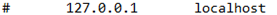

Dito isso, é necessário configurar algumas entradas no arquivo 'hosts' para facilitar nossa rotina.

Para encontrar o arquivo 'hosts', navegue até o diretório 'C:\Windows\System32\drivers\etc\hosts'.

Abra o arquivo com um editor de texto e insira as seguintes entradas no final dele:

> 172.31.44.247 gitlab.fiap.com.br

> 192.168.60.11 bancodeimagens.fiap.com.br

> 192.168.10.41 conhecimento.fiap.com.br

Após inserir as entradas no arquivo 'hosts', salve-o e feche o editor de texto. Agora, para verificar se as alterações estão em funcionamento, abra o navegador e digite 'bancodeimagens.fiap.com.br' na barra de endereços.

Se tudo estiver em perfeito estado e as alterações no arquivo 'hosts' estiverem corretas, o banco de imagens da FIAP deverá ser exibido corretamente no navegador. Isso significa que as configurações foram aplicadas com sucesso e você poderá acessar o banco de imagens diretamente pelo nome de host configurado em vez de usar o endereço IP completo.

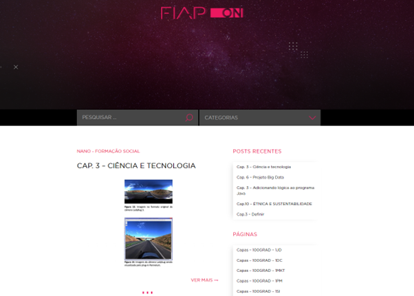

Caso as alterações no arquivo 'hosts' não estejam surtindo efeito imediatamente, pode ser necessário executar o comando '**flush dns**' no terminal para limpar o cache de resolução de DNS do sistema operacional.

### Configurando o Git

Acesse o [site](https://gitlab.com/users/sign_up) e digite suas informações (Nome, Sobrenome, Seu CL, Email FIAP e senha). 

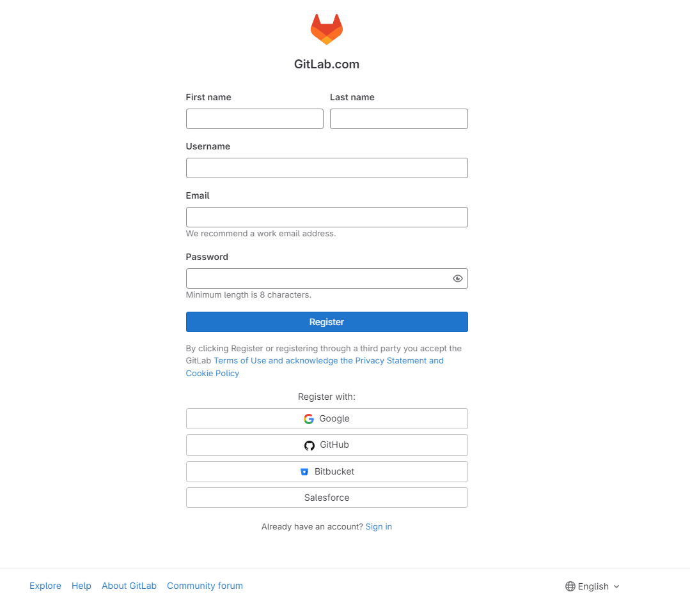

> OBS.: Muito possivelmente você já estará cadastrado no Gitlab (usuário: Seu CL | senha: Mesma utilizada no Teams).

Após isso clique em '**register**' e sua conta do Gitlab já estará pronta para utilização. Se por ventura você não ver o grupo 'EAD' na guia 'Groups', você deverá pedir que o incluam nesse grupo!

#### Gerando chave de conexões SSH

Para realizar as operações remotas do git (tais como push, pull, fetch etc.), será utilizado conexões via SSH, conforme exibido na imagem abaixo: 

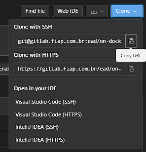

Porém, para utilizar conexão SSH, ele deve realizar algumas etapas para gerar uma chave RSA pública e vinculá-la ao Gitlab.

1 - Abra um terminal e execute o comando "ssh-keygen -t ed25519 -c '&lt; comentario &gt;'". 

O -t indica o tipo de chave e o -c um comentário opcional. Este comentário será incluído no arquivo .pub que será criado. Você pode optar por usar um endereço de e-mail como comentário ou deixar vazio.

2 - Pressione Enter. Será exibida uma saída semelhante à seguinte:

```bash
Generating public/private ed25519 key pair.
Enter file in which to save the key (/home/user/.ssh/id_ed25519):
```

3 - Aceite o nome de arquivo e diretório sugeridos, a menos que você deseje salvar em um diretório específico onde você armazena outras chaves.

4 - Logo após, será solicitado para inserir uma frase de segurança. 

```bash
Enter passphrase (empty for no passphrase):
Enter same passphrase again:
```

> É possível deixar o campo vazio ou inserir uma frase de segurança. Se uma frase for inserida, toda operação que envolva o git remoto (como pull, push, clone, etc.) solicitará que o usuário digite essa senha. 

> Como a carga de operações remotas dos Devs do FIAP ON é alta, é recomendável deixar o campo de frase de segurança vazio ou com uma frase curta.

5 - Uma confirmação será exibida, incluindo informações sobre onde seus arquivos são armazenados. Confirmada as informações, uma chave pública e privada serão geradas.

6 - Agora deve-se adicionar a chave **pública** SSH à sua conta do GitLab. Mantenha a chave privada em segurança.

7 - No caminho onde as chaves foram geradas (/home/{user}/.ssh), abra o arquivo 'id_ed25519.pub' com um editor de texto e copie a identificação da chave.

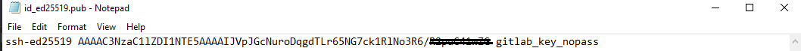

8 - Voltando ao Gitlab, clique no seu avatar e logo após em 'Preferences'. Em seguida, vá em ['SSH Keys'](https://gitlab.fiap.com.br/-/profile/keys).

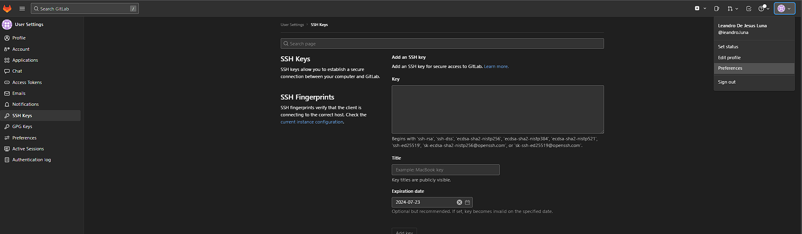

Preencha os campos da seguinte maneira: 

> Key: na caixa "Key", cole o conteúdo da sua chave pública. Certifique-se de copiar a chave inteira, que começa com 'ssh-ed25519' e pode terminar com um comentário (caso você tenha inserido um).

> Title: digite uma título descritivo, como "Chave FIAP ON".

> Expiration date (opcional!): atualize a data de expiração para modificar a data de expiração padrão. Em seguida, preencha a data desejada no formato correto.

9 - Após preencher corretamente as informações, clique em 'Add key'.

10 - Para testar se a conexâo está sendo estabelecida com sucesso, em um terminal execute o comando 'ssh -T git@gitlab.fiap.com.br'.


> Se esta for a primeira vez que você se conecta, é importante verificar a autenticidade do host do GitLab. Caso veja uma mensagem como: 

```bash
The authenticity of host 'gitlab.example.com (35.231.145.151)' can't be established.
ECDSA key fingerprint is SHA256:HbW3g8zUjNSksFbqTiUWPWg2Bq1x8xdGUrliXFzSnUw.
Are you sure you want to continue connecting (yes/no)? yes
Warning: Permanently added 'gitlab.example.com' (ECDSA) to the list of known hosts.
```

Digite "yes" e pressione Enter. Isso permitirá que você prossiga com a verificação de autenticidade do host do GitLab.

11 - Execute novamente o comando "ssh -T git@gitlab.fiap.com.br". Você deverá receber uma mensagem de "Welcome to GitLab, @nome_de_usuário!".

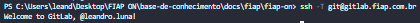

Se a mensagem de boas-vindas não aparecer, você pode solucionar o problema executando o comando "ssh" no modo verbose: 'ssh -Tvvv git@gitlab.fiap.com.br'.

E, assim, concluímos mais uma etapa! 😊  

> Para obter mais informações sobre como configurar chaves SSH para comunicações com o Gitlab, acesse o seguinte link: [Use SSH keys to communicate with GitLab (FREE)](https://gitlab.fiap.com.br/help/user/ssh.md#use-ssh-keys-to-communicate-with-gitlab).

### Snippets

Os snippets de código são uma excelente adição para otimizar o tempo durante o desenvolvimento. Eles simplificam a inserção de código repetitivo, como loops, estruturas HTML complexas ou métodos reutilizáveis.

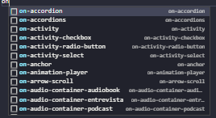

Os snippets são amplamente utilizados na rotina dos desenvolvedores de conteúdo, e sua configuração é simples:

No VSCode, no menu de ferramentas, procure por 'File > Preferences > User Snippets':

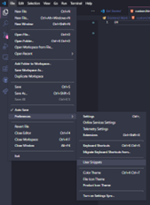

Em seguida, procure pelos arquivos 'html.json', 'scss.json' e 'typescript.json' - um de cada vez:

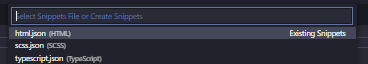

Dentro de cada arquivo '.json', copie as configurações que podem ser encontradas no seguinte [link](https://gitlab.fiap.com.br/ead/on-template/-/tree/master/snippets).

Salve os arquivos '.json' e os snippets funcionarão corretamente! 😉

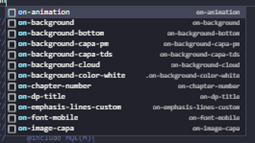

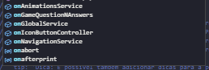

Agora, com os snippets devidamente configurados, você poderá aproveitar os benefícios de agilidade e produtividade durante o desenvolvimento de seus projetos no VSCode.

## GitLab

O GitLab é uma plataforma baseada na Web que oferece repositórios Git, tanto públicos como privados, recursos de rastreamento de problemas e wikis para documentação. É uma solução completa de DevOps que permite aos profissionais realizar todas as tarefas em um projeto, desde o planejamento e gerenciamento do código-fonte até o monitoramento e a segurança. Além disso, possibilita uma colaboração eficaz entre as equipes, resultando em softwares de melhor qualidade.

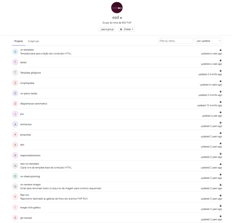

O GitLab é a ferramenta oficial de versionamento adotada pelos desenvolvedores de conteúdo. Para utilizar essa plataforma de forma eficiente, é importante compreender o Git, que é o sistema de controle de versões fundamental no qual o GitLab é construído. Com o conhecimento adequado do Git, os profissionais podem tirar o máximo proveito dos recursos e benefícios oferecidos pelo GitLab em seus projetos de desenvolvimento.

### Git

O Git é amplamente utilizado como um sistema de controle de versão. Ele registra e rastreia as alterações feitas nos arquivos, permitindo que você tenha um histórico completo do que foi realizado e possibilitando a reversão para versões específicas, caso seja necessário.

É importante destacar que o Git é um software executado localmente. Isso significa que seus arquivos e histórico são armazenados em seu próprio computador. Além disso, você pode utilizar serviços de hospedagem online, como o GitLab, para armazenar cópias dos arquivos e histórico de revisões. Ter um repositório centralizado online facilita a colaboração com outros desenvolvedores. O Git pode mesclar automaticamente as alterações, permitindo que várias pessoas trabalhem em partes diferentes do mesmo arquivo e, posteriormente, mesclar essas alterações sem perder o trabalho de outros colaboradores.

> OBS.: Para continuar aprendendo sobre o Git, é necessário ter concluído a etapa de configuração da máquina!

#### Instalação

Para baixar o Git, acesse o [site](https://git-scm.com/downloads) e selecione a versão preferencial, de preferência a versão LTS para Windows:

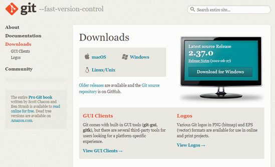

Execute o arquivo baixado '**Git Setup**' e, ao iniciar o instalador, siga as instruções padrões fornecidas pelo assistente de configuração do Git até que a instalação seja concluída.

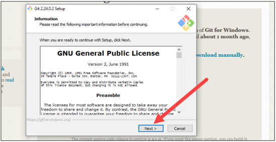

Após a instalação, abra o prompt de comando do Windows e digite o comando '**git version**' para verificar se o Git foi instalado com sucesso.

> OBS.: O prompt de comando Git Bash também será instalado caso você baixe uma das últimas versões do Git.

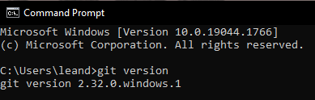

Ao concluir a instalação do Git, você estará pronto para iniciar sua jornada no controle de versão e aproveitar todos os benefícios que essa ferramenta poderosa pode oferecer para o desenvolvimento de projetos colaborativos e organizados.

#### Principais comandos

Aqui estão alguns dos principais comandos do Git que você utilizará em suas atividades de controle de versão:

| **Comando**                                                                          | **Descrição**                                                                                                                                                                                 |
| -------------------------------------------------------------------------------- | ----------------------------------------------------------------------------------------------------------------------------------------------------------------------------------------- |
| git config –global user.name “nome”<br><br>git config –global user.email “email” | Configura sua identidade de usuário. É fundamental para identificar, em um projeto colaborativo, quem, por exemplo, enviou um commit.                                                       |
| git init                                                                         | Inicializa um novo projeto, criando um repositório Git vazio.                                                                                                                              |
| git push -u &lt;remote&gt; &lt;nome-da-branch&gt;                                            | Envia a branch local para o repositório remoto, permitindo o rastreamento de sua origem.                                                                                                  |
| git clone &lt; https://url-do-link &gt;                                                  | Clona um repositório remoto em sua máquina local, baixando todo o código-fonte existente.                                                                                                 |
| git branch &lt;nome-da-branch&gt;                                                      | Cria uma nova branch local no repositório.                                                                                                                                               |
| git checkout &lt;nome-da-ramificação&gt;                                               | Alterna entre diferentes branches, permitindo que você trabalhe em um ramo específico do projeto.                                                                                         |
| git checkout -b &lt;nome-da-branch&gt;                                                 | Cria e alterna para uma nova branch de uma vez, economizando tempo.                                                                                                                        |
| git status                                                                       | Exibe o status atual do repositório, mostrando quais arquivos foram alterados e em quais branches você está trabalhando.                                                                  |
| git add &lt;arquivo&gt;                                                                | Adiciona as alterações de um arquivo específico à área de preparação para o próximo commit.                                                                                              |
| git add -A  ou git add .                                                         | Adiciona todas as alterações feitas em arquivos ao repositório para serem preparadas para o próximo commit.                                                                                |
| git commit -m "mensagem"                                                         | Salva as alterações feitas em um ou mais arquivos e cria um novo commit, registrando essas alterações no histórico do projeto.                                                             |
| git push                                                                         | Envia os commits locais para o repositório remoto associado à branch atual.                                                                                                               |
| git push -u origin &lt;nome-do-branch&gt;                                              | Se o branch foi criado recentemente, você precisa fazer upload dele para o repositório remoto.                                                                                           |
| git pull                                                                         | Obtém atualizações do repositório remoto e mescla-as em seu repositório local.                                                                                                            |
| git revert &lt;número do hash&gt;                                                      | Desfaz um commit de forma segura, criando um novo commit que reverte as alterações introduzidas pelo commit especificado.                                                                |
| git log                                                                          | Exibe o histórico de commits do projeto, mostrando informações sobre cada commit realizado.                                                                                               |
| git merge                                                                        | Combina as alterações de uma branch com outra, integrando-as ao código principal.                                                                                                         |
| git stash                                                                        | Arquiva as alterações em andamento em uma branch, permitindo que você mude para outra tarefa temporariamente e volte a essas alterações mais tarde.                                       |
| git stash list                                                                   | Lista todas as mudanças arquivadas pelo comando git stash.                                                                                                                                |
| git fetch                                                                        | Obtém informações sobre os commits do repositório remoto sem aplicar as alterações automaticamente no repositório local.                                                                  |
| git rebase                                                                       | Move ou combina uma sequência de commits para uma nova base de commit, mantendo o histórico de commits mais linear e organizado.                                                          |

> OBS.: Para obter mais informações sobre os comandos do Git, você pode acessar o [Git Reference](https://git-scm.com/docs).

> Confira uma demonstração do workflow dos Devs de conteúdo utilizando o Git e seus comandos: [Comandos Git](https://gitlab.fiap.com.br/ead/git-manual/blob/master/Comandos%20Git.txt)

## Ambiente de desenvolvimento (Graduação/MBA)

Finalmente! Chegou a hora de mergulhar no desenvolvimento de códigos. Com a máquina perfeitamente configurada e os comandos Git na ponta dos dedos, agora poderemos conhecer os procedimentos e etapas que seguirão em nosso cotidiano.

Dividimos nossa rotina em 4 etapas: **HTML1, HTML2, HTML3 e HTML4**.

Não se engane achando que esses números representam as versões do HTML publicadas pela W3C. Na verdade, cada número representa simbolicamente os procedimentos que realizamos, sendo eles:

- **HTML1**: clone de capítulo/fase, sem alterações no código. Embora pouco provável que falemos dele propriamente no cotidiano, é importante sabermos que ele existe.

- **HTML2**: conferir/bater texto e figuras de marcação. Nessa etapa também se encontra o planejamento.

- **HTML3**: inserção da parte gráfica produzida pelas equipes de criação e ilustração: figuras, vetores, capas e destaques.

- **HTML4**: é a última etapa com inserção de vídeos e áudios. Além disso, nessa etapa enviamos o projeto do capítulo para equipe de plataforma para que o conteúdo possa ser disponibilizado aos alunos.

Nos próximos tópicos, abordaremos cada uma dessas etapas em detalhes, exceto o HTML1, que por ser tão elementar, não demanda muita explicação. 😧

> OBS.: É válido destacar que as etapas a seguir são especialmente direcionadas aos cursos de Graduação e MBA. No caso dos cursos de Pós-Tech, há algumas divergências no processo, mas a base teórica sobre cada etapa do HTML ainda é válida.

Vamos lá! É hora de aprender e colocar a mão na massa!

### HTML2

No desenvolvimento de um conteúdo, o HTML2 representa a primeira etapa dentre todos os procedimentos. É nesse momento que elaboramos todo o planejamento e esboço do conteúdo. Aqui, fazemos a inserção de texto, a marcação de figuras e a diagramação. É o ponto de partida para criar a estrutura e o design do conteúdo que será apresentado.

#### Etapas do HTML2

##### Preparando o ambiente inicial

Antes de começar o desenvolvimento de qualquer conteúdo, é necessário preparar o ambiente adequado. 

O primeiro passo é clonar o repositório remoto da turma para a máquina local onde iremos trabalhar. Por exemplo, se estivéssemos criando um capítulo para a turma 2BD – Fase 5 – 2021, deveríamos clonar o repositório referente a ela com o seguinte comando: 

```bash
git clone git@gitlab.fiap.com.br:ead/HTML/100H/BD/Projeto/2ANO-2021/Fase-5.git
```

É importante que o capítulo seja clonado por SSH - e não HTTPS!

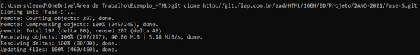

Isso criará uma cópia local do repositório da turma em nossa máquina, permitindo que trabalhemos no desenvolvimento do conteúdo.

Após realizar o clone do repositório remoto da turma, é necessário criar uma pasta para o capítulo específico que será desenvolvido. Por exemplo, para criar o capítulo 5 da turma 2BD, uma pasta com o número do capítulo deve ser criada dentro do diretório clonado.

Dentro dessa pasta recém-criada, alguns arquivos e pastas iniciais do projeto devem ser adicionados para garantir uma organização adequada:

- scripts/

- src/

- package.json

- README.md

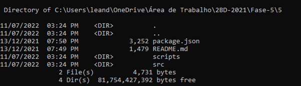

> OBS.: Os arquivos necessários para configurar o ambiente de desenvolvimento podem ser encontrados no repositório 'on-template' (https://gitlab.fiap.com.br/ead/on-template). A partir dele, copie os arquivos mencionados anteriormente.

Agora, o próximo passo é executar o script 'on-update-template.js' localizado na pasta 'scripts/'. Para isso, basta digitar o comando 'npm run update' no terminal. Esse script realizará um novo clone, desta vez baixando os arquivos necessários pelo Angular. 

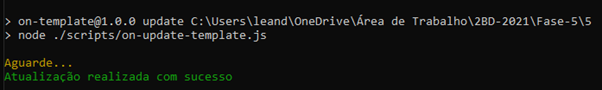

Se o script retornou a mensagem "Atualização realizada com sucesso", isso indica que todos os arquivos foram baixados corretamente. Após a execução do comando, você deverá ter os seguintes arquivos na estrutura do projeto:

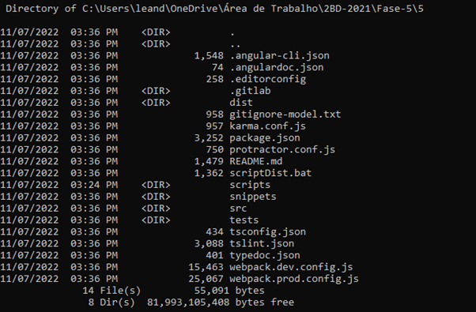

Após realizar as etapas anteriores, o próximo passo é colocar o documento do capítulo (formato .docx) dentro da pasta '/src/custom' e, em seguida, renomeá-lo de acordo com o número do capítulo em questão. Por exemplo, se o capítulo for o número 5, o arquivo deve ser renomeado para "5.docx".

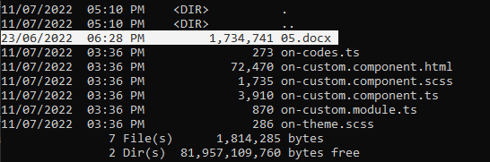

Certifique-se de seguir esse padrão de nomeação para todos os documentos de capítulos utilizados no projeto.

Gere, também, com base nesse documento, um arquivo '.txt':

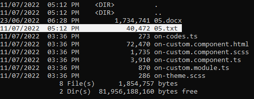

##### Utilizando o Diagramador

A partir deste momento, é possível gerar o arquivo pré-diagramado utilizando a aplicação 'ON-Diagramador' para facilitar o trabalho. Para isso, você deve clonar o repositório do diagramador em sua máquina a partir do [link](https://gitlab.fiap.com.br/ead/diagramacao-automatica) e executá-lo. O executável pode ser encontrado na pasta 'on-diagram-win32-x64/on-diagram.exe'.

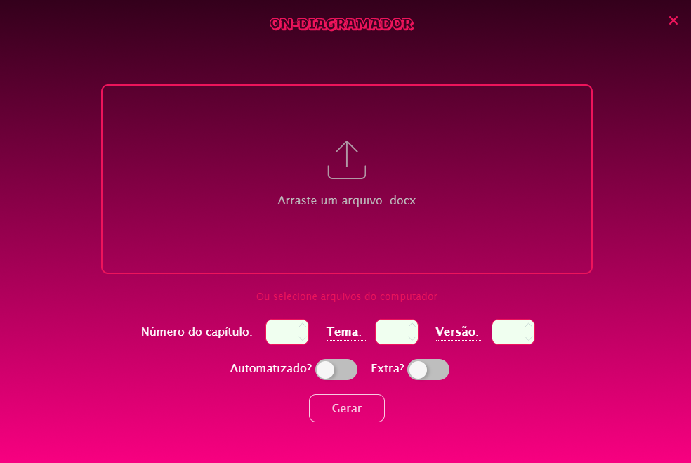

Em seguida, escolha o arquivo '.docx' correspondente ao capítulo e complete os campos com as informações do 'número do capítulo', 'tema' e 'versão'. Certifique-se de habilitar a opção 'automatizado' se o [capítulo for automatizado](http://conhecimento.fiap.com.br/fiap/fiap-on/devs-conteudo/#capitulos-automatizados) e a opção 'extra' se for um capítulo adicional. 

> OBS.: A regra utilizada é que o capítulo 1 corresponde ao tema 1, o capítulo 2 ao tema 2, e assim por diante até o capítulo 6. A contagem então é reiniciada, onde o capítulo 7 será tema 1, o capítulo 8 será tema 2, e assim sucessivamente. 

Após preencher os campos, clique no botão 'Gerar' e aguarde o diagramador concluir a elaboração dos arquivos 'on-custom.component.html', 'on-theme.scss' e 'on-codes.ts', caso este último exista.

Caso seja necessário [alterar o tema posteriormente](http://conhecimento.fiap.com.br/fiap/fiap-on/devs-conteudo/#tema), essa mudança pode ser feita na etapa do HTML3.

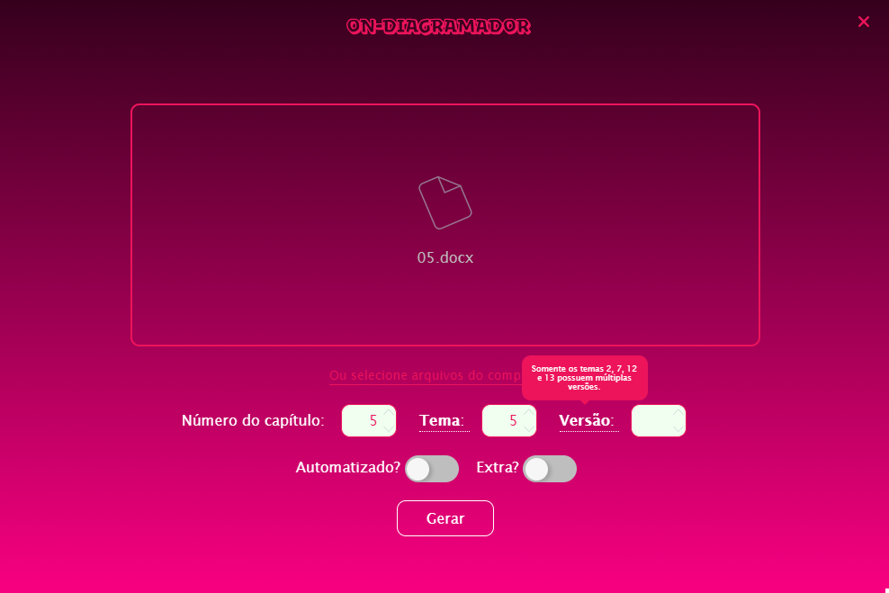

Quando a execução for concluída, os novos arquivos gerados devem ser salvos dentro da pasta junto ao arquivo '.docx' (./src/custom):

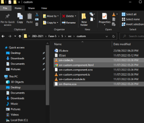

##### Conhecendo um pouco de cada arquivo

Para melhor compreensão do ambiente Angular, é essencial conhecer a função de cada arquivo. Abaixo estão as informações sobre cada um deles:

- **./src/custom/on-custom.component.html**: neste arquivo, é onde ocorre a diagramação do conteúdo do capítulo em si.

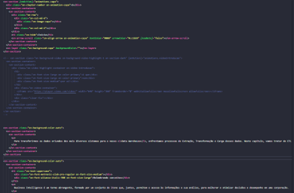

- **./src/custom/on-custom.component.scss**: arquivo usado para estilizar os componentes presentes no 'on-custom.component.html'.

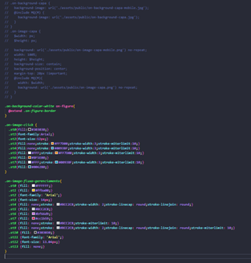

- **./src/custom/on-custom.component.ts**: este arquivo é utilizado principalmente para criar animações mais complexas para o componente 'on-custom-component.html'. Aqui também é possível alterar o título da página.

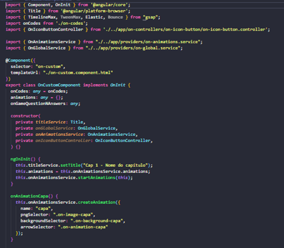

- **./src/custom/on-codes.ts**: arquivo que exporta trechos de código utilizados no atributo 'code' do componente 'on-code'.


- **./src/custom/on-theme.scss**: define o número do tema que será utilizado no projeto Angular do capítulo. Cada tema possui suas particularidades, como fontes diferentes, cores características etc.


- **./package.json**: é um arquivo central de configurações e metadados utilizados em um projeto Node. Aqui também são definidos os scripts que podem ser utilizados através do comando 'npm run'.


Dentre as pastas mais utilizadas no dia a dia, destacam-se:

- **./src/assets/private**: nesta pasta, são armazenadas as imagens em formato 'SVG' produzidas pela equipe de ilustração. Exemplos incluem infográficos e códigos com apontamentos do professor.

- **./src/assets/public**: nesta pasta, são armazenadas as imagens em formato 'JPG' e 'PNG' produzidas pela equipe de criação. Aqui podemos encontrar imagens de textos (on-image-capa) e fundos das capas (on-background-capa), figuras (on-image-destaque) e fundos de destaques (on-background-destaque), bem como imagens do próximo capítulo (on-image-next) etc.

- **./tests**: nesta pasta, serão depositados os resultados do script 'scriptAutomacaoTeste.js', que executa uma verificação de possíveis erros encontrados no HTML do componente Custom, minimizando os riscos de problemas no conteúdo produzido.

- **./src/app**: esta é uma pasta importante que contém todos os componentes que podem ser importados na diagramação do 'on-custom.component.html'. Além disso, alguns outros arquivos, como os de estilização, podem ser acessados aqui (/app/styles). O arquivo 'app.component.html' é o arquivo final com os componentes produzidos.


##### Enfim, diagramação!

Existem inúmeras maneiras de diagramar o projeto de um capítulo, mas alguns procedimentos se destacam independentemente da abordagem adotada.

No arquivo 'on-custom.component.ts', é necessário alterar o título da página para refletir o número e o título do capítulo que está sendo desenvolvido, como mostrado abaixo:


Isso é feito dentro da função 'ngOnInit', usando o método 'setTitle' do objeto 'titleService'.

O título do capítulo pode ser obtido no sumário do arquivo '.docx':


E/ou na contracapa:


> OBS.: É importante seguir o padrão 'Cap X - Nome do capítulo'.

Por enquanto, essa é a única alteração a ser feita no arquivo 'on-custom.component.ts'; no HTML3, será adicionado animações ao conteúdo através dele.

> OBS.: A definição manual do título da página não é mais exigida nos cursos de Graduação. Para obter informações adicionais, consulte a seção sobre [Capítulos automatizados](http://conhecimento.fiap.com.br/fiap/fiap-on/devs-conteudo/#capitulos-automatizados).

Agora, no arquivo 'on-custom.component.html', é hora de começar a esboçar o conteúdo. Cada 'bloco' de conteúdo é separado por seções (on-section), e dentro de cada seção, o código planejado é inserido:


O arquivo começa com uma seção para a capa, mesmo que ela ainda não esteja pronta nesse momento (será adicionada no HTML3):


Dentro deste trecho de código (on-section-capa), é necessário alterar o número do capítulo na div com a classe 'on-classe-number' aplicada.

> OBS.: A definição manual do número do capítulo não é mais exigida nos cursos de Graduação. Para obter informações adicionais, consulte a seção sobre [Capítulos automatizados](http://conhecimento.fiap.com.br/fiap/fiap-on/devs-conteudo/#capitulos-automatizados).

> OBS.: As propriedades dos atributos 'backgroundColor' e 'arrowColor' também serão alterados no HTML3.

Feito isso, é hora de separar o conteúdo conforme aparece no sumário do documento, mantendo, sempre que possível, a ordem em que está estruturado:


Toda seção deve **obrigatoriamente** começar com um título usando a tag H1, de acordo com o tema definido no diagramador (snippet 'on-title-theme-x'). No exemplo, o tema escolhido foi o 1, portanto, todas as seções terão um título (H1) do tema 1.

As tags H2 serão utilizadas para marcar os subitens dentro das seções H1. Apenas as tags H1 e H2 aparecerão no índice do capítulo; as demais tags (H3 até H6) não aparecem no índice.


Ao reestruturar o índice, ele ficará semelhante a isso:


Os títulos marcados com a cor verde serão os H1s, os em amarelo serão os H2s e os em azul serão H3, H4, H5 ou H6 - dependendo da necessidade. Assim:


> OBS.: Caso o arquivo (docx) possua glossário, não é necessário incluí-lo no HTML do componente Custom.

Com o esqueleto do capítulo pronto, agora é necessário fazer as marcações das figuras. Para cada figura do documento, utilize o snippet 'on-figure-marcacao', e dentro do atributo 'description', insira a legenda dessa figura. Não é necessário incluir a fonte. 

Por exemplo:


> OBS.: Em geral, nas figuras que o aluno precisa visualizar, deixaremos com visualização completa - snippet 'on-figure-marcacao' acima. Já nas figuras complementares, poderemos deixá-las dividindo o espaço junto aos parágrafos utilizando o snippet 'on-figure-left-marcacao' (para a figura do lado esquerdo do texto) ou 'on-figure-right-marcacao' (para a figura do lado direito do texto).

Agora, devemos terminar de criar o esqueleto final do conteúdo. Para conhecer cada um dos componentes que poderão ser utilizados nessa etapa, abra o arquivo 'index.html' que se encontra dentro da pasta '/dist' do repositório 'on-template' que foi clonado anteriormente.


Feito isso, é necessário garantir que todos os links, incluindo os links das referências, estejam encurtados e dentro do snippet 'a-href'. Para isso, utilize o site [tinyurl](https://tinyurl.com/app) para encurtar cada um dos links, como exemplificado abaixo:


Os links devem ser deixados interativos e, quando possível, inseridos junto ao parágrafo que faz referência a eles:


Por fim, depois de encurtar todos os links, basta inserir o 'rodapé' do conteúdo. Para isso, utilize o snippet 'on-footer' no final do arquivo HTML do componente Custom.


Dentro de 'on-references', todas as referências do arquivo .docx devem ser listadas utilizando a tag '&lt;li&gt;', ficando da seguinte maneira:


> OBS.: Caso você tenha utilizado o diagramador, a formatação das referências já deverá vir com o esqueleto pré-montado, bastando somente verificar se o link está encurtado e dentro de um snippet 'a-href'.

Além disso, é necessário alterar algumas informações dentro do componente 'on-content-switch'.

> OBS.: A definição manual das propriedades do componente 'on-content-switch' não é mais exigida nos cursos de Graduação. Para obter informações adicionais, consulte a seção sobre [Capítulos automatizados](http://conhecimento.fiap.com.br/fiap/fiap-on/devs-conteudo/#capitulos-automatizados).


No atributo 'chapter', informe o número do capítulo imediatamente posterior ao que estamos diagramando. Por exemplo, no caso do capítulo 5, informaremos o número **6**.

O atributo 'figure' também deverá ser indicado. O caminho ('./assets/public/on-image-next.png') é estático – sempre o mesmo -, logo raramente faremos alguma alteração nele.


> OBS.: É necessário ressaltar sobre um atributo que foi omitido nesse exemplo: 'justHas'. O 'justHas' serve para assinalar caso um capítulo não tenha um capítulo antecedente a ele – por exemplo, capítulo 1 -, ou quando não tem um capítulo posterior – por exemplo, capítulos finais. Quando o omitimos, denota que o capítulo que estamos diagramando possui tanto um capítulo antecedente quanto um capítulo posterior.

> No caso de não haver um capítulo antecedente, devemos informar a propriedade 'next' para o atributo 'justHas'; e caso não possua um capítulo posterior, informaremos o valor 'prev'.


**No caso de não haver um capítulo posterior, os atributos 'chapter' e 'figure' podem ser descartados**.

Além disso, devemos alterar algumas outras informações do componente 'on-content-switch' referentes ao capítulo imediatamente posterior ao capítulo que estamos diagramando.


Dentro da tag '&lt;h2&gt;', deverá ser informado o título do próximo capítulo. Caso o título seja muito extenso, é recomendado quebrar o título em 2 partes – ou quantas forem necessárias – dentro das div.

Já na tag '&lt;p&gt;', como indicado, devemos informar um breve resumo do próximo capítulo. Esse resumo poderá ser encontrado entre as páginas 4 e 5 do documento .docx.


Não é necessário replicar todo o resumo na íntegra, pois alguns resumos são demasiadamente extensos. Para tal, somente uma alusão do que se trata o capítulo é suficiente.


> OBS.: Nos capítulos em que não há um capítulo posterior ao capítulo de referência, é possível descartar a etapa anteriormente mencionada. Isso se deve ao fato de não haver informações disponíveis (título e resumo) para serem inseridas nesse contexto específico. Portanto, não será necessário realizar esse procedimento quando a situação se aplicar.

###### Inserindo códigos no HTML do componente Custom: o componente on-code!

Após a inserção do Rodapé, que não necessariamente é a última etapa - conforme mencionado no início da seção anterior 'Enfim, diagramação!' - não há uma maneira linear de diagramar o conteúdo. Em alguns capítulos, é necessário inserir trechos de códigos indicados pelos professores por meio do documento docx.


Esses trechos geralmente são marcados no docx como 'Código-fonte X'. Para inseri-los, não podemos simplesmente copiar e colar o conteúdo, devemos utilizar um componente específico para esses casos, chamado 'on-code':


> OBS.: O componente 'on-code' sempre deve estar envolto pelo componente 'on-code-box'.

Para o atributo 'code', é necessário informar ao objeto 'onCodes' o valor da chave do código-fonte que consta no arquivo 'on-codes.ts'. Esse arquivo, como introduzido anteriormente, é encontrado dentro da pasta './src/custom/':


Dentro do arquivo 'on-codes.ts', um módulo é exportado por padrão. Nesse módulo, temos um objeto. Cada chave será utilizada no 'onCodes' do componente 'on-code'. **Geralmente, o nome da chave é a legenda do 'código-fonte'**. Já o valor associado a cada uma das chaves serão os trechos de 'código-fonte' extraídos do docx, contidos entre acentos graves '``'. No nosso exemplo, ficará da seguinte maneira:


> OBS.: Como estamos exportando uma string, lembre-se de 'escapar' caracteres especiais adicionando uma barra invertida extra '\'. Por exemplo: caso o professor tenha inserido uma quebra de linha ('\n') no código, devemos alterá-la para '&bsol;\n'.

No HTML do componente Custom:


> OBS.: Conforme a necessidade, podemos ter vários 'on-codes' dentro de um componente 'on-code-box'.

O atributo 'identifier' serve para identificar a origem da linguagem do código-fonte informado.


> Para saber quais linguagens de identificação são suportadas, acesse: [PrismJS](https://prismjs.com/download.html#themes=prism-okaidia&languages=markup+css+clike+javascript+actionscript+apacheconf+applescript+arduino+aspnet+bash+batch+c+csharp+cpp+cypher+django+docker+ejs+fortran+git+graphql+groovy+http+hpkp+hsts+ignore+java+javadoc+javadoclike+jsdoc+json+json5+jsonp+kotlin+lisp+makefile+markup-templating+mongodb+n4js+objectivec+pascal+php+php-extras+plsql+powerquery+powershell+properties+python+r+jsx+tsx+ruby+sass+scss+scala+scheme+shell-session+sql+swift+toml+typescript+uri+visual-basic+xml-doc+xquery+yaml&plugins=line-numbers+toolbar). Nem todas as linguagens funcionam, porém, para as mais comuns nos conteúdos (Python, JavaScript, CSS, HTML, SQL etc.), você não deverá ter problemas.

Após todas as alterações, nosso componente 'on-code-box' deverá ficar assim:


##### Pontos de atenção

Antes de avançar para o HTML3, é importante estar ciente de alguns erros e más práticas mais frequentes que ocorrem no dia-a-dia e que podem ser evitados:

- **Símbolos numéricos/não-convencionais**: alguns caracteres especiais, especialmente os relacionados à matemática, podem não ser reconhecidos pelo diagramador. É recomendado verificar os trechos que contêm equações matemáticas e, caso identifique a falta de algum símbolo, utilizar os ['códigos de entidades'](https://www.toptal.com/designers/htmlarrows/math/) para inseri-los corretamente no projeto do capítulo.

- **Componente dentro de componente**: devido aos dispositivos móveis, é considerada uma boa prática evitar colocar um componente dentro de outro componente (por exemplo, 'on-slider' aninhado em um 'on-tabs') devido à dificuldade de visualização em dispositivos com telas menores.

- **Título e textos em letras maiúsculas**: palavras escritas com todas as letras maiúsculas são lidas como siglas por leitores de tela. Por questões de acessibilidade, devemos reservar o uso de letras maiúsculas apenas para siglas, evitando seu uso desnecessário em casos que não representem siglas.

Ufah! Diagramar um conteúdo é uma jornada longa, mas ainda há muito pela frente! A partir de agora, abordaremos o HTML3!

### HTML3

A etapa de HTML3 é realizada em conjunto com as equipes de designers de conteúdo: Criação e Ilustração. Nessa etapa, é necessário inserir todos os conteúdos gráficos (capa, destaques e imagens) que foram demarcadas no HTML do componente Custom, além de verificar se o tema está padronizado de acordo com o tema definido.

Começando pela verificação do tema.

#### Tema

Primeiramente, é necessário verificar no [Monday de Criação](https://fiap.monday.com/boards/4371845886) qual tema deve ser utilizado no capítulo que está sendo diagramado.


Na 5ª coluna de subelemento da turma e fase desejada, 'Tema', temos a indicação do tema que deve ser utilizado.


> OBS.: A imagem anterior é meramente ilustrativa.

No caso do capítulo 4 de 1BD – 2021 - Fase 5, o tema definido foi o 3.

Voltando ao projeto, dentro da pasta 'custom/', será necessário alterar a variável '$on-theme-number' no arquivo 'on-theme.scss', ficando dessa maneira:


> OBS.: Há uma exceção no tema 2. Nesse caso, também devemos inserir a variável '$on-theme-version = 1' ou '$on-theme-version = 2'.


> OBS.: Algumas turmas (como por exemplo, TDS, ESO, JD, PM, DC e Nano Courses de 2024) utilizam temas que requerem uma camada de alterações extras. No tópico ['Temas especiais: o que muda?'](http://conhecimento.fiap.com.br/fiap/fiap-on/devs-conteudo/#temas-especiais-o-que-muda) será comentado quais são essas alterações em detalhe.

Além disso, outra alteração que deve ser feita é nos títulos das tags &lt;H1&gt; nas seções do HTML da 'on-custom.component'.

Baseado no tema pretendido, é necessário substituir as classes desses títulos com o snippet 'on-title-theme-X'.


Ficando dessa maneira:


> OBS.: Essa substituição deve ser feita em todas as tags H1.

> Uma dica para fazer essas substituições com mais facilidade no Visual Studio Code é utilizar a ['seleção múltipla'](https://bit.ly/3Yqi5K3) usando o atalho 'CTRL+D'.

Feito isso, agora podemos avançar para a inserção da capa, destaques e imagens.

#### Capa e Destaques

Além da alteração do tema, outro procedimento essencial a ser realizado durante a etapa de HTML3 é a inserção das capas e dos destaques.

A capa é encontrada logo na primeira seção do conteúdo no HTML do componente Custom.


Já os destaques podem ser encontrados ao longo do conteúdo, entre seções diferentes. Comumente - mas não obrigatoriamente - eles serão inseridos na seção introdutória (imediatamente posterior à capa) e na seção conclusiva (imediatamente anterior às referências).


> OBS.: É importante notar que todos os capítulos devem ter uma capa. No entanto, nem todos os capítulos terão destaques.

##### Capa

Sem mais delongas, para inserirmos a capa, precisaremos dos seguintes arquivos da rede de Criação:

- Imagem de background: mobile e desktop

- Texto em imagem do título da fase/disciplina e do capítulo: mobile e desktop OU desktop.

> OBS.: A imagem dos títulos do capítulo não é mais exigida nos cursos de Graduação. Para obter informações adicionais, consulte a seção sobre [Capítulos automatizados](http://conhecimento.fiap.com.br/fiap/fiap-on/devs-conteudo/#capitulos-automatizados).


Localizados os arquivos listados anteriormente, copie-os para a pasta './src/assets/public'.


Confirme a substituição de quaisquer arquivos que forem solicitados e renomeie-os seguindo a seguinte padronização:

Background:

- on-background-capa.jpg

- on-background-capa-mobile.jpg

Títulos:

- on-image-capa.png

- on-image-capa-mobile.png


> OBS.: No caso desse capítulo exemplo, a imagem do título mobile não foi gerada pela Criação. Para exemplificar, foi duplicada a imagem do título do desktop e renomeada com o sufixo '-mobile' para que possamos prosseguir com a explicação.

Já no HTML do componente Custom, na seção inicial, é importante verificar se o trecho da capa (snippet **'on-section-capa'**) foi inserido previamente:


> OBS.: Lembre-se, também, de descomentar (caso esteja comentada) no SCSS da custom a classe 'on-background-capa' para acompanhar as próximas alterações.


Na presente situação, procederemos à modificação das informações a seguir:

Dentro da div marcada pela classe 'on-chapter-number', verifique se o número coincide com o número do capítulo pretendido.


No componente **'on-arrow-scroll'**, altere a propriedade do atributo 'textColor' para uma cor que crie contraste e legibilidade com a imagem de background. Em 90% dos casos, a cor preta (#000) poderá ser utilizada e, em outras situações, a cor branca (#fff) resolverá o problema.


Após isso, faremos alterações nos atributos 'arrowColor' do componente **'on-arrow-scroll'** e 'backgroundColor' do componente **'on-layer'**.

Para alterar essas propriedades, utilizaremos como referência a cor de fundo utilizada no degradê do background. Em uma das extremidades do background, utilize o seletor de cores do Developer Tools (Chrome) - ou o conta-gotas de ferramentas de edição de imagens - e anote o valor em hex color dessa cor.


> OBS.: Caso a cor de fundo do background desktop seja diferente do background mobile, utilize no atributo backgroundColor a cor da versão mobile. Alteraremos a cor do desktop através do SCSS do componente 'custom' logo mais.


Partindo para o SCSS, caso a cor de fundo do background desktop seja diferente do background mobile, dentro da diretiva '@include MQ(M)' da classe 'on-background-capa', insira a propriedade 'background-color' com o valor da hex color de uma das extremidades desse degradê - processo similar ao feito anteriormente no HTML do componente Custom.


Além disso, devemos descomentar a classe 'on-image-capa' para que o título da capa apareça sob o background que acabamos de inserir.


Para isso, dentro dessa classe, altere o valor das propriedades 'height' e 'width'. Os valores que deverão ser inseridos serão aqueles da altura e da largura, respectivamente, da imagem 'on-image-capa-mobile'.

Selecione a imagem com o botão direito, clique em 'propriedades' e vá na guia 'detalhes'. Sob a legenda 'imagem', visualize os valores de 'altura' e 'largura', e altere-os no SCSS.


Dessa maneira, podemos finalizar a inserção da capa e prosseguir para a discussão sobre a inserção dos destaques.


##### Destaques

Para a inserção dos destaques, o processo é realizado de maneira similar ao que foi apresentado anteriormente, com alguns detalhes a mais que deverão ser observados.

Na pasta da rede de arquivos de Criação, você deve procurar pelos backgrounds dos destaques. Esses arquivos devem conter a imagem 'JPG' tanto para a versão mobile quanto para a versão desktop.


> OBS.: Em alguns casos, como no tema 12, poderá conter a imagem com título (texto) para cada um dos destaques. Esses casos especiais serão explicados posteriormente no tópico ['Temas especiais: o que muda?'](http://conhecimento.fiap.com.br/fiap/fiap-on/devs-conteudo/#temas-especiais-o-que-muda).

Após localizar os arquivos de background, o próximo passo é copiá-los para a pasta 'assets/public', da mesma forma como foi feito com a capa. Em seguida, é necessário renomear os backgrounds com o sufixo 'destaque' e enumerá-los, conforme mostrado abaixo:


Feito isso, é hora de trabalhar com os códigos!

No SCSS da custom, é preciso inserir o snippet 'on-background-' e completá-lo com a nomenclatura utilizada no passo anterior, ou seja, 'destaque1', 'destaque2' e assim por diante. Ficando dessa maneira:


Em seguida, é necessário criar a função que servirá para animar os destaques. No arquivo TypeScript (ts) da custom, essa função deve ser inserida após a função 'onAnimationCapa', ou após qualquer outra função 'onAnimation', mas preferencialmente após a capa. O snippet 'onAnimationDestaque' deve ser preenchido com o nome da função e com as propriedades 'name', 'textSelector' e 'backgroundSelector' dentro do método 'createAnimation'. Essa nomenclatura deve seguir o padrão apresentado anteriormente, correspondente a cada um dos destaques.


Por último, é necessário inserir as marcações dos destaques no HTML da custom. Para isso, é preciso determinar onde exatamente os destaques devem ser posicionados.

Existem duas maneiras de descobrir onde inserir os destaques:

1 - A primeira, e mais simples, é através da prancheta/grid. Esse arquivo é disponibilizado pela equipe de Criação e geralmente pode ser encontrado entre as pastas do capítulo em que se está fazendo a diagramação.
    


2 - A segunda maneira é através dos comentários no documento docx. Para visualizar os comentários do docx, é necessário acessar a guia "Revisão" no ribbon e clicar na opção "Mostrar comentários" na barra de ferramentas. 
    


Em seguida, é possível selecionar a opção "Lista" para exibir todos os comentários presentes no documento.


Após escolher o local para inserir o destaque, deve-se utilizar o snippet "on-section-destaque" no HTML do componente Custom. 


Em seguida, completar a diretiva "onAction", informando na propriedade "animations" a nomenclatura utilizada anteriormente, como "destaque1", "destaque2", e assim por diante. Também é necessário acrescentar as classes "on-animation" e "on-background" com o sufixo de identificação correspondente aos destaques.


Feitos os passos anteriores, é importante preencher o atributo 'backgroundColor' com a cor correspondente ao fundo dos degradês do background, seguindo o mesmo processo utilizado na capa. Além disso, é preciso aplicar as fontes do tema do capítulo na tag H1 do destaque.

Até o momento, a marcação do destaque deve ter o seguinte aspecto:


Por fim, é importante observar o lado em que o texto deve ficar posicionado com base na imagem de fundo. Se a imagem estiver localizada à direita, o destaque estará pronto para receber os textos, uma vez que o snippet "on-row" já está posicionado com somente 6 colunas (on-col-md-6). Basta recortar o texto da seção correspondente e colá-lo dentro do destaque.


> OBS.: Lembre-se de adicionar a classe 'on-animation-' com o sufixo correspondente para cada parágrafo que tiver dentro do destaque.

Caso a imagem de fundo esteja posicionada à esquerda, será necessário mover o texto para a direita. Para isso, adicione uma tag 'div' com a classe 'on-col-md-6' dentro da div marcada com a classe 'on-row' ANTES da outra 'on-col-md-6' que já estava presente no destaque. Dessa forma, o texto será empurrado para a direita.


> OBS.: Após uma revisão do exemplo apresentado, constatou-se que o texto encontra-se em proximidade inadequada com a imagem de fundo, o que pode comprometer a leitura do destaque.

> Nesse sentido, sugere-se a alteração no número de colunas do texto, passando de 6 (on-col-md-6) para 5 colunas (on-col-md-5), e, consequentemente, a modificação no número de colunas da imagem, que passaria de 6 (on-col-md-6) para 7 colunas (on-col-md-7). Ressalta-se que é imprescindível que o Grid utilizado totalize 12 colunas.

> Essas medidas resultarão em uma disposição mais equilibrada dos elementos, permitindo que o texto do destaque seja evidenciado de forma adequada.


Após realizar essas etapas, você pode prosseguir para a última etapa do HTML3: a inserção de figuras e vetores.

#### Imagens

A inserção de figuras é uma tarefa relativamente simples, mas que frequentemente exige alguns ajustes por parte da equipe de Desenvolvimento do ON.

Nesse processo, dois elementos são essenciais e precisam ser apresentados: o 'Banco de imagens' e a 'equipe de Ilustração'.

O "Banco de imagens" é um servidor que armazena todas as **imagens tratáveis** produzidas pela equipe de Criação. Nele, a equipe pesquisa as imagens necessárias para o documento, que são identificadas pelo assets 'on-image-model' em nosso HTML do componente Custom.


É importante ressaltar que, exceto em casos específicos, essas imagens não são vetoriais.

As **imagens vetoriais**, por sua vez, são criadas pela equipe de Ilustração (que é um departamento da equipe de Criação, mas desempenha um trabalho distinto). Essas imagens não são encontradas na Internet; elas passam por um processo de criação seguindo as orientações dos professores.

> OBS.: Para entender mais sobre imagens vetoriais, acesse: ['O que são Imagens Vetoriais?'](https://www.treinaweb.com.br/blog/o-que-sao-imagens-vetoriais)

As imagens produzidas pela equipe de Ilustração não são armazenadas no Banco de Imagens, mas sim em um repositório no [Gitlab](https://gitlab.fiap.com.br/ead/ilustracao). Para acessar essas imagens, o repositório é clonado no servidor de arquivos, que pode ser encontrado em 'M:\EAD\GIT\Ilustracao'.

Ao obter acesso ao repositório, a equipe copia as imagens no formato 'SVG' para a pasta 'assets/private' do capítulo com o qual estão trabalhando.


> OBS.: Entender a diferença entre uma imagem vetorial e uma imagem tratável pode ser desafiador, uma vez que essa escolha é feita pelas equipes de Criação e Ilustração.

> Em geral, imagens usadas para demonstrações de tela, instalação de software, trechos de código ou que representam conceitos são consideradas "imagens tratáveis".

> Por outro lado, imagens de informações, como gráficos e infográficos, são consideradas "imagens vetoriais" - ou simplesmente "vetores".

> Em caso de dúvida sobre a classificação de uma imagem, é recomendado buscar orientação de um membro da equipe de Criação ou Ilustração.

Após a apresentação dos elementos importantes para a última etapa do HTML3, é hora de voltar ao código.

No 'Banco de Imagens', utilize a legenda de uma das figuras do documento para pesquisá-la.


Não é necessário se ater muito ao título dos capítulos que serão exibidos, pois muitas imagens são reaproveitadas de um capítulo para outro.

Ao encontrar a imagem desejada, basta clicar com o botão direito sobre ela e selecionar a opção 'copiar link'.


De volta ao HTML do componente Custom, procure o componente 'on-figure' com o atributo 'description' que corresponda à legenda da imagem que será alocada.


No atributo 'img', substitua o texto existente pelo link que foi copiado anteriormente.


> OBS.: Caso o link da figura contenha alguma indicação de resolução, é necessário excluí-la até o hífen (incluindo-o) que se encontra imediatamente antes dessa indicação de resolução, para que a imagem ocupe o máximo de espaço possível no container do conteúdo.

> Por exemplo: o link 'https://s3.amazonaws.com/b5fa8c4024182e6fb580b451bb51ed1719e4949feb566bd9b6b92b85df31576/wp-content/uploads/2023/03/09131429/on-image-119-1024x666.jpg' ficaria 'https://s3.amazonaws.com/b5fa8c4024182e6fb580b451bb51ed1719e4949feb566bd9b6b92b85df31576/wp-content/uploads/2023/03/09131429/on-image-119.jpg'

> Essa alteração é especialmente importante no caso de indicações inferiores à largura '1024' (por exemplo, figuras com indicação '768').

Esse processo é repetido para todas as outras figuras encontradas no 'Banco de Imagens'. Caso alguma figura não seja encontrada, é provável que ela seja um vetor.

Nesse caso, depois de localizar os vetores na rede de Ilustração, copie-os para a pasta 'assets/private'.


A inserção de vetores é ligeiramente diferente. Tendo como referência a figura à seguir:


Dentro do atributo 'img', é feita a alteração do caminho, substituindo 'public' por 'private', e acrescentando a extensão '.svg' no nome da imagem.


#### Pontos de atenção

Antes de prosseguir para o HTML4, é importante destacar alguns erros e más práticas comuns que podem ser evitados nesta etapa, semelhantes aos que foram mencionados na etapa do HTML2.

- **Imagens presas no HTML do componente Custom**: certifique-se de inserir o caminho correto das imagens no HTML do componente Custom para evitar problemas de carregamento. No caso de imagens vetoriais (SVG), verifique se os caminhos relativos do atributo 'src' estão corretos. Para as figuras do banco de imagens, confirme se as URLs estão inseridas corretamente. Além disso, lembre-se de evitar espaços em branco e caractéres especiais nos nomes de arquivos de imagens vetoriais ou salvas localmente dentro da pasta assets.

- **Imagens trocadas (inseridas erroneamente)**: após a inserção das figuras, faça uma revisão do HTML do componente Custom para garantir que todas as imagens estejam posicionadas corretamente e na ordem desejada.

- **Imagens de marcação não removidas**: ao gerar o bundle do contéudo (pasta './dist') usando o script 'scriptDist.bat' na raiz do projeto, verifique se todas as figuras de marcação (on-image-model) foram devidamente substituídas no HTML do componente Custom. Caso encontre alguma figura de marcação, remova-a para evitar problemas na visualização.

- **Image-next não inserido**: em caso de [capítulos não automatizados](http://conhecimento.fiap.com.br/fiap/fiap-on/devs-conteudo/#capitulos-automatizados), verifique se a imagem 'on-image-next' está presente na pasta './src/assets/public' em todos os capítulos que não sejam os finais. Essa imagem é importante para a navegação entre os capítulos.

- **Título da capa e/ou on-chapter-number não visíveis no mobile**: certifique-se de que haja um bom contraste entre o texto do título da capa ('on-image-capa') ou o número do capítulo ('on-chapter-number') e a cor de fundo da capa ('on-background-capa') para garantir a legibilidade no mobile. Se necessário, entre em contato com a equipe de Criação para gerar uma nova imagem ou altere o atributo 'color' no arquivo '.scss' do componente Custom para corrigir o problema.

- **Background-color da capa não inserido ou cor errada no mobile**: verifique se o atributo 'backgroundColor' está definida corretamente na seção da capa. Além disso, observe se o degradê da imagem 'on-background-capa' está se expandindo corretamente na versão mobile. Em alguns temas, a cor do degradê da capa no mobile pode ser diferente da cor no desktop. Nesse caso, altere a cor do atributo 'background-color' no SCSS do componente Custom usando um '@include MQ(M)' dentro da classe 'on-background-capa'.

> OBS.: É importante ressaltar que, antes de prosseguir com o projeto para o HTML4, é necessário [enviar o conteúdo para a equipe de revisão a fim de verificar sua conformidade com o documento docx e realizar todas as alterações necessárias](http://conhecimento.fiap.com.br/fiap/fiap-on/devs-conteudo/#ajustes). Cada turma possui um responsável designado para essa tarefa. Recomenda-se consultar o/a analista de projeto atual para obter informações sobre para quem o capítulo deve ser enviado. Você, também, pode consultar a [seção de equipes](http://conhecimento.fiap.com.br/fiap/fiap-on/devs-conteudo/#revisao-graduacao) ao final desse documento. 

Com tudo revisado e ajustado, é hora de avançar para a última etapa: o HTML4!

### HTML4

A etapa de HTML4 conclui a diagramação do conteúdo com a inserção de vídeos e áudios. É interessante notar que o conteúdo audiovisual é produzido pela equipe de estúdio da FIAP e, em seguida, compartilhado com os coordenadores dos cursos. Eles utilizam uma planilha para indicar onde esses conteúdos devem ser alocados no HTML do componente Custom.

#### Acessando às planilhas de alocações

Para acessar a planilha de alocações, é necessário entrar no Sharepoint do ['Escritório de Projetos'](https://fiapcom.sharepoint.com/sites/FIAPON-ProjetosON/Documentos%20Compartilhados/Forms/AllItems.aspx?originalPath=aHR0cHM6Ly9maWFwY29tLnNoYXJlcG9pbnQuY29tLzp2Oi9zL0ZJQVBPTi1Qcm9qZXRvc09OL0VWUm1lM0ZxM0RwQWxxT2dxMEpYa0VrQkJYTGdIeUVWcVp2cERzejAxTkdXR2c%5FcnRpbWU9TnhKS3dPOVYyVWc&params=eyJBcHBOYW1lIjoiVGVhbXMtRGVza3RvcCIsIkFwcFZlcnNpb24iOiIyNy8yMjAyMDcwMTgxMiJ9&OR=Teams%2DHL&CT=1679695689375&clickparams=eyJBcHBOYW1lIjoiVGVhbXMtRGVza3RvcCIsIkFwcFZlcnNpb24iOiIyNy8yMzAzMDUwMTEwNSIsIkhhc0ZlZGVyYXRlZFVzZXIiOmZhbHNlfQ%3D%3D&id=%2Fsites%2FFIAPON%2DProjetosON%2FDocumentos%20Compartilhados%2FFIAP%20%2D%20Escrit%C3%B3rio%20de%20Projetos1&viewid=b50b2b8a%2D7062%2D4be1%2D8702%2D3cf6171196cb) da FIAP.


Dentro do Sharepoint, as planilhas de alocações para as turmas de Graduação estão disponíveis na pasta 'Mapeamentos' > 'Graduação Online', e para os cursos de MBA, acesse 'Planilha de vídeos e áudios' > 'MBA'.


Ao localizar a planilha da turma desejada, será apresentada uma interface semelhante à imagem a seguir:


> OBS.: É importante ressaltar que as planilhas estão sujeitas a alterações frequentes, podendo variar em sua interface. Por exemplo, as planilhas das turmas de 2021 possuem uma interface diferente das planilhas de 2023. No entanto, o processo final e a forma de alocação dos vídeos não são afetados.

#### Alocando vídeos

Para alocar os vídeos no HTML do componente Custom, é necessário observar a estrutura geral da planilha:


Apenas algumas colunas são relevantes para o processo:

- Capítulo do projeto: indica o título e número do capítulo.

- Nome do vídeo: indica o nome a ser atribuído ao vídeo.

- Links reutilizados / Links novos: indica o link do vídeo no Vimeo. Apenas o ID do vídeo é necessário, a parte do link base será alterada posteriormente.

- Ordem: indica a sequência dos vídeos, especialmente útil em casos que envolvem alocações em um carrossel.

- Alocações no HTML: indica o local específico no HTML do componente Custom onde a alocação deve ser inserida.


Usando a coluna 'Capítulo do projeto', localizamos as alocações do capítulo desejado.


Antes de prosseguir, é importante retornar ao código HTML do componente Custom para entender quais informações estão sendo buscadas na planilha.

Ao utilizar o snippet 'on-video-container', pode-se observar duas informações sendo indicadas para serem alteradas no iframe.


Dentro do atributo 'src', após '../video/', deve-se inserir o ID do vídeo desejado. No atributo 'name', deverá ser inserido o título do vídeo.

Essas informações correspondem, respectivamente, às colunas 'Links reutilizados' (ou 'Links novos') e 'Nome do vídeo' na planilha de alocações.


O ID é a numeração presente na última parte do link da planilha. O nome do vídeo corresponde ao título do vídeo, excluindo a numeração inicial, se houver.


No entanto, ainda falta uma informação importante: em qual trecho do HTML do componente Custom devemos inserir a alocação?

Para descobrir essa informação, na planilha de alocações, observe a coluna 'Alocações no HTML'. O professor deixará indicado algum trecho do documento onde o vídeo deve ser inserido.


Utilize a ferramenta de pesquisa (CTRL + F) em sua IDE e posicione o vídeo no trecho indicado na planilha.


> OBS.: Caso na planilha esteja indicado que o vídeo deve ser inserido na seção 'O que vem por aí?', utilize o snippet 'on-section-video-highlight' imediatamente após a seção da capa. 


> Se estiver indicando vários vídeos a serem inseridos ao final do capítulo, utilize o snippet 'on-section-video-list-theme-X' logo após a última seção do conteúdo do documento DOCX.


Uma dica comum: caso o vídeo não tenha uma indicação específica de onde deve ser inserido, coloque-o em um carrossel de vídeos no final do capítulo. Esses vídeos podem precisar ser remanejados posteriormente, mas é preferível do que enviar o capítulo sem os vídeos.

#### Alocando áudios

Para alocar os áudios, o processo é feito de maneira muito semelhante, com algumas particularidades extras que devem ser observadas.

Primeiramente, altere da planilha de vídeos para áudios.


A planilha de áudios funciona de maneira bastante semelhante à planilha de vídeos, e as colunas que nos interessam são as seguintes:

- Capítulo: semelhante à coluna 'Capítulo do projeto' na planilha de vídeos.

- Nome do áudio: semelhante à coluna 'Nome do vídeo' na planilha de vídeos.

- Tipo do áudio: indica se o áudio é um 'podcast', 'audiobook' ou 'bate-papo/entrevista'.

- Descrição do áudio: breve descrição do conteúdo do áudio.

- Links reutilizados / Links novos: semelhante à planilha de vídeos.

- Alocação no HTML: semelhante à planilha de vídeos.


Dito isso, localize o seu capítulo através da coluna 'Capítulo' e observe onde o áudio deverá ser inserido.


> OBS.: A área de áudio só é necessária quando o professor solicitar que a alocação seja feita no final do capítulo. Caso o professor peça para o áudio ser inserido dentro de uma seção já existente, ignore o passo de criação de seção à seguir.

A seção de áudio funciona como qualquer outra. Para criá-la, utilize o snippet 'on-section' e adicione um título H1 (snippet 'on-title-theme-X'). Nomeie-o como 'Áudio'.


Agora devemos escolher o snippet de áudio de acordo com o tipo de áudio indicado na planilha. Observe na coluna 'Tipo do áudio' qual snippet ('on-audio-container-podcast', 'on-audio-container-audiobook' ou 'on-audio-container-entrevista') deve ser utilizado e insira-o no HTML do componente Custom.


Preencha as informações do iframe da mesma forma que os vídeos foram preenchidos (respectivamente, utilizando o ID das colunas 'Links reutilizados' ou 'Links novos' e a coluna 'Nome do áudio').

Além disso, dentro da tag &lt;p&gt;, preencha-o com o texto da coluna 'Descrição de áudio'. Ficando da seguinte forma:


> OBS.: De maneira semelhante aos vídeos, caso haja uma lista de áudios a serem inseridos ao final do capítulo, utilize o snippet 'on-section-audio-list-theme-X'.

#### Pontos de atenção

Assim como nas outras etapas, antes de avançar para a derradeira seção, é importante evitar alguns erros e más práticas frequentes que ocorrem no dia-a-dia.

- **ID de alocação inserido incorretamente**: certifique-se de copiar apenas o ID do link da planilha e de não deixar nenhum dígito faltando.

- **Alocação inserida no trecho incorreto**: é fundamental verificar se a alocação foi inserida no trecho correto indicado pelo professor. Uma alocação posicionada em um local errado pode causar confusão para os alunos.

Dessa maneira, chega-se ao momento que todos esperavam: encaminhando o capítulo para a equipe de plataforma!

#### Enviando para plataforma

Contextualizando, o envio do capítulo para a equipe de plataforma implica redirecioná-lo aos responsáveis por cadastrar o conteúdo dos alunos no portal do FIAP ON. Esse momento consiste simplesmente em enviar um e-mail para notificar as pessoas de que o capítulo está pronto e já pode ser cadastrado.

> OBS.: O envio do HTML4 para a plataforma é feito quando todos os capítulos estão prontos. Não envie individualmente, capítulo por capítulo, para não interromper o fluxo da equipe de plataforma.

Para enviar os projetos, será utilizado o provedor de e-mail Outlook.


O e-mail a ser enviado segue uma formatação específica para facilitar a localização entre diversas turmas. Preencha-o da seguinte maneira:

- Para: no caso das turmas de Graduação, encaminhe o e-mail para 'Conteúdo On Graduação' (conteudosongrad@fiap.com.br). Já para as turmas de MBA, encaminhe-o para 'Conteúdos On MBA' (conteudosonmba@fiap.com.br). Informe apenas um dos endereços de e-mail!

- Cc: adicione o e-mail dos 'Dev Fiap ON' (devfiapon@fiap.com.br), além do analista de projeto atual e do coordenador do curso (no caso das turmas de Graduação).

- Assunto: no assunto do e-mail, insira a tag '&lbrack;MBA&rbrack;' ou '&lbrack;Grad/100H&rbrack;' para indicar respectivamente as turmas de MBA e Graduação. Em seguida, identifique a turma seguindo o formato 'TURMA-FASE-ANO'. Por exemplo, '&lbrack;Grad/100H&rbrack; 2BD - Fase 5 - 2021'.

- Corpo do e-mail: para concluir, no corpo do e-mail, insira o modelo de tabela identificando o que foi enviado, o responsável pelo envio do capítulo produzido, o local onde os arquivos da turma estão armazenados na rede e o responsável pelo carregamento do conteúdo na plataforma. A última informação será preenchida por quem fizer o carregamento do conteúdo e não por nós. 

Ao final do e-mail, não esqueça de informar a sua assinatura do e-mail - possívelmente será preenchida automáticamente.


Após preencher as informações corretamente, confirme o envio do projeto.

Dessa forma, chega-se ao fim da esteira de diagramação de um conteúdo para o FIAP ON! Foram abordadas as 3 principais etapas da diagramação (HTML2, HTML3 e HTML4) e mencionado o HTML1 (clone). 😃

## Complementares

Nas próximas seções, serão compartilhadas algumas outras informações úteis para ajudar no entendimento dos fluxos de trabalho da equipe. Sinta-se à vontade para explorá-las sem uma ordem específica. 

### Ajustes

Os ajustes são uma parte fundamental na produção de um capítulo. Conforme mencionado anteriormente, após concluir o HTML3, é necessário enviar o capítulo para a equipe de Revisão para verificar se as informações do projeto estão em conformidade com o documento docx.

Muitas vezes, alguns trechos do capítulo precisarão passar por alterações devido a diferentes motivos, como a falta de informações, imagens ausentes, símbolos matemáticos que não foram reconhecidos pelo diagramador, entre outros.

Em decorrência disso, a equipe de Revisão envia um conjunto de observações por e-mail para o grupo Dev Fiap ON (devfiapon@fiap.com.br), indicando as alterações que devem ser realizadas.


Para indicar que um ajuste está em andamento, você deverá responder ao e-mail informando que verificará o ajuste. É importante sinalizar que um ajuste está sendo realizado, a fim de evitar que dois desenvolvedores fiquem presos ao mesmo problema, o que poderia gerar um possível conflito ([Git merge conflicts](https://www.atlassian.com/git/tutorials/using-branches/merge-conflicts)).

Após realizar as alterações indicadas no projeto do capítulo, é necessário informar novamente à equipe de Revisões para que possam verificar se mais alguma mudança precisa ser feita. Isso permitirá que o capítulo seja liberado para a próxima etapa pendente.

> OBS.: Sempre que houver uma alteração nos capítulos, certifique-se de enviar as mudanças para o branch remota do GitLab e atualizar o arquivo de distribuição (dist) do projeto na rede de arquivos.

#### Organizando e criando regras para o Outlook

Para facilitar a localização dos e-mails no Outlook, é possível criar regras para mover automaticamente os e-mails para diferentes pastas, proporcionando maior facilidade e organização na hora de encontrá-los.

Portanto, é aconselhável criar pelo menos uma pasta para cada turma. Também é possível ir além e criar subpastas para cada fase.


Essa etapa é totalmente opcional, porém altamente recomendada - além de ser fácil de configurar, como será apresentado a seguir.

Primeiramente, é necessário criar as pastas para onde os e-mails serão redirecionados. Para fazer isso, clique no item "Pastas" no painel esquerdo e, em seguida, selecione "Criar nova pasta".


Agora, para criar uma regra no Outlook, clique no botão de configurações no canto superior direito da tela e, em seguida, selecione a opção "Exibir todas as configurações do Outlook".


Logo em seguida, clique em "Regras" e em "Adicionar nova regra".


Preencha as informações referentes à sua regra da seguinte maneira:

- Dê um nome à sua regra que seja facilmente identificável.

- Em "Adicionar uma condição", selecione "Assunto inclui" e informe o nome da turma que a regra filtrará.

- Em "Adicionar uma ação", selecione "Mover para" e escolha a pasta para a qual os e-mails serão redirecionados.

- Desmarque a opção "Parar de processar mais regras" e marque "Executar regras agora" para aplicar as regras a todos os e-mails já enviados e futuros.

- Clique no botão "Salvar" para confirmar as informações preenchidas.


Feito isso, uma nova regra foi adicionada à lista de regras do Outlook. É possível criar regras mais complexas, mas com essa configuração simples, sua caixa de e-mails já ficará mais organizada.


### Modelos de e-mail

Uma ferramenta especialmente útil no cotidiano é a utilização de modelos de e-mails ao redigir mensagens no Outlook, principalmente quando é necessário seguir um padrão específico. Esses modelos possibilitam a criação de uma mensagem formatada previamente, tornando o processo de redação extremamente simples.


Criar um modelo no Outlook é uma tarefa bastante simples.

No cabeçalho de utilidades do Outlook, acesse a guia 'Mensagem' e clique no ícone 'Aplicativos'. Em seguida, escolha a opção 'Meus modelos', o que abrirá um modal na lateral direita da página.


Dentro desse modal, clique no botão '+ Modelo' para iniciar a criação de um novo modelo.


Em seguida, atribua um título ao seu modelo e, logo abaixo, redija a mensagem que deseja padronizar.


Após essa etapa, clique em "Salvar" e pronto! Seu modelo foi gerado com sucesso. 


Agora, sempre que precisar utilizá-lo, basta abrir o email ao qual deseja responder e selecionar o modelo desejado.


### Capítulos automatizados

No meio de 2022, foi iniciado um processo de automação dos conteúdos do FIAP ON. Esse processo envolve a flexibilização dos capítulos, com o objetivo de reutilizar e realocar capítulos de turmas de anos anteriores, buscando maior eficiência para as equipes.

No que diz respeito aos conteúdos desenvolvidos pelos Devs de conteúdo, duas seções principais do HTML do componente Custom foram automatizadas: a capa e o rodapé.

- Capa e rodapé 'tradicionais':


- Capa e rodapé automatizados:


Além disso, a automação também abrangeu o título das guias de navegação. No entanto, uma vez que esse processo é realizado pela equipe de desenvolvimento da plataforma e não requer nenhuma alteração da nossa parte, não iremos nos aprofundar muito nesse aspecto. É importante apenas ter conhecimento de sua existência.

Sem mais delongas, vamos às alterações!

#### Capa

Conforme observado nas imagens anteriores, na seção da capa, o título e o número do capítulo em questão foram alterados. 

Portanto, essas são as modificações que devem ser replicadas no HTML do componente Custom.


Ao observar as imagens, é possível notar que a div com a classe 'on-chapter-number' foi substituída pelo componente 'on-chapter-number'. Além disso, a div com a classe 'on-image-capa' foi substituída pelo componente 'on-title'.

Após a realização dessas duas simples modificações, o número e o título do capítulo agora estão automatizados. A alteração só será exibida quando o conteúdo for cadastrado na plataforma do FIAP ON. Durante o estágio de desenvolvimento, o título e o número do capítulo não devem ser exibidos.

Caso deseje verificar como o título e o número ficarão após o cadastro do capítulo na plataforma, é possível realizar testes modificando as propriedades 'nomeCap' e 'nomeFase' no arquivo typescript do componente 'on-title', e a propriedade 'numeroCap' no componente 'on-chapter-number'.


> OBS.: Não se esqueça de remover qualquer arquivo e CSS que não esteja mais sendo utilizado. No caso da automatização da capa, a imagem 'on-image-capa' e a classe de estilização 'on-image-capa' podem ser excluídas.

> No caso dos temas 7 (Nano), 8 (Áudio) e 9 (Cinema/Fotográfia), o snippet da capa sofre algumas alterações sutis. Da mesma forma, nos temas 12 (TDS/ESO) e 13 (DC), outros atributos nos componentes 'on-title' e 'on-chapter-number' devem ser modificadas.  As modificações poderão ser visualizadas na seção ["Temas especiais: o que muda?"](http://conhecimento.fiap.com.br/fiap/fiap-on/devs-conteudo/#temas-especiais-o-que-muda).

> Em qualquer caso, a ideia por trás dos componentes permanece a mesma. 

#### Rodapé (Footer)

Mudando de direção, agora será abordado o rodapé (footer).

A alteração no rodapé é ainda mais simples. Não é necessário adicionar nenhum novo componente, apenas realizar modificações no componente 'on-content-switch' já existente.


Conforme observado na imagem anterior, todo o conteúdo, incluindo os atributos e suas respectivas propriedades, dentro do componente 'on-content-switch' foi removido.

Após concluir essa modificação, a automação do rodapé estará concluída! Novamente, é importante lembrar de excluir os arquivos que não estão mais sendo utilizados (se houver). No caso do rodapé, a imagem 'on-image-next' poderá ser excluída.

> OBS.: Em situações especiais em que um capítulo não possui um capítulo sucessor ou antecessor, o componente 'on-content-switch' pode ser removido do HTML do componente Custom.

Após concluir essas etapas, a automação foi implementada com sucesso!

### Temas especiais: o que muda?

Após apresentar todo o processo de desenvolvimento de um capítulo, é necessário abordar alguns temas do HTML3 que funcionam de maneira distinta, cada um com suas peculiaridades. 

Os temas à serem abordados são os seguintes:

- Tema 7: Nanos.

- Tema 8, 9, 10 e 11: PM.

- Tema 12: TDS.

- Tema 13: DC.

- Temas 1 ao 6 no contexto de 1ºJD - Fase 7: 1ºJD - Fase 7.

- Temas 1 ao 6 no contexto de 2ºJD - Fase 1: 2ºJD - Fase 1.

- Temas 1 ao 6 no contexto de 2ºJD - Fase 4: 2ºJD - Fase 4.

Em seguida, será detalhado como lidar com esses temas e as alterações necessárias nos projetos dos capítulos.

> OBS.: Todos os arquivos SCSS e TS que forem mencionados, mas não repassados nessa seção (por motivo de serem grandes demais), podem ser encontrados nos capítulos de referência, na seção de mapeamento de temas.

#### Nanos

Em relação aos cursos de Nano, existem 6 versões diferentes do tema 7:

Versão 1: Android


Versão 2: IOS


Versão 3: Front-End


Versão 4: Banco de dados


Versão 5: Ingestão e tratamento de dados


Versão 6: NoSQL


##### Capa

No HTML do componente Custom, o snippet 'on-section-capa-theme-7' deve ser utilizado.

```HTML
<on-section  [onAction]="animations.capa">
  <on-chapter-number></on-chapter-number>
  <on-section-container>
   <on-section-content>
     <div class="on-row">
       <div class="on-col-md-6">
         <on-title></on-title>
       </div>
       <div class="on-col-md-6"></div>
     </div>
     <h1 class="on-hide">Início</h1>
     <on-arrow-scroll class="on-align-arrow on-animation-capa" textColor="#fff" arrowColor="" [hasDots]="false"></on-arrow-scroll>
   </on-section-content>
  </on-section-container>
  <on-layer class="on-background-capa" backgroundColor="#"></on-layer>
  <on-layer class="on-image-capa"></on-layer>
</on-section>
```

Para inserirmos a capa, precisamos dos seguintes arquivos da rede de Criação: 


Diferente das capas automatizadas que utilizamos, neste tema é necessário que o ícone e os shapes da capa venham em uma imagem separada, assim como mostra o arquivo 'on-image+shapes-capa.png'

Ao acessar o arquivo SCSS do componente Custom, deve-se utilizar o snippet 'on-background-theme-7'.

```SCSS
.on-background-capa {
  background-image: url('./assets/public/on-background-capa-mobile.jpg');
  @include MQ(M) {
    background-size: cover !important;
    background-image: url('./assets/public/on-background-capa.jpg');
  }
}
```


Assim como mencionado anteriormente, para inserir a imagem com os shapes e o ícone, é necessário utilizar o snippet 'on-image-capa-theme-7'.

```SCSS
.on-image-capa {
  display: none; 

  @include MQ(M){
    display: block;
    background: url('./assets/public/on-image-capa.png') no-repeat;
    background-size: unset !important;
    margin-top: 20px
  }

  /**
  * Aplica estilos responsivos com zoom com base na largura mínima da tela.
  *
  * @param {number} min-width - Largura mínima da tela em pixels.
  * @param {number} zoom - Valor de zoom em decimal, variando de 0 a 1.
  *
  */
  @include responsive-zoom(1000, 0.6);
  @include responsive-zoom(1100, 0.65);
  @include responsive-zoom(1200, 0.7);
  @include responsive-zoom(1400, 0.8);
  @include responsive-zoom(1600, 0.9);
  @include responsive-zoom(1800, 1);
}
```


##### Títulos

Deve-se utilizar o snippet 'on-title-theme-7'.

```HTML
<h1 class="on-text-uppercase">
  <div class="on-font-gotham-htf-medium on-font-size-medium"></div>
  <div class="on-font-gotham-htf-large on-font-size-large"></div>
</h1>
```

#### PM

Em relação à turma de PM, existem quatro versões diferentes de temas, sendo uma para cada assunto principal abordado:

8 - Áudio.


9 - Cinema e Fotografia.


10 - Roteiro.


11 - Storytelling.


Cada uma dessas versões é especialmente elaborada para oferecer uma experiência de aprendizado única e completa em seu respectivo tema.

A seguir, serão apresentadas as alterações que cada tema deve receber.

##### Áudio

Iniciando pela capa, o snippet 'on-section-capa-pm' deve ser utilizado.


Altere o número do capítulo e ajuste os demais atributos ('textColor' e 'arrowColor') de acordo com o necessário. Caso haja informações de vídeo, também deve preenchê-las; do contrário, removê-lo.


No SCSS do componente Custom, utilize o snippet 'on-background-capa-pm'.


O valor das variáveis '$on-background-color-desktop' e '$on-background-color-mobile' deve ser alterado para '#8926E5'.


Para os títulos, utilize o snippet 'on-title-theme-8'.


Além disso, é necessário adicionar a classe 'on-background-shapes' em todas as seções 'não especiais' da on-section que não sejam as de destaques, capa e footer.


> OBS.: lembre-se de alterar no arquivo 'on-theme.scss' a variável 'on-theme-number' para 8.

###### Capa automatizada

No caso das capas automatizadas, o código que deve ser inserido no HTML do componente Custom para a capa é o seguinte:

```HTML
<on-section [onAction]="animations.capa">
  <on-section-container>
    <on-chapter-number capa="PM"></on-chapter-number>
    <div class="on-image-align">
      <div class="on-image-capa"></div>
    </div>
    <on-title capa="pm"></on-title>
    <h1 class="on-hide">Início</h1>
  </on-section-container>
  <on-layer [isResponsive]="false" backgroundColor="#"></on-layer>
</on-section>
```

No SCSS do componente:

```SCSS
.on-image-capa {
  background: url('./assets/public/on-image-capa-mobile.png') no-repeat;
  width: 100%;
  height: px; // Mobile
  background-size: cover;
  background-position: center;
  margin: 0 auto;
  @include MQ(M){
    width:  px; // Desktop
    height: px; // Desktop
    background: url('./assets/public/on-image-capa.png') no-repeat;
  }
}
```

Para preencher os valores das propriedades 'height' e 'width', deve-se considerar as dimensões da figura 'on-image', conforme demonstrado abaixo:


Ficando dessa maneira:


##### Cinema e Fotografia

Iniciando pela capa, o snippet 'on-section-capa-pm' deve ser utilizado.


Altere o número do capítulo e ajuste os demais atributos ('textColor' e 'arrowColor') de acordo com o necessário. Caso haja informações de vídeo, também deve preenchê-las; do contrário, removê-lo.


No SCSS do componente Custom, utilize o snippet 'on-background-capa-pm'.


O valor das variáveis '$on-background-color-desktop' e '$on-background-color-mobile' deve ser alterado para '#131313'.


Para os títulos, utilize o snippet 'on-title-theme-9'.


Fora essas modificações, é necessário aplicar algumas classes que atuam em nível global ao tema do capítulo no SCSS do componente Custom.


Para finalizar, é necessário adicionar a classe 'on-background-shapes' em todas as seções 'não especiais' da on-section que não sejam as de destaques, capa e footer.


> OBS.: lembre-se de alterar no arquivo 'on-theme.scss' a variável 'on-theme-number' para 9.

###### Capa automatizada

No caso das capas automatizadas, o código que deve ser inserido no HTML do componente Custom para a capa é o seguinte:

```HTML
<on-section [onAction]="animations.capa">
  <on-chapter-number capa="PM2"></on-chapter-number>
  <on-section-container>
    <on-section-content>
      <div class="on-row">
        <div class="on-col-md-6">
          <on-title capa="PM2"></on-title>
        </div>
        <div class="on-col-md-6"></div>
      </div>
      <h1 class="on-hide">Início</h1>
      <on-arrow-scroll class="on-align-arrow on-animation-capa" textColor="#" arrowColor="#" [hasDots]="false">
      </on-arrow-scroll>
    </on-section-content>
  </on-section-container>
  <on-layer class="on-background-capa" backgroundColor="#131313"></on-layer>
</on-section>
```

As classes e seletores que fazem referência à capa devem ser removidos do SCSS, e a classe do background padrão ('on-background-capa') deve ser incluída.


##### Roteiro

Iniciando pela capa, o snippet 'on-section-capa-pm' deve ser utilizado.


Altere o número do capítulo e ajuste os demais atributos ('textColor' e 'arrowColor') de acordo com o necessário. Caso haja informações de vídeo, também deve preenchê-las; do contrário, removê-lo. 


No SCSS do componente Custom, utilize o snippet 'on-background-capa-pm'.


As seguintes alterações devem ser feitas:

1. O valor da variável '$on-background-color-desktop' deve ser alterado para '#eee', e a variável '$on-background-color-mobile' deve ser alterada para '#787878'.

2. Na propriedade 'color' do seletor 'on-section h1', a variável '$on-color-primary' deve ser substituída por '$on-color-secondary'.


Para os títulos, utilize o snippet 'on-title-theme-10'.


Fora essas modificações, é necessário aplicar algumas classes que atuam em nível global ao tema do capítulo no SCSS do componente Custom.


Para finalizar, é necessário adicionar a classe 'on-background-shapes' em todas as seções 'não especiais' da on-section que não sejam as de destaques, capa e footer.


> OBS.: lembre-se de alterar no arquivo 'on-theme.scss' a variável 'on-theme-number' para 10.

###### Capa automatizada (07/2023)

Atualmente, a capa do tema de roteiro (10) não possui automatização.

##### Storytelling

Iniciando pela capa, o snippet 'on-section-capa-pm' deve ser utilizado.


Altere o número do capítulo e ajuste os demais atributos ('textColor' e 'arrowColor') de acordo com o necessário. Caso haja informações de vídeo, também deve preenchê-las; do contrário, removê-lo. 


No SCSS do componente Custom, utilize o snippet 'on-background-capa-pm'.


O valor das variáveis '$on-background-color-desktop' e '$on-background-color-mobile' deve ser alterado para '#ff5f17'.


Para os títulos, utilize o snippet 'on-title-theme-11'.


Fora essas modificações, é necessário aplicar algumas classes que atuam em nível global ao tema do capítulo no SCSS do componente Custom.


Para finalizar, é necessário adicionar a classe 'on-background-shapes' em todas as seções 'não especiais' da on-section que não sejam as de destaques, capa e footer.


> OBS.: lembre-se de alterar no arquivo 'on-theme.scss' a variável 'on-theme-number' para 11.

###### Capa automatizada (07/2023)

Atualmente, a capa do tema de storytelling (11) não possui automatização.

#### TDS/ESO

A turma de TDS e ESO está utilizando o tema 12, o qual requer algumas modificações adicionais.

##### Capa

Tal como feito nos demais temas, vamos iniciar pela capa.


No HTML do componente Custom, o snippet 'on-section-capa-tds' deve ser utilizado.


As principais diferenças consistem na ausência de grid para o 'on-image-capa' e na utilização do atributo isResponsive com a propriedade "false", o qual possibilita a sobreposição de elementos tanto no modo mobile, quanto no desktop. Adicionalmente, o número do capítulo e o nome da fase são preenchidos nas tags span para serem renderizados juntamente com a capa.


Ao acessar o arquivo SCSS do componente Custom, deve-se utilizar o snippet 'on-background-capa-tds'.


Os estilos SCSS são aplicados para permitir a formatação completa da capa e ajustar o posicionamento do 'on-image-capa' que contém o título do capítulo, garantindo que não haja cortes ou distorções em diferentes resoluções.

Para alcançar esse objetivo, é necessário preencher as medidas de largura (linha 35) e altura (linha 36) do 'on-image-capa' para a visualização no desktop. 

Em seguida, verifique a renderização da página em resolução mobile small vertical (modo retrato em celulares) e confirme a necessidade de uma nova altura específica em que não haja espaçamentos vazios, cortes ou diminuição da imagem da capa. 

Busque uma altura máxima na qual a imagem não aumente mais de tamanho, e somente o espaçamento vazio seja ajustado, garantindo uma exibição adequada.


> OBS.: Por boas práticas, é importante sempre verificar o status da capa nas seguintes resoluções desktop, mobile small vertical (celular em pé), mobile small horizontal (celular deitado), mobile large vertical (tablet em pé) e mobile large horizontal (tablet deitado)

##### O que vem por ai?

A seção 'O que vem por ai?' também passa por alterações. Essas diferenças estão padronizadas em algumas classes SCSS do componente Custom, as quais têm efeito em nível global, mas com a modificação específica da chamada de animação (&lbrack;onAction&rbrack;="onAnimationVideoIntro") para essa seção.


As imagens utilizados nessa seção estão localizados na pasta assets/public.


No arquivo typescript, deve-se adicionar a seguinte animação 'OnAnimationVideo':

```Typescript
onAnimationVideo() {
    this.animationTime = 2
    this.animationTimeSequence = .3
    let videoIntroText = new TimelineMax()
      .from('.on-video-introducao h1', this.animationTime, { x: -100, autoAlpha: 0 }, this.animationTimeSequence)
    let videoIntroBox = new TimelineMax()
      .from('.on-video-introducao .on-video-container', this.animationTime, { autoAlpha: 0 }, this.animationTimeSequence)
    this.onAnimationVideoIntro = new TimelineMax({ paused: true })
      .add(videoIntroText, 'a')
      .add(videoIntroBox, 'a')
  }
```


##### Títulos

Nas turmas de TDS e ESO que estiverem utilizando o tema 12, deve-se aplicar o snippet 'on-title-tds'.


##### Figuras

Em relação às figuras, é suficiente adicionar apenas a classe 'on-figure-full-caption' ao componente 'on-figure' para que a legenda seja exibida abaixo da imagem, em vez de aparecer somente quando o aluno sobrepôr a imagem com o mouse.


##### Destaques

Existem duas estruturas de destaques para o layout de TDS e ESO.

1. Os destaques sem texto consistem em um 'on-background-' de fundo e uma 'on-image-' com o título da seção.

  

2. E os destaques com texto, que incluem um 'on-background-' de fundo e um uma 'on-image-' com o título da seção, posicionado acima de um parágrafo.

  

###### Destaque sem paragráfo

O snippet 'on-section-destaque-tds' deve ser utilizado, e o parágrafo deve ser removido, ficando dessa maneira.


No arquivo SCSS do componente Custom, é necessário utilizar o snippet 'on-image-title'.


A imagem de título (mobile e desktop) é aplicada chamando seus arquivos no SCSS e especificando sua altura mínima para evitar cortes ou distorções de espaçamento. Essa altura mínima é definida com base na resolução mobile small no sentido vertical (celular em pé).

Desta maneira, caso haja um título para o mobile e para o desktop, utilize a altura da imagem do destaque mobile para preencher a propriedade 'min-height'.


Lembre-se também de criar a classe do background usando o snippet 'on-background'.

No arquivo TS do componente Custom, não há alteração.

###### Destaque com paragráfo

No caso dos destaques com texto, o 'on-image-' é inserido na forma de imagem através da tag IMG, que deve possuir exatamente o mesmo título da seção também em seu atributo ALT.

O texto da seção é inserido sob o título em parágrafos normalmente.

```HTML
<on-section class="on-section-dark" [onAction]="animations.">
  <on-section-container>
    <on-section-content>
      <div class="on-row">
        <div class="on-col-md-6">
          <h1 class="on-hide"></h1>
          
          <p class="on-animation-">
            
          </p>
        </div>
      </div>
    </on-section-content>
  </on-section-container>
  <on-layer class="on-background-"></on-layer>
</on-section>
```

No segundo caso dos destaques com texto, não é necessário inserir a classe 'on-image-title' no SCSS do componente Custom, pois a imagem do título é adicionada por meio da tag IMG no HTML e o texto da seção é inserido em parágrafos normalmente, sem a necessidade de estilos específicos no SCSS para a imagem do título. A classe do background deve ser mantida!


É recomendável considerar o uso das propriedades 'user-select' e 'pointer-events' com o valor 'none' para tratar a imagem do destaque como se fosse texto.

##### Atividades

As atividades desse tema também passam por algumas alterações em relação ao header (cabeçalho) da seção.


Os arquivos SVG dos selos das atividades/desafios que valem/não valem de TDS estão localizados na pasta assets/private. Sua estrutura é renderizada com os estilos desse layout após a estilização desenvolvidos no arquivo SCSS do componente Custom.


Para aplicar tais mudanças, utilize dentro de uma on-section o snippet 'on-challenge-header-tds-nao-vale' quando a atividade não estiver valendo nota, e o snippet 'on-challenge-header-tds-vale-nota' quando estiver valendo nota.


Se o ícone ficar excessivamente grande, é recomendado adicionar a seguinte classe no SCSS do componente Custom:

```SCSS
.on-challenge-header {
  display: flex;
  align-items: center;
  @include MQL(M) {
  margin-bottom: 20px;
  flex-wrap: wrap;
  }
  & > img {
  $size: 120px;
  width: $size;
  height: $size;
  margin-right: 20px;
  @include MQL(M){
    $size: 100px;
    width: $size;
    height: $size;
    margin: 0 auto;
  }
  }
  h1{
  color: #e5e5e5;
  letter-spacing: 9px;
  font-size: 120px;
  @include MQL(M){
    margin: 20px 0 40px 0;
    font-size: 100px;
    width: 100%;
    text-align: center;
    &>*{
    width: 100%;
    }
  }
  @include MQL(XS){
    margin: 20px auto;
    font-size: 40px;
  }
  }
}
```

##### Rodapé (Footer)

Para esse layout, o footer é outra seção que passa por algumas alterações pontuais.

No HTML do componente Custom, utilize o código abaixo:

```HTML
<on-section class="on-background-footer on-section-dark footer">
  <on-section-container>
    <on-section-content>
      <h1 class="on-font-size-medium on-text-uppercase on-text-center">Quer se aprofundar mais?</h1>
      <on-references>
        <ul class="on-list">
          <li></li>
          <li></li>
        </ul>
      </on-references>
      <on-content-switch chapter="" figure="./assets/public/on-image-next.png" version="2">
        <h2>
          <div></div>
          <div></div>
        </h2>
        <p>

        </p>
      </on-content-switch>
    </on-section-content>
  </on-section-container>
</on-section>
```

As diferenças residem na sobreposição de classes através da classe 'footer' e na inclusão do atributo "version", onde a propriedade '2' corresponde à renderização da estrutura do content-switch.


##### Miscellaneous

Fora essas modificações, como foi comentado é necessário aplicar algumas classes que atuam em nível global ao tema do capítulo no SCSS do componente Custom.


Para finalizar, em vez de usar a classe 'on-background-color-auto', que intercala automaticamente as cores das on-section entre branco e cinza, utilize a classe 'on-background-color-white' para que todas as seções tenham a cor branca. Essa escolha visa facilitar a leitura nesse tipo de layout, e uma divisão por sombra é aplicada no SCSS desse tema para criar uma separação visual entre as seções.


> OBS.: lembre-se de alterar no arquivo 'on-theme.scss' a variável 'on-theme-number' para 12 e a 'on-theme-version' para versão informada pela equipe de Criação (1, 2, 3 ou 4).

##### Capa automatizada

No caso das capas automatizadas, o código que deve ser inserido no HTML do componente Custom para a capa é o seguinte:

```HTML
<on-section  [onAction]="animations.capa">
  <on-section-container>
    <on-section-content>
      <div class="on-row">
        <div class="on-col-md-7">
          <on-chapter-number capa="TDS"></on-chapter-number>
          <on-title capa="TDS"></on-title>
        </div>
        <div class="on-col-md-5"></div>
      </div>
      <h1 class="on-hide">Início</h1>
    </on-section-content>
  </on-section-container>
  <on-layer class="on-background-capa" backgroundColor="#"></on-layer>
</on-section>
```

As classes e seletores que fazem referência à capa devem ser removidos do SCSS, e a classe do background padrão ('on-background-capa') deve ser incluída.


#### DC

O tema 13 é utilizado pela turma de DC e apresenta algumas características pontuais que precisam ser atualizadas nos projetos.

##### Capa

Na capa, deve-se utilizar o snippet 'on-section-capa-dc'.


As diferenças consistem na falta de um grid para o on-image-capa e na utilização do atributo 'isResponsive' com a propriedade "false", que possibilita a sobreposição de elementos tanto no modo mobile, quanto no desktop.

Assim como nos demais temas, é necessário verificar e alterar os atributos 'textColor', 'arrowColor' e 'backgroundColor'.

No SCSS do componente Custom, utilize o código abaixo. Outrossim, é o mesmo snippet utilizado no tema 12, 'on-background-capa-tds':

```SCSS
.on-background-capa {
  background-image: url('./assets/public/on-background-capa-mobile.jpg');
  background-size: cover !important;
  @include MQ(M) {
    background-image: url('./assets/public/on-background-capa.jpg');
  }
}
.on-image-capa {
  /* Mobile small vertical */
  $width: px;
  $height: px;
  background: url('./assets/public/on-image-capa-mobile.png') no-repeat;
  width: 100%;
  height: $height;
  background-size: contain !important;
  background-position: top;
  @include MQ(XS){
  /* Tablet e desktop */
    background: url('./assets/public/on-image-capa.png') no-repeat;
    margin-top: 180px !important;
  }
  @include MQL(M){
    /* Mobile small horizontal */
    // height: px;
    margin-top: 110px !important;
  }
}
```

Tal como no tema 12, os estilos SCSS são aplicados de forma a permitir e ajustar o formato full da capa e adequar o on-image-capa que engloba o número e títulos do capítulo e da fase, a espaçamentos e tamanhos sem corte ou distorção nas diferentes resoluções.


(As classes devem ser manipuladas de acordo para que a melhor visualização possível seja alcançada.)

Para isso, após preencher as medidas de altura e largura do on-image-capa no desktop, deve-se verificar a renderização na página na resolução mobile small vertical (celular em pé) e confirme se a altura em que não há espaçamentos, cortes ou diminuição (a altura máxima onde a imagem em si não aumenta mais, e só o que cresce é o espaçamento vazio que é desnecessário) da imagem.


##### Seção 'O que vem por ai?'

O vídeo em destaque também passa por alterações.

Deve-se utilizar o código abaixo no lugar da 'on-section-highlight' convencional.

```HTML
<on-section class="on-background-video on-background-video-custom on-section-dark" [onAction]="animations.videoIntroducaoNovo">
  <on-section-container>
    <on-section-content>
      <div class="on-video-highlight-container on-video-introducao-novo">
        <h1>
          <div class="on-font-dk-lemon-yellow-sun on-text-uppercase">O que vem</div>
          <div class="on-font-flashback-demo">por aí!</div>
        </h1>
        <div class="on-video-container">
          <iframe data-src="https://player.vimeo.com/video/" class="lazyload" name="O que vem por aí!" width="640" height="360" frameborder="0"
            webkitallowfullscreen mozallowfullscreen allowfullscreen allow="autoplay"></iframe>
        </div>
        <div class="clear-fix"></div>
      </div>
    </on-section-content>
  </on-section-container>
</on-section>
```

As diferenças referem-se à sobreposição de classes e fontes customizadas para esse layout, bem como à chamada específica da nova forma de animação dessa seção nesse layout, atributo 'onAction' com a propriedade 'animations.videoIntroducaoNovo'.

No arquivo SCSS do componente Custom, deve-se certificar de que a estilização dessa seção esteja presente.


> OBS.: Confirme que a imagem 'on-background-bg-dc-o-que-vem-por-ai' esteja na pasta assets/public.

  

Para a animação, deve-se utilizar o código abaixo no arquivo TypeScript do componente Custom.

```TypeScript
onAnimationVideoIntroducao() {
    this.onAnimationsService.createAnimation({
      name: "videoIntroducaoNovo",
      videoContainerSelector: ".on-video-introducao-novo .on-video-container",
      videoTitleSelector: ".on-video-introducao-novo h1 > div"
    });
  }
```


##### Títulos

Nas turmas de DC que estiverem utilizando o tema 13, deve-se aplicar o snippet 'on-title-dc'.


##### Figuras

Em relação às figuras, é suficiente adicionar apenas a classe 'on-figure-full-caption' ao componente 'on-figure' para que a legenda seja exibida abaixo da imagem, em vez de aparecer somente quando o aluno sobrepôr a imagem com o mouse.


##### Destaques

Existem duas estruturas de destaques para o layout de DC.

1. Os destaques sem texto consistem em um 'on-background-' de fundo e uma 'on-image-' com o título da seção.

  

2. E os destaques com texto, que incluem um 'on-background-' de fundo e um uma 'on-image-' com o título da seção, posicionado acima de um parágrafo.

  

###### Destaque sem paragráfo

O snippet 'on-section-destaque-dc' deve ser utilizado, e o parágrafo deve ser removido, ficando dessa maneira.


No arquivo SCSS do componente Custom, é necessário utilizar o snippet 'on-image-title'.


A imagem de título (mobile e desktop) é aplicada chamando seus arquivos no SCSS e especificando sua altura mínima para evitar cortes ou distorções de espaçamento. Essa altura mínima é definida com base na resolução mobile small no sentido vertical (celular em pé).

Desta maneira, caso haja um título para o mobile e para o desktop, utilize a altura da imagem do destaque mobile para preencher a propriedade 'min-height'.


Lembre-se também de criar a classe do background usando o snippet 'on-background'.

No arquivo TS do componente Custom, não há alteração.

###### Destaque com paragráfo

No caso dos destaques com texto, a imagem do destaque, 'on-image-', é inserido na forma de imagem através da tag IMG, que deve possuir exatamente o mesmo título da seção também em seu atributo ALT.

O texto da seção é inserido sob o título em parágrafos normalmente.

```HTML
<on-section class="on-section-dark" [onAction]="animations.">
  <on-section-container>
    <on-section-content>
      <div class="on-row">
        <div class="on-col-md-6">
          <h1 class="on-hide"></h1>
          
          <p class="on-animation-">
            
          </p>
        </div>
      </div>
    </on-section-content>
  </on-section-container>
  <on-layer class="on-background-"></on-layer>
</on-section>
```

No segundo caso dos destaques com texto, não é necessário inserir a classe 'on-image-title' no SCSS do componente Custom, pois a imagem do título é adicionada por meio da tag IMG no HTML e o texto da seção é inserido em parágrafos normalmente, sem a necessidade de estilos específicos no SCSS para a imagem do título. A classe do background deve ser inserida normalmente.


É recomendável considerar o uso das propriedades 'user-select' e 'pointer-events' com o valor 'none' para tratar a imagem do destaque como se fosse texto.

##### Atividades / Desafios

As atividades desse tema também passam por algumas alterações em relação ao header (cabeçalho) da seção.


Os arquivos SVG dos selos das atividades/desafios que valem/não valem de TDS estão localizados na pasta assets/private. Sua estrutura é renderizada com os estilos desse layout após a estilização desenvolvidos no arquivo SCSS do componente Custom.


Para aplicar tais mudanças, utilize dentro de uma on-section o snippet 'on-challenge-header-dc-nao-vale' quando a atividade não estiver valendo nota, e o snippet 'on-challenge-header-dc-vale-nota' quando estiver valendo nota.


A estrutura no HTML do componente Custom é exclusiva para exibir o título H1 "Atividade" junto com o selo customizado de vale nota / não vale nota para esse layout. O título específico com o nome da atividade é apresentado em uma tag H2.

Se o ícone ficar excessivamente grande, é recomendado adicionar a seguinte classe no SCSS do componente Custom:

```SCSS
/* Titulo Atividade */
.on-challenge-header {
  display: flex;
  align-items: center;
  @include MQL(M) {
    margin-bottom: 20px;
    flex-wrap: wrap;
	}
	& > img {
    $size: 120px;
    width: $size;
    height: $size;
    margin-right: 20px;
    @include MQL(M){
      $size: 100px;
      width: $size;
      height: $size;
      margin: 0 auto;
    }
  }
  h1{
    color: #000;
    font-family: 'Flashback demo';
    text-transform: inherit;
    font-size: 200px;
    margin-left: 40px;
    margin-bottom: 0px;
    @include MQL(M){
      margin: 20px 0 40px 0;
      font-size: 100px;
      width: 100%;
      text-align: center;
      &>*{
        width: 100%;
      }
    }
    @include MQL(XS){
      margin: 20px auto;
      font-size: 40px;
    }
  }
}
```

##### Rodapé (Footer)

O rodapé do tema de DC (13) também passa por alterações. 


No HTML do componente Custom, deve-se utilizar o snippet 'on-footer-dc'.


As diferenças encontram-se na sobreposição de classes e fontes customizadas para esse layout, bem como na presença do atributo version, onde a propriedade '3' corresponde à renderização da estrutura do content-switch nos estilos para esse layout.

As imagens da seção do rodapé de DC estão localizados na pasta assets/public. 


Sua estrutura no capítulo é renderizada com os estilos desse tema após a chamada da folha de estilos desenvolvida no arquivo SCSS do componente Custom.


##### Miscellaneous

Fora essas modificações, como foi comentado é necessário aplicar algumas classes que atuam em nível global ao tema do capítulo no SCSS do componente Custom.


Para finalizar, em vez de usar a classe 'on-background-color-auto', que intercala automaticamente as cores das on-section entre branco e cinza, utilize a classe 'on-background-color-white' para que todas as seções tenham a cor branca. Essa escolha visa facilitar a leitura nesse tipo de layout, e uma divisão por sombra é aplicada no SCSS desse tema para criar uma separação visual entre as seções.


> OBS.: lembre-se de alterar no arquivo 'on-theme.scss' a variável 'on-theme-number' para 13 e a 'on-theme-version' para versão informada pela equipe de Criação (1, 2, 3 ou 4).

##### Capa automatizada

No caso das capas automatizadas, o código que deve ser inserido no HTML do componente Custom para a capa é o seguinte:

```HTML
<on-section  [onAction]="animations.capa">
  <on-section-container>
    <on-section-content>
      <div class="on-row">
        <div class="on-col-md-6">
          <on-chapter-number capa="DC"></on-chapter-number>
          <on-title capa="DC"></on-title>
        </div>
        <div class="on-col-md-6">
        </div>
      </div>
      <h1 class="on-hide">Início</h1>
    </on-section-content>
  </on-section-container>
  <on-layer class="on-background-capa" backgroundColor="#"></on-layer>
</on-section>
```

As classes e seletores que fazem referência à capa devem ser removidos do SCSS, e a classe do background padrão ('on-background-capa') deve ser incluída.


No tema de DC, o rodapé (footer) também sofre alterações.

É necessário remover o estilo inline (algo como **style="color: #00c5c8; font-family: 'Dk Lemon Yellow Sun';"**) do span que envolve o título 'se aprofundar' dentro do H1. Além disso, deve-se adicionar o atributo 'version' ao componente content-switch, com a propriedade 3.

```HTML
<on-section class="on-background-footer on-section-dark">
  <on-section-container>
    <on-section-content>
      <h1 class="on-font-size-medium on-text-uppercase on-text-center">
        Quer <span>se aprofundar</span> mais?
      </h1>
      <on-references>
       <ul class="on-list">
         <li></li>
       </ul>
      </on-references>
      <on-content-switch version="3"></on-content-switch>
    </on-section-content>
  </on-section-container>
</on-section>
```


#### 1JD - Fase 7

Na última fase de 1JD, se faz uso de um dos temas mais complexos em relação aos demais comentados até o momento. Esse tema é utilizado somente na fase 7 em específico, não havendo um tema direto ao qual deva ser atribuído aos capítulos.


Nessa fase, os temas convencionais são empregados de forma variada, abrangendo os temas de 1 a 6, acompanhados por algumas alterações complementares.

As alterações que devem ser efetuadas referem-se principalmente à capa e ao rodapé (footer). Os demais elementos, como destaques, seções ou atividades, não passam por modificações.


##### Capa

Iniciando pela capa, ocorrem várias alterações nela.

Dessa forma, no HTML do componente Custom, utilize o snippet 'on-capa-jd-fase7'.


Na seção carregada, o número do capítulo deve ser inserido na div identificada pela classe 'on-chapter-number'. Além disso, é necessário incluir a propriedade '7' dentro do atributo 'fase' no componente 'on-rock-map'.

Além disso, como é possível observar, um novo componente foi incorporado, o 'on-map-of-section'. Uma variedade de atributos é transferida para ele, porém, a fim de manter a documentação concisa, não se procederá com a descrição detalhada. Deve-se manter a estrutura conforme fornecida pelo snippet e, caso haja interesse, é recomendado examinar o arquivo TypeScript correspondente ao referido componente.

No arquivo SCSS do componente Custom, deve-se incluir apenas uma classe. Além das classes padrão da capa ('on-background-capa' e 'on-image-capa'), deve-se utilizar o snippet 'on-background-cloud'.


Não é necessário realizar nenhuma alteração nas propriedades dessa classe, porém, como se pode supor, uma imagem PNG (tanto 'on-background-cloud', quanto 'on-background-cloud-mobile') deve ser incluída na pasta 'assets/public'.


> OBS.: Essas imagens apresentam várias versões de cores, como azul, amarelo, laranja, roxo e rosa. Deve-se optar pela que melhor se harmonize com o tema do projeto em questão.

Para concluir a adição da capa, é importante fazer uma observação relevante. O número de seções nos capítulos que empregam a capa do tema 1JD - Fase 7 é limitado pelo total de pedras no componente 'on-rock-map'. Portanto, cada pedrinha no caminho das pedras representa uma seção. Certifique-se de igualar o número de 'on-section' do capítulo com a quantidade de seções disponíveis na capa.

No exemplo, podemos notar que é necessário ter no mínimo (e no máximo, idealmente) 12 seções no capítulo.


Além disso, os títulos exibidos no efeito de sobreposição (:hover) de cada pedrinha são configurados manualmente. Portanto, no arquivo HTML do componente 'on-rock-map', localize os títulos antigos e faça as devidas alterações para os títulos desejados, seção por seção, conforme mostrado na imagem a seguir:


Dentro da tag 'text', é possível ajustar a propriedade 'transform' nos eixos X e Y para centralizar melhor o texto, caso seja necessário.


##### Rodapé (Footer)

Na Fase 7 do 1JD, o design do rodapé se diferencia dos demais temas. O texto é centralizado junto ao componente 'on-stones-jd' (a última 'on-col-md-3' do 'on-row' é omitida, fazendo que a coluna 'on-col-md-6' seja centralizada), que exibe um polígono onde cada cristal representa um capítulo, associado a um link específico por meio do método construtor, que será introduzido no próximo tópico. 

O componente 'on-content-switch', com o atributo 'version' configurado para a propriedade '4', é inserido para não ser renderizado. 


Por fim, o componente 'on-stone-popup' consiste em um popup que surge quando o aluno rola a tela até o rodapé, exibindo o cristal conquistado recentemente (relativo ao capítulo concluído). O atributo 'tema' deve ser realizado conforme a cor desejada para o cristal. Para identificar as opções de cores disponíveis, é necessário examinar o código HTML do componente e abrir manualmente os arquivos SVG correspondentes.


##### Arquivo TS do componente Custom 

E, por fim, é necessário modificar o arquivo TypeScript do componente Custom. Ele passa por uma série de alterações, que serão explicadas a seguir. No entanto, é aconselhável copiá-lo de turmas dos anos anteriores.

**Método construtor**:
  
- O construtor inicializa algumas dependências, como `Title`, `OnGlobalService` e `OnAnimationsService`.
  
- Define algumas constantes e URLs relacionadas aos capítulos (`onFiapUrl` e `chaptersUrl`).
  
- Utiliza jQuery para manipulação do DOM quando um dos cristais do rodapé é clicado, abrindo um link associado ao capítulo.


**Método OnInit**:
  
- Configura o título da página.

- Inicializa algumas propriedades e serviços necessários para animações.

- Chama métodos relacionados a animações e interações na inicialização do componente.


**Método onAnimationCapa** e **randomNumber**:

- Método `onAnimationCapa` manipula animações relacionadas a nuvens e ao mapa da seção.

- `randomNumber` gera um número aleatório dentro de um intervalo.


**Método onAnimationCristais**:
  
- Este método manipula várias animações relacionadas a cristais e popups.
  
- Utiliza a biblioteca GSAP (GreenSock Animation Platform) para criar sequências de animações.


**Método onMapButton**:

- Configura botões, títulos e estados ativos para o mapa de seções.


**Método onIndentifyCap**:
  
- Extrai o número do capítulo a partir do conteúdo da div do 'on-chapter-number'.


**Método setAllSection**:
  
- Obtém todas as seções da página.


##### Capa automatizada (01/2024)

Atualmente, a capa do tema de 1JD - Fase 7 não possui automatização.

#### 2JD - Fase 1

Outro tema que apresenta uma abordagem distinta em JD é o tema das cartas. Ele é especialmente utilizado durante a fase 1 do 2JD e requer atenção especial quanto à formatação da capa e do rodapé (footer). Certas modificações são necessárias para garantir a conformidade com as diretrizes estabelecidas.


Assim como na temática de 1JD - Fase 7, este não possui um número de tema específico. Nele, os temas de 1 a 6 são aplicados com suas devidas modificações.


##### Capa

Começando pela capa, há duas abordagens distintas para sua criação: 

1 - Em turmas mais antigas (até 2020), incorporava-se um arquivo SVG à capa, contendo a imagem a ser apresentada aos alunos, juntamente com outras personalizações. 


Os assets a serem utilizados serão: "on-background-capa" (para desktop e mobile), contendo exclusivamente o degradê, e o "on-image-capa" (para desktop e, se aplicável, para mobile).


No SCSS do componente Custom, além das classes convencionais 'on-background-capa' e 'on-image-capa', outras classes serão adicionadas para a personalização do SVG e a animação das partículas geradas aleatoriamente.


2 - Nas turmas mais recentes, opta-se por exportar a imagem da capa como background, tornando sua inserção consideravelmente mais simples.


No SCSS, a abordagem assemelha-se ao Método 1, com a distinção de que não é preciso adicionar as classes relacionadas ao SVG - a saber, 'on-object-capa' e 'on-object-center'.

##### Rodapé (Footer)

No que diz respeito ao rodapé, é necessário incorporar uma div com a classe 'on-card-container' logo após o componente 'on-references'. Dentro dessa div, cada capítulo desejado deve ser representado por uma div identificada com a classe 'on-card'. O resultado final deve seguir uma estrutura semelhante a esta:


Cada capítulo será representado por dois vetores (imagens SVG): uma imagem será exibida na frente da carta quando o aluno tiver desbloqueado o capítulo, e a outra será utilizada para os capítulos ainda não desbloqueados. 


Essas imagens deverão ser adicionadas a pasta 'assets/private'.


No contexto do SCSS, é necessário integrar algumas classes para viabilizar a funcionalidade desejada. Estas incluem 'on-card-wrapper', 'on-card-face', 'on-card-container' e 'on-chess-blacks'. Além disso, é preciso efetuar ajustes nas propriedades do componente 'on-content-switch'.


Exemplo: para o capítulo 2, é necessário adicionar as classes 'on-card-face back' (com a imagem 'on-carta-02.svg'), indicando que o aluno concluiu o capítulo 2. A adição da div marcada pela classe 'on-card-face back' nos cards subsequentes ao que representa o capítulo 2 é opcional, sendo obrigatória apenas até o card referente ao capítulo 2.


O resultado esperado será esse:


##### Arquivo TS do componente Custom 

E, por fim, é necessário modificar o arquivo TypeScript do componente Custom. Ele passa por uma série de alterações, que serão explicadas a seguir. No entanto, é aconselhável copiá-lo de turmas dos anos anteriores.

**Método construtor**:

- O construtor inicializa propriedades e importa módulos necessários, como o 'Title' do Angular, animações do GSAP e serviços de animações, navegação e controle global.

- Define URLs dos capítulos com base no número do capítulo, facilitando o redirecionamento do aluno ao clicar nos cards.

- Utiliza jQuery para detectar cliques nos cards e redireciona para a URL do capítulo correspondente.


**Método onInit**:

- Define o título da página, inicializa propriedades e inicia animações.

- Configura a estrutura 3D dos cards e define animações ao passar o mouse sobre eles. Também inicia a animação das partículas da capa.


**Método onAnimationCapa** (somente necessário nas capas até 2020):

- Define a animação da capa utilizando o GSAP, incluindo a flutuação da imagem.


**Método onAnimationCards**:

- Utiliza o GSAP para criar animações dos cards, definindo a transição de opacidade e rotação ao passar o mouse sobre eles.


##### Capa automatizada (01/2024)

Para a implementação das capas automatizadas - somente aplicável as tumas à partir de 2021 -, proceda à substituição da div marcada com a classe 'on-chapter-number' pelo componente 'on-chapter-number', e da div com a classe 'on-image-capa' pelo componente 'on-title' no HTML do componente Custom.

```HTML
<on-section  [onAction]="animations.capa">
  <on-chapter-number></on-chapter-number>
  <on-section-container>
    <on-section-content>
      <div class="on-row">
        <div class="on-col-md-2"></div>
        <div class="on-col-md-10">
          <on-title></on-title>
        </div>
      </div>
      <h1 class="on-hide">Início</h1>
      <on-layer class="on-circle-wrap" [isResponsive]="false">
        <div class="on-dust"></div>
      </on-layer>
      <on-arrow-scroll class="on-align-arrow on-animation-capa" textColor="#000" arrowColor="#" [hasDots]="false"></on-arrow-scroll>
    </on-section-content>
  </on-section-container>
  <on-layer class="on-background-capa" backgroundColor="#"></on-layer>
</on-section>
```

No arquivo SCSS do componente Custom, é necessário realizar uma leve modificação na classe 'on-title'. Para o formato desktop, deve-se incluir a propriedade 'margin-top: 100%' a fim de reposicionar o título abaixo da imagem. Adicionalmente, é necessário adicionar a propriedade 'text-align: center' para centralizar o texto e corrigir o alinhamento da imagem por meio das propriedades 'margin-left' ou 'margin-right'.

```SCSS
.on-background-capa {
   background-image: url('./assets/public/on-background-capa-mobile.jpg');
   @include MQ(M) {
     background-image: url('./assets/public/on-background-capa.jpg');
   }
}

on-section[number='1']{
	on-section-content{
		@include MQ(M){
			padding: 80px 0;
		}
	}
}

.on-title {
	@include MQ(M){
		margin-top: 100%;
    text-align: center;
		margin-left: -10%; // Ou 'margin-right: 10%';
	}
}
```


> OBS.: Quanto ao rodapé, deve-se manter o componente 'on-content-switch' desprovido de quaisquer atributos. No entanto, a inclusão das cartas ainda demanda intervenção manual. Nesse sentido, é necessário inserir as URLs dos capítulos no arquivo TypeScript do componente Custom. Além disso, deve-se adicionar as divs 'on-card' correspondentes a cada capítulo dentro da div identificada pela classe 'on-card-container', conforme explicado no tópico anterior.

#### 2JD - Fase 4

O último tema que apresenta uma abordagem distinta em JD é o tema de xadrez. Ele é especialmente utilizado durante a fase 4 do 2JD e requer atenção especial quanto à formatação da capa e do rodapé (footer). Certas modificações são necessárias para garantir a conformidade com as diretrizes estabelecidas.


Assim como nos demais temas de JD, este não possui um número de tema específico. Nele, os temas de 1 a 6 são aplicados com suas devidas modificações.


##### Capa

Começando pela capa, incorpora-se um arquivo SVG à capa, contendo a imagem a ser apresentada aos alunos, juntamente com outras alterações.


Os assets a serem utilizados serão: "on-background-capa" (para desktop e mobile), contendo exclusivamente o degradê, e o título do capítulo (para desktop e, se aplicável, para mobile).


No SCSS do componente Custom, além das classes convencionais 'on-background-capa' e 'on-image-capa', outras classes serão adicionadas para a personalização do SVG e animações.


##### Rodapé (Footer)

Em relação ao rodapé, é deve-se adicionar uma div com a classe 'on-chess' imediatamente após o componente 'on-references'. Dentro dessa div, organizaremos nosso HTML em três colunas usando a classe 'on-col-md-4'. À esquerda, alocaremos o vetor das peças pretas (classe 'on-chess-blacks'); no centro, o vetor do tabuleiro de xadrez (classe 'on-chess-board'); e à direita, o vetor das peças brancas (classe 'on-chess-whites').

Além disso, lembre-se de incorporar a animação 'onChess' ao componente 'on-section'.

O resultado final deve adotar uma estrutura semelhante a esta:


Para compreender a dinâmica do tema de xadrez, é bastante simples. As peças com opacidade 1, que é o padrão, correspondem aos capítulos que o aluno já assistiu. 


Por outro lado, as peças com opacidade reduzida para 0.4, obtida através da aplicação da classe 'on-locked-chess', representam os capítulos que o aluno ainda está por assistir.


É válido salientar que a aplicação da classe 'on-locked-chess' é feita dinâmicamente pelo TypeScript do componente Custom.

Dessa forma, considerando o exemplo do capítulo 5, apenas as peças com os ID 'on-chess-1' ao 'on-chess-5' manterão sua opacidade inalterada, enquanto as demais receberão a classe 'on-locked-chess'.


> OBS.: Cada peça também exibe o número do capítulo que representa, visível na parte inferior.

No contexto do SCSS, é necessário integrar algumas classes para viabilizar a funcionalidade desejada. Estas incluem 'on-object-content-switch', 'on-locked-chess', 'on-chess-whites' e 'on-chess-blacks'. Além disso, é preciso efetuar ajustes nas propriedades do componente 'on-content-switch'.


##### Arquivo TS do componente Custom 

E, por fim, é necessário modificar o arquivo TypeScript do componente Custom. Ele passa por uma série de alterações, que serão explicadas a seguir. No entanto, é aconselhável copiá-lo de turmas dos anos anteriores.

**Método construtor**: 

- Recebe como parâmetros os serviços Title, OnGlobalService, OnAnimationsService e OnIconButtonController.

- Inicializa algumas variáveis, como thisChapterNumber e onFiapUrl.

- Define URLs específicas para cada capítulo no objeto chaptersUrl.

- Adiciona um ouvinte de evento de clique para elementos com a classe .on-chess-chapters path:not(.on-locked-chess). Quando um desses elementos é clicado, verifica se o número do grupo é diferente do número do capítulo atual (thisChapterNumber) e, se for o caso, abre a URL correspondente ao número do grupo.


**Método onAnimationCapa**: 

- Utiliza a biblioteca GSAP (GreenSock Animation Platform) para criar animações.

- Cria duas instâncias de TimelineMax para manipular elementos com IDs específicos.

- A primeira instância (onImageFlutuacao) realiza uma série de movimentos de flutuação em diferentes elementos.

- A segunda instância (onImageCapa) é uma sequência de animações que inclui a escala de objetos, a animação de entrada de imagens e a aplicação de uma animação de flutuação.


**Método onAnimationChess**: 

- Este método é responsável pela animação da seção de xadrez (chess) relacionada ao Content Switch.

- Utiliza a biblioteca GSAP para criar animações.

- Manipula elementos relacionados ao tabuleiro de xadrez, peças bloqueadas e introduz peças de xadrez conforme o capítulo.

- Através de um loop, define as peças bloqueadas e as torna invisíveis antes do capítulo atual.

- Cria uma instância (onImageChess) de TimelineMax para realizar uma série de animações, incluindo a introdução do tabuleiro, das peças e do Content Switch.


##### Capa automatizada (01/2024)

Para a implementação das capas automatizadas, proceda à substituição da div marcada com a classe 'on-chapter-number' pelo componente 'on-chapter-number', e da div com a classe 'on-image-capa' pelo componente 'on-title' no HTML do componente Custom.

```HTML
<on-section section-id="1" [onAction]="animations.ObjectCapa">
  <on-chapter-number></on-chapter-number>
  <on-section-container>
    <on-section-content>
      <div class="on-row">
        <div class="on-col-md-1"></div>
        <div class="on-col-md-10">
          <object class="on-object-capa on-object-center">
            <!-- O SVG DEVERÁ SER INSERIDO AQUI. POR QUESTÃO DE VISUALIZAÇÃO, OPTOU-SE POR REMOVÊ-LO. -->
          </object>
        </div>
      </div>
      <div class="on-row">
        <div class="on-col-md-12">
          <on-title></on-title>
        </div>
      </div>
      <h1 class="on-hide">Início</h1>
      <on-arrow-scroll class="on-align-arrow on-animation-capa" textColor="#000" arrowColor="#" [hasDots]="false">
      </on-arrow-scroll>
    </on-section-content>
  </on-section-container>
  <on-layer class="
```

No arquivo SCSS do componente Custom, é necessário realizar uma leve modificação na classe 'on-title'. Para o formato desktop, deve-se incluir a propriedade 'text-align: center' para centralizar o texto.

```SCSS
.on-background-capa {
  background-image: url('./assets/public/on-background-capa-mobile.jpg');
  @include MQ(M) {
    background-image: url('./assets/public/on-background-capa.jpg');
  }
}

.on-title {
    @include MQ(M){
    	text-align: center;
    }
}

on-arrow-scroll.on-animation-capa{
	z-index: 2;
}
  
.on-object-center{
	margin: 0 auto;
}
  
on-section[section-id='1']{
	on-section-content{
		@include MQ(M){
			padding-top: 105px;
		}
	}
}
  
.on-object-capa{
	@include MQ(M){
		width: 65%;
	}

	.st0{clip-path:url(#SVGID_2_);}
	.st1{opacity:0.25;}
	.st2{fill:#FFFFFF;}
	.st3{fill:#80317F;}
	.st4{opacity:0.28;}
	.st5{fill:#661799;}
	.st6{fill:#331CCC;}
	.st7{fill:#4D02B2;}
	.st8{clip-path:url(#SVGID_4_);fill:#B3644C;}
	.st9{clip-path:url(#SVGID_4_);fill:#661799;}
	.st10{clip-path:url(#SVGID_4_);fill:#CC7D33;}
	.st11{clip-path:url(#SVGID_4_);}
	.st12{clip-path:url(#SVGID_6_);fill:#CC7D33;}
	.st13{clip-path:url(#SVGID_8_);}
	.st14{clip-path:url(#SVGID_4_);fill:#994A66;}
	.st15{clip-path:url(#SVGID_4_);fill:#80317F;}
	.st16{fill:#CC7D33;}
	.st17{fill:#B3644C;}
	.st18{fill:#994A66;}
	.st19{fill:#B76848;}
	.st20{clip-path:url(#SVGID_10_);fill:#CC7D33;}
	.st21{clip-path:url(#SVGID_10_);fill:#FFFFFF;}
	.st22{clip-path:url(#SVGID_10_);fill:#B3644C;}
	.st23{clip-path:url(#SVGID_10_);}
	.st24{clip-path:url(#SVGID_12_);fill:#B3644C;}
	.st25{fill:#E69719;}
}
```


> OBS.: Quanto ao rodapé, deve-se manter o componente 'on-content-switch' desprovido de quaisquer atributos. No entanto, a inclusão do link de redirecionamento de cada uma das peças de xadrez ainda demanda intervenção manual. Nesse sentido, é necessário inserir as URLs dos capítulos no arquivo TypeScript do componente Custom.

### Terminal: comandos alias

Na computação, **alias** é um comando em vários interpretadores de linha de comando (shells), que permitem a substituição de uma palavra por outra string. É usado principalmente para abreviar um comando do sistema ou para adicionar argumentos padrão a um comando usado regularmente.

Um exemplo de um comando útil no dia a dia que pode ser abreviado é o ['ipconfig'](https://learn.microsoft.com/pt-br/windows-server/administration/windows-commands/ipconfig).


No Windows 10, podemos criar **aliases** com o comando ['doskey'](https://learn.microsoft.com/pt-br/windows-server/administration/windows-commands/doskey):


No caso, criamos um aliases 'ip' para executar o comando 'ipconfig'. Desta maneira, obteremos o mesmo resultado que tivemos anteriormente:


#### Git Aliases

Em vista disso, o Git também permite que sejam criados aliases pelo **git config**.

Para tal, utilizaremos o seguinte padrão de comando para criar esses aliases:

> git config --global alias.{apelido} {comando a ser abreviado}    


Você pode visualizar todos os aliases registrados com o comando **'git config --get-regexp ^alias'** 


Ou através do arquivo '.gitconfig' na raiz - caminho padrão de instalação - do seu usuário do Windows.


### Nomenclatura das turmas

Às vezes, ocorre uma discrepância na forma como a equipe acadêmica da FIAP trata as siglas dos cursos em comparação com a abordagem adotada pelas equipes de Criação e Desenvolvimento. Por esse motivo, a seguir será apresentada uma lista dos cursos oferecidos e suas respectivas siglas, para fins de curiosidade.

| |Curso|Sigla |Sigla do acadêmico|
|:----|:----|:----|:----|
|Graduação||||
| |DATA SCIENCE|SC|TSCO|
| |SISTEMAS DE INFORMAÇÃO|SI|SIO|
| |DEFESA CIBERNÉTICA|DC|TDCO|
| |MARKETING|MKT|TMKT|
| |SISTEMAS PARA INTERNET|TIN|TINO|
| |ANÁLISE E DESENVOLVIMENTO DE SISTEMAS|TDS|TDSO|
| |ENGENHARIA DE SOFTWARE|ESO|-|
| |GESTÃO DA TECNOLOGIA DA INFORMAÇÃO|GTI|TGTO|
| |JOGOS DIGITAIS|JD|TJDO|
| |PRODUÇÃO MULTIMÍDIA|PM|TMUO|
|MBA||||
| |ARQUITETURA DE SOLUÇÕES|ASOO|-|
| |CYBER SECURITY|SGO|-|
| |ENGENHARIA DE DADOS|ABDO|-|
| |BUSINESS INTELLIGENCE|BIO|-|
| |DIGITAL TRANSFORMATION|DTSO|-|
| |FULL STACK DEVELOPMENT|SCJO|-|
| |ENGENHARIA DE SOFTWARE|AOJO|-|
| |DIGITAL BUSINESS|DGO|-|
| |GESTÃO ESTRATÉGICA DE NEGÓCIOS|NGO|-|
| |BUSINESS STRATEGY & TRANSFORMATION|BTO|-|
| |GESTÃO DA TECNOLOGIA DA INFORMAÇÃO|GTIO|-|
| |BID DATA COM ÊNFASE EM CIÊNCIA DE DADOS|BDTO|-|
| |MOBILE DEVELOPMENT|MOBO|-|
|STARTUP ONE|-|STO|-|
|CORPORATE|-|-|-|
|SHIFT|-|-|-|

### Temas (01/2024)

A seguir será apresentada uma lista de todos os temas utilizados pelas equipes de Criação e Desenvolvimento.

| Tema |             Exemplo de capa           | Observação | Capítulo de referência |
|:----:|:-------------------------------------:|:-----------:|:-----------:|
|   1  | | | [2SI - 2021 - Fase 4 - Capítulo 3](file:///M:/EAD/GIT/HTML/100H/SI/Projeto/2ANO/2ANO-2021/Fase-4/3/dist/index.html) |
|   2-1  | | |[1SI - 2021 - Fase 5 - Capítulo 1](file:///M:/EAD/GIT/HTML/100H/SI/Projeto/1ANO/1ANO-2021/Fase-5/1/dist/index.html) |
|   2-2  | | |[Temas FIAP ON - 2.2](file:///M:/EAD/Equipe-Desenvolvimento/Temas-FIAP-ON/Temas/2.2/dist/index.html) | <!-- In Jan/2024 we haven't used this version so far. Must have to update image and link -->
|   3  | | | [1SI - 2021 - Fase 5 - Capítulo 2](file:///M:/EAD/GIT/HTML/100H/SI/Projeto/1ANO/1ANO-2021/Fase-5/2/dist/index.html) |
|   4  | | | [1SI - 2021 - Fase 5 - Capítulo 3](file:///M:/EAD/GIT/HTML/100H/SI/Projeto/1ANO/1ANO-2021/Fase-5/3/dist/index.html) |
|   5  | | | [1SI - 2021 - Fase 5 - Capítulo 4](file:///M:/EAD/GIT/HTML/100H/SI/Projeto/1ANO/1ANO-2021/Fase-5/4/dist/index.html) |
|   6  | | | [1SI - 2021 - Fase 5 - Capítulo 5](file:///M:/EAD/GIT/HTML/100H/SI/Projeto/1ANO/1ANO-2021/Fase-5/5/dist/index.html) |
|   7-1  | | O tema possui HTML e SCSS customizado | [Nano - Android - 2024 - Capítulo 1](file:///M:/EAD/GIT/HTML/NANO/2024/Android/1/index.html) |
|   7-2  | | | [Nano - IOS - 2024 - Capítulo 1](file:///M:/EAD/GIT/HTML/NANO/2024/Ios/1/index.html) | 
|   7-3  | | | [Nano - Front-End - 2024 - Capítulo 1](file:///M:/EAD/GIT/HTML/NANO/2024/Front-end/1/index.html) |
|   7-4  | | | [Nano - Banco de dados - 2024 - Capítulo 1](file:///M:/EAD/GIT/HTML/NANO/2024/Banco-dados-oracle/1/index.html) |
|   7-5  | | | [Nano - Ingestão e tratamento de dados - 2024 - Capítulo 1](file:///M:/EAD/GIT/HTML/NANO/2024/Ingestao-tratamento-dados/1/index.html) |
|   7-6  | | | [Nano - NoSQL - 2024 - Capítulo 1](file:///M:/EAD/GIT/HTML/NANO/2024/NoSQL/1/index.html) |
|   8 - Áudio  | | Os temas de PM (8 ao 11) possuem HTML e SCSS customizado | [1PM - 2020 - Fase 2 - Capítulo 1](file:///M:/EAD/GIT/HTML/100H/PM/Projeto/1ANO/1ANO-2020/Fase-2/1/dist/index.html)|
|   9 - Cinema | |  | [1PM - 2020 - Fase 3 - Capítulo 1](file:///M:/EAD/GIT/HTML/100H/PM/Projeto/1ANO/1ANO-2020/Fase-3/1/dist/index.html) |
|   9 - Fotografia | | A diferença entre o tema de Cinema e Fotografia é que no tema de Fotografia a imagem de background não possui efeitos de glitch por cima do título | [1PM - 2020 - Fase 1 - Capítulo 1](file:///M:/EAD/GIT/HTML/100H/PM/Projeto/1ANO/1ANO-2020/Fase-1/1/dist/index.html) |
|   10 - Roteiro | | | [1PM - 2020 - Fase 3 - Capítulo 2](file:///M:/EAD/GIT/HTML/100H/PM/Projeto/1ANO/1ANO-2020/Fase-3/2/dist/index.html) |
|   11 - Storytelling | | | [1PM - 2020 - Fase 3 - Capítulo 4](file:///M:/EAD/GIT/HTML/100H/PM/Projeto/1ANO/1ANO-2020/Fase-3/4/dist/index.html) |
|   12-1  | | Os temas 12 possuem HTML e SCSS customizado | [1TDS - 2021 - Fase 1 - Capítulo 1](file:///M:/EAD/GIT/HTML/100H/TDS/Projeto/1ANO-2021/Fase-1/1/dist/index.html) |
|   12-2  | | | [1TDS - 2021 - Fase 1 - Capítulo 2](file:///M:/EAD/GIT/HTML/100H/TDS/Projeto/1ANO-2021/Fase-1/2/dist/index.html) |
|   12-3  | | | [1TDS - 2021 - Fase 1 - Capítulo 3](file:///M:/EAD/GIT/HTML/100H/TDS/Projeto/1ANO-2021/Fase-1/3/dist/index.html) |
|   12-4  | | | [1TDS - 2021 - Fase 1 - Capítulo 5](file:///M:/EAD/GIT/HTML/100H/TDS/Projeto/1ANO-2021/Fase-1/5/dist/index.html) |
|   12-4 (Opção 2)  | | Algumas vezes, a capa da versão 4 do tema 12 poderá ser apresentada com um layout diferente | [1TDS - 2021 - Fase 4 - Capítulo 4](file:///M:/EAD/GIT/HTML/100H/TDS/Projeto/1ANO-2021/Fase-4/4/dist/index.html) |
|   13-1  | | Os temas 13 possuem HTML e SCSS customizado | [1DC - 2021 - Fase 1 - Capítulo 1](file:///M:/EAD/GIT/HTML/100H/DC/Projeto/1ANO-2021/Fase-1/1/dist/index.html) |
|   13-2  | | | [1DC - 2020 - Fase 1 - Capítulo 2](file:///M:/EAD/GIT/HTML/100H/DC/Projeto/1ANO-2020/Fase-1/2/dist/index.html) |
|   13-3  | | | [1DC - 2022 - Fase 1 - Capítulo 9](file:///M:/EAD/GIT/HTML/100H/DC/Projeto/1ANO-2022/Fase-1/9/dist/index.html) |
|   13-4  | | | [1DC - 2022 - Fase 1 - Capítulo 10](file:///M:/EAD/GIT/HTML/100H/DC/Projeto/1ANO-2022/Fase-1/10/dist/index.html) |
|   1JD - Fase 7  | | O tema possui HTML e SCSS customizado | [1JD - 2022 - Fase 7 - Capítulo 2](file:///M:/EAD/GIT/HTML/100H/JD/Projeto/1ANO-2022/Fase-7/2/dist/index.html) |
|   2JD - Fase 1  | | O tema possui HTML e SCSS customizado | [2JD - 2020 - Fase 1 - Capítulo 2](file:///M:/EAD/GIT/HTML/100H/JD/Projeto/2ANO-2020/Fase-1/2/dist/index.html) |
|   2JD - Fase 4  | | O tema possui HTML e SCSS customizado | [2JD - 2020 - Fase 4 - Capítulo 5](file:///M:/EAD/GIT/HTML/100H/JD/Projeto/2ANO-2020/Fase-4/5/dist/index.html) |

### Equipes FIAP ON (01/2024)

A seguir será listada todas as equipes com as quais os Desenvolvedores têm contato no dia a dia.

#### Desenvolvedores de Conteúdo

|Nome| |
|:----|:----|
|Stephane Fernandes|Agile Master|
|Jonathan Medeiros| |
|Gustavo Velosa| |
|Marcelo Alamo| |
|Pedro Velosa| |
|Leandro Luna| |
|Igor Everton| |
|Marcelo Donega| |
|Breno Tosi| |
|Leonardo Rigo| |
|Guilherme Muniz| |
|André Kenzo| |
|Pedro Panegossi| |
|Marcos Hiroyshi| |
|Bruno Kenji| |
|Maria Eduarda| |

#### Criação

|Nome| |
|:----|:----|
|Miguel Guidotte|Analista de Projeto|
|Natália Lioi| |
|Glaucyely Soares| |
|Caroline Polimeno| |
|Pedro Muriel| |
|Dylan Pires| |
|Vitor Viana| |
|Amanda Souza| |

#### Ilustração

|Nome|
|:----|
|Gabriel Sozzi|
|Nathalia Irokawa|

#### Revisão Graduação

|Nome|Responsável pelas turmas|Coordenadora de projetos|
|:----|:----|:----|
|Roberta Rodrigues|SC, SI|Deborah Cardoso|
|Alice Santana| | |
|Átila Gomes|DC, MKT, TIN|Stephanie Baldin|
|Bethiara Paulino|TDS, ESO|Sthefanie Carvalho|
|Gabriela Mendes|GTI, JD, PM|Cristina Pereira|
|Juliana Dini| | |

#### Revisão MBA

|Nome|Responsável pelas turmas|
|:----|:----|
|Thayse Cristina|ASOO, SGO|
|Vanessa Chiozzo|ABDO, BIO, DTSO, SCJO, AOJO|
|Tábata Chorwat|DGO, NGO, BTO, GTIO|
|Rayanne Nazaré|CORPORATE, SHIFT|

#### Plataforma

|Nome|
|:----|
|Felipe Aguilar|
|Leonardo Ruescas|
|Paulo Eduardo|
|Victor Santos|
|Gabriel Fernandes|
|Gustavo Vitoti|
|Larissa Ponciano|
|Leia Margarida|
|Lucas Almeida|

## Saiba mais...

- Angular: [Tour of Heroes](https://angular.io/tutorial) | [Understading Angular](https://angular.io/guide/understanding-angular-overview) | [Curso Angular: Lorraine](https://www.youtube.com/watch?v=tPOMG0D57S0&list=PLGxZ4Rq3BOBoSRcKWEdQACbUCNWLczg2G&ab_channel=LoianeGroner) | [Pilula de conhecimento: Angular 2+](M:\EAD\Equipe-Desenvolvimento\Template-Angular-2)

- CSS3: [CSS reference](https://developer.mozilla.org/en-US/docs/Web/CSS/Reference) | [CSS Syntax](https://www.w3schools.com/css/css_syntax.asp)

- HTML5: [HTML: HyperText Markup Language](https://developer.mozilla.org/en-US/docs/Web/HTML) | [HTML Tutorial](https://www.w3schools.com/html/default.asp)

- JavaScript ES6: [Javascript ES6](https://www.w3schools.com/js/js_es6.asp) | [ES6 Features](http://es6-features.org/#Constants)

- TypeScript: [TypeScript for the New Programmer](https://www.typescriptlang.org/docs/handbook/typescript-from-scratch.html)

- SCSS: [Sass Basics](https://sass-lang.com/guide)

- SVG: [Tutorial SVG](https://gitlab.fiap.com.br/ead/animacoes/tree/master/tutorial/dist) | [Using SVG](https://css-tricks.com/using-svg/)