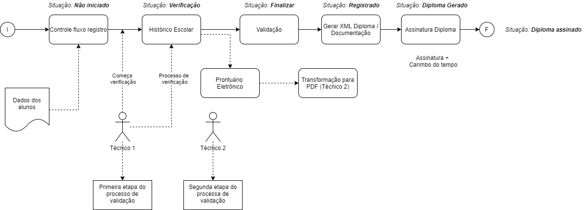

# Controle Fluxo Registro

## Funcionalidades Principais

> Fluxo com objetivo de registrar aluno no livro registro e gerar diploma digital do mesmo.

*Fluxograma do processo*

## Instalação
Certifique-se de ter as seguintes dependências instaladas:

- [Livro Registro Diploma](https://gitlab.fiap.com.br/dotnet/LivroRegistroDiploma): Sistema responsável pelos diplomas e os livros registros dos alunos.  
- [Prontuário Eletronico](https://gitlab.fiap.com.br/dotnet/Intranet.ConsultaDocumento): Sistema responsável pelos documentos no ArqMort  
- [Assinatura Diploma Digital](https://gitlab.fiap.com.br/dotnet/Intranet.AssinaturaDiplomaDigital): Front-end para assinatura dos xmls necessários para o diploma.  
- [Api - Diploma Digital](https://gitlab.fiap.com.br/dotnet/Api.DiplomaDigital): Gerar os documentos relacionados ao diploma  
- [Api - Conversor PDF](https://gitlab.fiap.com.br/dotnet/Api.ConversorPDF): Converter imagens em pdf, pdf/a e assinar

## Uso
Para utilizar o projeto, siga as etapas abaixo:

1. Configure a Intranet no IIS para utilizar o layout da FIAP.
2. Precisa criar uma pasta no C:/ com o nome de 'Diplomas'