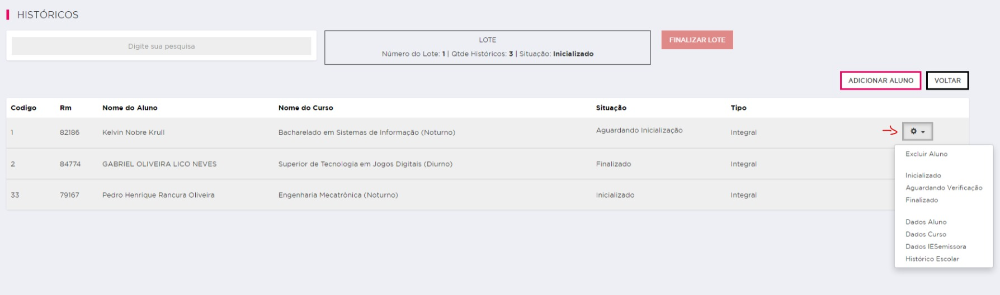
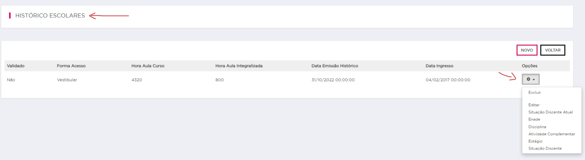

# Fluxo do Histórico Escolar Digital

## Visão Geral
O Fluxo do Histórico Escolar Digital é a segunda etapa do processo do Diploma Digital, desenvolvido para atender às novas normas do Ministério da Educação. Neste projeto, é criado o histórico digital do aluno que finalizou o curso, seguindo as especificações solicitadas pelo MEC. A versão atual deste projeto é 1.05.

- Documentação do MEC: [Link para a documentação](http://portal.mec.gov.br/diplomadigital/?pagina=pacote-instituicoes) (A partir do Item 2.4)

**Observação:** [Todas as tabelas estão no banco **Educacional**]

## Funcionalidades Principais
1. ***Informações do Lote***
   - Criação de um lote para colocar os alunos que serão criados o histórico.
   - Tabelas: HELote
    
2. ***Informações dentro do Lote***
    -- Dentro dessa tela você consegue adicionar ou remover um aluno e ver todos os que estão dentro.
    -- **Dentro da tela do Lote**

   

   1. **Excluir Aluno**: Essa opção permite excluir os dados de um aluno do lote. Ao selecioná-la, os registros do aluno serão removidos permanentemente do banco de dados.

   2. **Inicializado**: Essa opção indica que o Histórico foi iniciado, mas ainda não foi concluído. Geralmente, é usado como um status temporário para indicar que a ação está em andamento.

   3. **Aguardando Verificação**: Essa opção representa um estado em que o Histórico foi feito, porém aguarda uma verificação ou aprovação de um terceiro.

   4. **Finalizado**: Essa é a última fase do Histórico, quer dizer que foi validado e concluido com sucesso. É usado para indicar que um processo foi finalizado sem erros ou problemas pendentes.  

   5. **Dados Aluno**: Essa opção fornece acesso aos dados pessoais e informações relevantes de um aluno, como: Nome, Nomesocial, Sexo, Cpf, DataNascimento, Nacionalidade.

   6. **Dados Curso**: Essa opção permite visualizar informações sobre um curso específico, como, CodigoCursoMEC e Nome Curso.

   7. **Dados IESEmissora**: Essa opção exibe os dados da Instituição de Ensino Emissora (FIAP), como Nome, Código do MEC, CNPJ.

   8. **Histórico Escolar**: Essa opção apresenta o histórico escolar de um aluno, incluindo todas as disciplinas cursadas, notas obtidas e outras informações acadêmicas relevantes.
      - **Dentro da tela do Histórico Escolar** 
      

      1. **Situação Discente Atual**: Permite visualizar/cadastrar a situação atual do aluno em relação ao seu curso, como ativo, trancado, formado, entre outros.
      1. **Enade**: Permite visualizar/cadastrar os resultados do Enade, que avalia o rendimento dos alunos em relação aos conteúdos programáticos previstos nas diretrizes curriculares do respectivo curso de graduação
      1. **Disciplina**: Permite visualizar/cadastrar as disciplinas do curso do aluno, como nome da disciplina, carga horária, situação na disciplina (aprovado, reprovado), forma de integralização, nota, etc...
      1. **Atividade Complementar**: Permite visualizar/cadastrar as atividades complementares realizadas pelo aluno, que foram realizadas fora do currículo obrigatório do curso, mas que contribuem para sua formação acadêmica.
      1. **Estágio**: Permite visualizar/cadastrar informações sobre os estágios realizados pelo aluno durante seu curso (Opcional).
      1. **Situação Discente**: Permite visualizar/cadastrar as situações de um Aluno durante um Período Letivo

## Exemplo de um XML Finalizado.
[Clique aqui para baixar o arquivo XML](historico-87104-dac37bab-ae3d-4405-9d84-fbb2f99db883.xml)

## Arquitetura
Mostrar Json ou UML

## Instalação
Certifique-se de ter as seguintes dependências instaladas:

- [API do Histórico Digital](https://gitlab.fiap.com.br/dotnet/Api.HistoricoDigital): Sistema responsável pelo back-end, onde gera-se o RVHE, XML e CRUD das informações.  
- [Intranet do Histórico Digital](https://gitlab.fiap.com.br/dotnet/Intranet.HistoricoDigital): Front-End do sistema utilizado para criar os lotes e históricos.

## Uso
Para utilizar o projeto, siga as etapas abaixo:

1. Configure a Intranet no IIS para utilizar o layout da FIAP.
2. Precisa criar uma pasta no C:/ com o nome de 'Historicos'