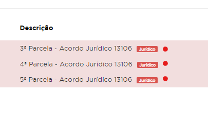

### Etiquetas do Débito

Por algumas circustâncias, o débito pode entrar em processo jurídico ou serasa. Essas duas condições, são identificados com etiquetas (é assim que o financeiro denomina), que nada mais são do que flags de status desses débitos no sistema. 



### Etiquetas Jurídico

Todos os débitos constam na tabela **FNDebitos** e a coluna correspondente as etiquetas dos débitos no jurídico é a **Externa**. 

Atualmente temos algumas letras que indicam quando o débito possui etiqueta do jurído que são: **E**, **J**, **X**, **Z**, **L**. Então para uma busca em débitos que estão no jurídico, as letras citadas devem constar no **WHERE**.

```
SELECT
Codigo, 
Tipo,
RM,
Externa,
Mes, 
Ano,
ValorCheioNominal,
DataVencimento,
DataAtualizado,
DataVencimentoDebito,
DataVencimentoPadrao,
MotivoAlteracaoDataVencimento,
OpcaoSelecionadaAlteraDataVencimento,
CodigoPessoaRespFinanceiro,
CPFResponsavel
FROM
 BaseEducacional..FNDebitos 
WHERE 
Externa in ('E', 'J', 'X', 'Z', 'L') 
	and Visivel = 1
	and Excluido = 0

``` 
- **J** e **Z** - Jurídico
- **C** -  Acordo Jurídico Cancelado
- **P** e **Y** - Pré-jurídico, Extinto
- **X** - Extinto

### Atualizações 

**No dia 18/08/2023, foi solicitado pela Barbara Barcelos, através do ticket 102840, a alteração da regra da geração dos boletos com o seguinte descritivo:** 

- Débito com etiqueta jurídica, cuja descrição seja 'acordo jurídico' ou 'acordo extra judicial' - EMITIR BOLETO VIA API

- Débito com etiqueta 'jurídico', mas com descrição mensalidade, diferença, acordo financeiro, etc - NÃO EMITIR BOLETO VIA API

