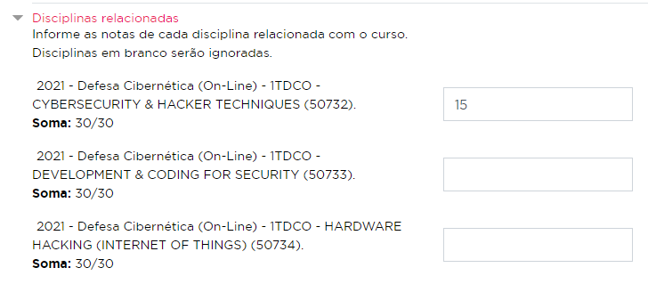
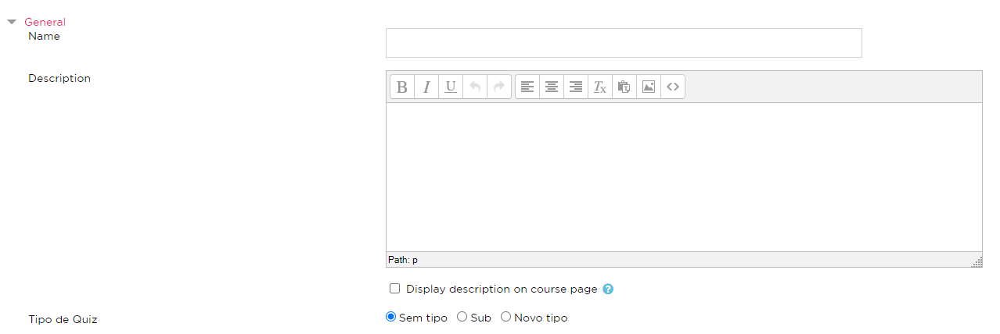

#Notas
Os cursos da plataforma possuem algumas atividades que podem valer nota para os alunos.
Ao atribuir uma nota (em caso de atividades de avaliação manual, como assign) ou no momento
em que a atividade é concluída (no caso do quiz), é criada uma task que será posteriormente
executada por um CRON no Jenkins que irá enviá-la para o boletim (com exceção das notas de
Sub Encontro Presencial 1 e 2, sendo enviadas somente se já tiverem sido pagas).

*As tasks podem ser consultadas na tabela fiapead_task_adhoc.*

Este boletim fica dentro do SQL Server, para saber mais sobre onde encontrar as notas
para cada regra, acesse a seção sobre [Boletim](/tabelas/boletim).

Para que a nota seja enviada ao boletim, nas configurações da atividade ela deve
possuir ao menos uma disciplina relacionada.

Existem duas formas de consultar se uma atividade possui disciplinas relacionadas:

*Via query*
```sql
SELECT *
FROM fiapead_moodle_relacao2004_assign
WHERE fiapead_moodle_relacao2004_assign.assignid = @assign_id;
```

*Via plataforma*

Na tela de criação/edição de uma atividade, existe uma seção chamada "Disciplinas relacionadas",
com uma listagem de todas as disciplinas que estão relacionadas ao curso ao qual a atividade pertence.

Para que a nota vá para uma disciplina, o campo de peso deve estar preenchido.
No exemplo abaixo, a nota será enviada apenas para a disciplina "CYBERSECURITY & HACKER TECHNIQUES"
com codrelacao 50732, enquanto as outras disciplinas que estão com os campos vazios não receberão
a nota.



A coluna no boletim para qual a nota será enviada e o cálculo a ser realizado com ela
depende do tipo da atividade. (Para saber mais sobre esses tipos, [clique aqui](http://conhecimento.fiap.com.br/moodle/notas/#tipos-existentes).)

*O tipo da atividade pode ser consultada na tabela fiapead_fiap_assign_config/fiapead_fiap_quiz_config.*

##Adicionando um novo tipo

### 1. Adicionando opção no formulário

**Assign**

Para adicionar um novo tipo de nota, primeiro é necessário mapeá-lo na constante
*TIPOS_ASSIGN* e em *TIPOS_ASSIGN_LABEL*, no arquivo *local/fiapdb/locallib.php*.

Em seguida, adicione o tipo desejado no arquivo *mod/assign/mod_form.php*, utilizando
a função *addAssignType*.

**Quiz**

Para adicionar um novo tipo de nota, primeiro é necessário mapeá-lo na constante
*TIPOS_QUIZ* e em *TIPOS_QUIZ_LABEL*, no arquivo *local/quiz/locallib.php*.

Em seguida, adicione o tipo desejado no arquivo *mod/quiz/mod_form.php*, utilizando
a função *addQuizType*.

### 2. Verificando se opção está habilitada

Após realizar estes passos, a nova opção deve estar disponível no formulário de
adição/edição do módulo escolhido, como na imagem abaixo, seguindo o exemplo de um quiz:



Ao marcar a opção do novo tipo e salvar, essa configuração será salva na tabela
*fiapead_fiap_(nome_do_modulo)_config* e listada abaixo do nome do conteúdo numa tarja
azul.


### 3. Criando a classe

O envio de notas da plataforma segue o padrão de projetos strategy. Se não conhece
este padrão ou quer aprender um pouco mais, visite:
[Padrões de Projeto: Strategy em PHP](https://refactoring.guru/pt-br/design-patterns/strategy/php/example)

Na classe *local/notas/classes/envio_nota_context.php*, mapeie a sua nota de acordo
com à(s) regra(s) que ela pertence na constante *TIPOS_NOTA*, indicando qual classe será
responsável por realizar as ações específicas da nota.

A seguir, crie uma classe com o nome *local/notas/classes/envio_nota_(nome_da_regra)_(tipo_da_nota).php* e implemente
a interface *envio_nota_strategy*, com todos os métodos necessários.

**Obs. 1: A documentação dos métodos está acima de cada função na interface.**

**Obs. 2: Para o método *create_request_api* talvez seja necessária a criação de uma nova rota
no projeto *php / api-fiapon*.**

### 4. Observer

O observer é responsável por criar as tasks que irão enviar a nota com o novo tipo
criado e configurado, na função *notas_exportar*.

Nesta função, existem algumas ações específicas para regras e tipos de nota. Antes de finalizar
a criação do novo tipo de nota, é importante verificar se nenhuma alteração precisa ser realizada
neste arquivo para que o novo tipo funcione corretamente.

Este observer está localizado em *local/notas/observer.php*.

##Tipos existentes

###Graduação On-line

####Sem tipo
A nota enviada é igual à nota que o aluno tirou na atividade considerando
o peso de cada codrelacao. Ela é enviada para uma tabela chamada "LancamentoNacFiap",
para o codrelacao, codAtividadeMoodle (id do assign, quiz, etc.), tipoAtividadeMoodle (assign,
quiz, etc.) e para o rm do aluno.

Na publicação das notas no boletim, as notas dessa tabela são somadas e publicadas na
coluna "AD" do boletim.

####Challenge
A nota enviada é igual à nota que o aluno tirou na atividade. Ela é enviada para a
coluna "EP2_1" no boletim e marca "EP2_1Manual" = 1.

####DP1
A nota enviada é igual à nota que o aluno tirou na atividade. Ela é enviada para a
coluna "ps1" no boletim.

####DP2
A nota enviada é igual à nota que o aluno tirou na atividade. Ela é enviada para a
coluna "ps2" no boletim.

####Encontro Presencial 1/Sub Encontro Presencial 1
A nota enviada é a soma de todas as notas que o aluno tirou em atividades marcadas
com esse tipo ou com o tipo "Sub Encontro Presencial 1" que tenham sido pagas. Ela
é enviada para a coluna "EP1" no boletim e marca "EP1Manual" = 1.

####Encontro Presencial 2/Sub Encontro Presencial 2
A nota enviada é a soma de todas as notas que o aluno tirou em atividades marcadas
com esse tipo ou com o tipo "Sub Encontro Presencial 2" que tenham sido pagas. Ela
é enviada para a coluna "EP2" no boletim e marca "EP2Manual" = 1.

####Sub AD
A prova de Sub AD é uma prova que o aluno realiza quando inicia uma turma que já
está em andamento. A nota que o aluno tirar nessa prova irá servir para todas as
atividades que foram aplicadas enquanto ele ainda não estava na turma.

A nota que o aluno tirou é inserida nas atividades da fase que ele ainda não
possui nota na plataforma, conforme o peso da atividade e também é enviada
ao boletim, conforme o peso de cada relação.

###MBA Híbrido/PWC

####Sem tipo
A nota enviada é igual à nota que o aluno tirou na atividade. Ela é enviada para a
coluna "media" no boletim e marca "tipoAvaliacao" = 1.

####Atividade Sub
A nota enviada é igual à nota que o aluno tirou na atividade. Ela é enviada para a
coluna "media" no boletim e marca "tipoAvaliacao" = 3.

###MBA On-line

####Sem tipo
A nota enviada é igual à nota que o aluno tirou na atividade. Ela é enviada para a
coluna "AtividadeOnLine" no boletim e marca "AtividadeOnLineManual" = 1.

####Atividade Sub
A nota enviada é igual à nota que o aluno tirou na atividade. Ela é enviada para a
coluna "Media" no boletim e remove a nota das colunas "AtividadeOnLine", "EncontroPresencial"
e "Challenge", marcando as respectivas colunas manuais como 0.

####Challenge
A nota enviada é igual à nota que o aluno tirou na atividade. Ela é enviada para a
coluna "Challenge" no boletim e marca "ChallengeManual" = 1.

####Encontro Presencial
A nota enviada é igual à nota que o aluno tirou na atividade. Ela é enviada para a
coluna "EncontroPresencial" no boletim e marca "EncontroPresencialManual" = 1.

####Média
A nota enviada é igual à nota que o aluno tirou na atividade. Ela é enviada para a
coluna "Media" no boletim e marca "MediaManual" = 1.
