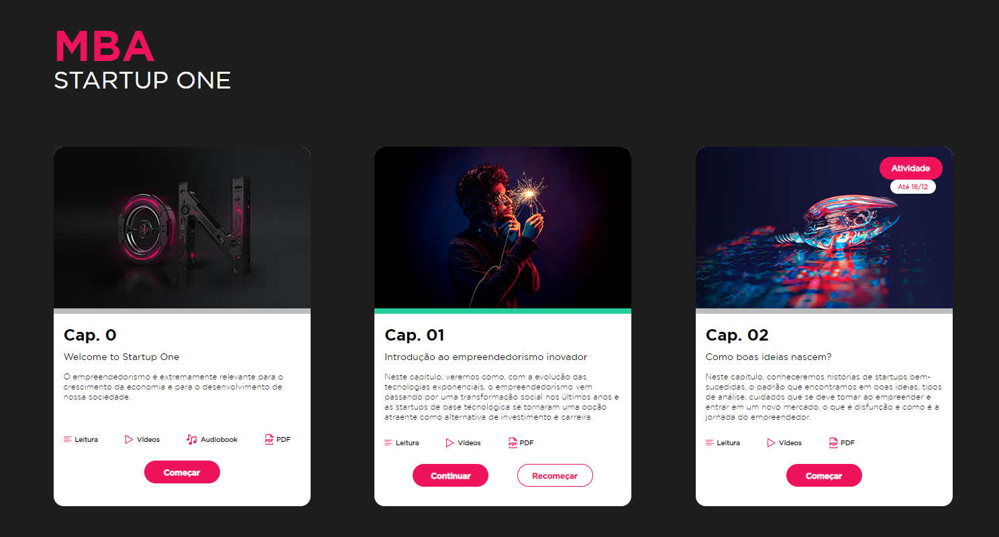
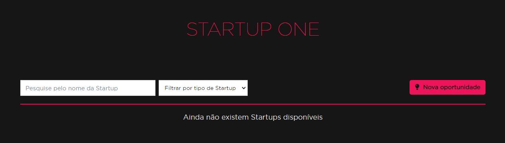

# Startup One

## Home personalizada
O curso de Startup One possui um conteúdo que é aberto assim que os usuários acessam o curso,
dando a impressão de que é a home da plataforma com um layout diferente, quando, na verdade, é apenas
um conteúdo HTML.

### Como configurar
Para que um conteúdo seja considerado uma home (também chamado de página principal), no cadastro
do conteúdo, a flag "É uma página principal" deve ser marcada.

Assim, quando o usuário acessar o curso, ele será redirecionado para o conteúdo.

### API

Para que o nome dos capítulos, quais conteúdos cada capítulo possui, as informações da atividade
atrelada e a porcentagem de visualização seja exibida para o aluno, a home consome uma API da
plataforma que retorna todas essas informações.

## Criação de grupos
O curso de Startup One também permite que os usuários criem os próprios projetos e visualizem
projetos cadastrados por outros alunos, com o nome, descrição e tipo da Startup.

Caso o curso permita essa criação, será exibido o ícone "Projetos Startup One" no menu left
para os alunos.

### Como configurar
Para que a criação de grupos seja liberada, ao cadastrar o curso a opção "Criação de grupos por
alunos" na seção "Grupos" deve estar marcada.

Ao marcar essa opção, um campo para escolher o número máximo de integrantes por grupo é exibido.

### Tipos de Startup
Os tipos de Startup disponíveis que são exibidas no filtro e no momento do cadastro do grupo
internamente são os agrupamentos do curso.

Para que eles sejam exibidos para os alunos, eles devem ser cadastrados em cada curso de
Startup One.

*Caso os agrupamentos estejam cadastrados e mesmo assim não estão disponíveis, limpe o cache.*