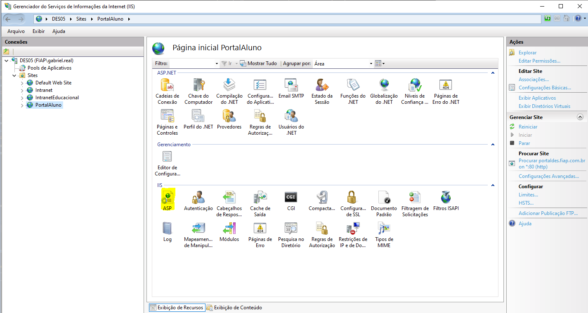
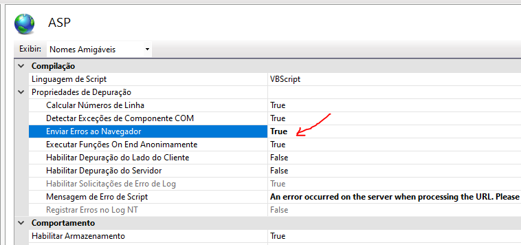

# Adicionar PortalDes ASP no IIS

## Configuração do Portal do Professor no IIS

Este documento fornece instruções detalhadas sobre como configurar o Portal do Professor no servidor IIS. Siga as etapas abaixo para realizar essa configuração.

## Download dos Projetos

Clone os seguintes repositórios GitLab:

- [Portal do Aluno](https://gitlab.fiap.com.br/dotnet/PortalAluno.git) (Projeto Principal)
- [FIAP2](https://gitlab.fiap.com.br/asp/FIAP.Fiap2) (Portal do Professor)
- [FIAP6](https://gitlab.fiap.com.br/asp/FIAP.FIAP6) (Alguns programas para alunos)
- [ControleSessao](https://gitlab.fiap.com.br/dotnet/PortalProfessor.ControleSessao.git)

## Configuração no IIS
O primeiro passo é criar uma pasta pasta vazia `C:/EmptyFolder`.

Após isso, crie uma nova aplicação no IIS -> Add Application -> Configurar o portal do aluno

Em seguida, ainda na aplicação IIS criada, adicione os diretórios virtuais especificados abaixo:

* Add Virtual Folder -> fiap -> FIAP6/fiap
* Add Virtual Folder -> net -> C:/EmptyFolder
* Add Virtual Folder -> fiap/login/login -> FIAP2/fiap/login/login
* Add Virtual Folder -> fiap/login/ipac -> FIAP2/fiap/login/ipac
* Add Virtual Folder -> fiap/login/Empresas -> FIAP2/fiap/login/Empresas
* Add Virtual Folder -> FIAP2/fiap/login/formulario_email
* Add Virtual Folder -> fiap/login/imagens -> FIAP2/fiap/login/imagens
* Add Virtual Folder -> fiap/login/professor_2004 -> FIAP2/fiap/login/professor_2004
* Add Virtual Folder -> fiap/login/ProfessorNet -> C:/EmptyFolder
* Add Application  -> ControleSessao dentro de login/ProfessorNet 

O mesmo processo deve ser feito com a pasta `programas` na raiz do portal do aluno (www2):

* Add Virtual Folder -> programas -> FIAP6/fiap
* Add Virtual Folder -> programas/login/login -> FIAP2/fiap/login/login
* Add Virtual Folder -> programas/login/ipac -> FIAP2/fiap/login/ipac
* Add Virtual Folder -> programas/login/Empresas -> FIAP2/fiap/login/Empresas
* Add Virtual Folder -> programas/login/formulario_email -> FIAP2/fiap/login/formulario_email
* Add Virtual Folder -> programas/login/imagens -> FIAP2/fiap/login/imagens
* Add Virtual Folder -> programas/login/ProfessorNet -> C:/EmptyFolder
* Add Application  -> ControleSessao dentro de login/ProfessorNet

Por fim:

* Add Virtual Folder -> includes -> C:/Git/FIAP.FIAP6/fiap/include
* Add Virtual Folder -> javascript -> C:/PastasCompartilhadasISS/javascript
* Add Virtual Folder -> updown -> C:/PastasCompartilhadasISS/updown

As pastas `javascript` e `updown` podem ser obtidas em: [PastasCompartilhadasIIS.zip](https://fiapcom.sharepoint.com/:u:/s/Desenvolvimento66/EUwSnnO29-xCjgP9z9tmtxYBnEzOvS-EcMbSygbpIPgSyw?e=9cBkMs). Após baixar, descompactar no `C:/`.

### Envio de erros ao navegador

Ir até o pool do Portal do Aluno. Em seguida, ir até a opção `ASP`. Por fim, marcar como `True` a flag `Compilação > Enviar erros ao Navegador`






## Component Services

Para executar o projeto, também será necessário configurar algumas DLLs contidas em Component Services. Os passos para instalação desses Component Services se encontram documentados no readme do [repositório do projeto FIAP.IntranetEducacional](https://gitlab.fiap.com.br/asp/FIAP.IntranetEducacional#configurar-component-services).

## Autenticação no Portal do Professor
1. Antes de autenticar-se no portal do professor, é necessário acessar o Portal do Aluno e inserir as credenciais de um professor que você deseja realizar o login. Para isso, escolha um professor a partir da consulta abaixo:

    ```sql
    SELECT * FROM site_fiap..Professor_2004
    ```

2. Altere a senha do professor para `x` (ou alguma outra senha aleatória) com a função de criptografia `SyscriptCrip`:

    ```sql
    UPDATE site_fiap..Professor_2004 SET Senha = webadm.dbo.SysCriptCrip('x',256) WHERE Codigo = ${codigo}
    ```

3. Inserir as credenciais do professor e realizar o login