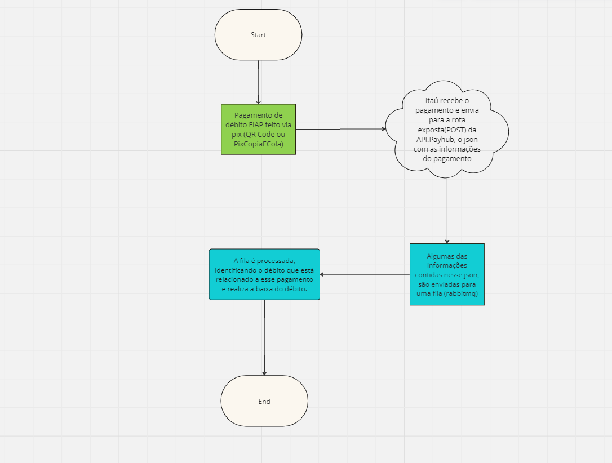

# Api.PayHub

Esta API foi criada com a proposta de **centralizar pagamentos** dos serviços prestados pela FIAP. 
Atualmente a FIAP disponibiliza essas 3 formas de pagamento: **Pix**, **Cartão de Crédito** e **Boleto Bancário**

No ano de 2024, foi implementado o pagamento via **QR Code** ou **Pix Copia e Cola**, como nova forma de pagamento no **Portal do Aluno (FIAP)** que anteriormente disponibilizava somente duas formas de pagamento: **boleto** e **cartão**.
Para o recebimento de pagamentos via QR Code ou Pix Copia e Cola, foram desenvolvidas algumas rotas no projeto Api.PayHub que fazem a comunicação com uma das API's do **Itaú** que gerenciam o recebimento e notificação dos pagamentos via pix.

<h2 id="portal-desenvolvedor-itau">Portal do Desenvolvedor do Itaú</h2>

Para **auxiliar nas implementações** e requisições para a API, o **Itaú** disponibiliza o [**Portal do Desenvolvedor**](https://devportal.itau.com.br/login).

Acesse o [**Link**](https://devportal.itau.com.br/login) e realize o login:

| E-mail            | Senha    |
|-------------------|----------|
| andre@fiap.com.br | Fiap1234 |


### APIs Regulatórias Pix Recebimentos

<h2>Preparando as requisições</h2>

Para todas as requisições feitas para as rotas da APIs Regulatórias Pix Recebimentos do Ítau, é obrigatório a utilização do token no header da requisição. Para as rotas do QR Code imediato (COB), a API Payhub já faz isso de forma automática a cada requisição. Porém se você deseja testar as rotas diretas do Itaú via Postman ou qualquer outra ferramenta de **client REST**, será necessário criar o token e armazenar-lo em uma environment da ferramenta.

Aqui está o passo-a-passo de [**como testar as rotas do Itaú via Postman**](https://devportal.itau.com.br/como-comecar#teste-via-postman)

### QR Code imediato (COB)

Um QR Code imediato tem como principais características o pagamento único e o tempo de expiração. É uma forma de recebimento que facilita a conciliação do cliente recebedor, podendo ser realizada através do identificador do QR Code (txid). Além disso, permite a inserção de valor e de dados do cliente pagador de forma opcional.

- **URL BASE**: v1/QRCodeImmediate

**Referencia da documentação Itaú para mais informações, rotas e responses** - [**APIs Regulatórias Pix Recebimentos**](https://devportal.itau.com.br/nossas-apis/itau-ep9-gtw-pix-recebimentos-ext-v2)

Para as rotas da **Api de Recebimento PIX - QR Code imediato (COB)** POST e PUT, o **Response** é o mesmo:

```json
{
    "message": "Success",
    "data": {
        "pixCopyAndPaste": "00020101021226910014BR.GOV.BCB.PIX2569spi-h.itau.com.br/pix/qr/v2/af581bdc-624e-4333-af38-1adaddfa6ce05204000053039865802BR5914PMD BASHAR RIO6009SAO PAULO62070503***6304E7DB",
        "creation": "2024-01-10T17:17:35.84",
        "expiration": 86400,
        "amount": "1104.00",
        "descriptionDebt": "Mens. Mês 10 Ano: 2023"
    }
}
```

- **message** - String - Propriedade de retorno padrão da API. **Sucess** em caso de solicitação bem sucedida ou outra mensagem descritiva em caso de algum erro durante a requisição.

- **data** - Objeto - Objeto de retorno padrão da API que pode conter diversas propriedades. Para as rotas do **QR Code imediato (COB)** temos: 

**pixCopyAndPaste**: String - Propriedade referente ao pix que pode ser copiado e colado no aplicativo de banco para ser realizado o pagamento. <br>
**creation**: String - Propriedade referente a data em que a transação foi criada. <br>
**expiration**: Int - Propriedade referente ao tempo de validade do pix. <br>
**amount**: String - Propriedade referente ao valor monetário que está sendo pago. <br>
**descriptionDebt**: String - Propriedade referente a descrição do débito que está sendo pago. <br>

<h2>POST</h2>

API para emitir um QR Code imediato em que o Itaú é responsável por criar o identificador do QR Code (txid).

- **Body** (raw > JSON):

Exemplo de body:

```json
{
    "data": "IpJaCqNo82xGnepqp9sHzaPrHHV+Dle+xBOVON8tHfW1QRKdDrZpcSni+J8uUD+dnnqYaKLRH3hzT8yKuApyUKqSEgVxXSL3t26nFMDjm3qRZ2SuFFBsJUkbTCiLJBuG1IDfnwNfni26Ga0p4Gb6dJYT1FyIfRyo9gTZcqGKn+0="
}
```

- **data**: código do débito (Codigo - FNDebitos), criptografado com **RSA-OAEP** (Optimal Asymmetric Encryption Padding)

**Atenção** - A descriptografia do código do débito, depende de uma chave privada correspondente a chave publica da qual foi usada para a criptografia, sem isso, a descriptografia não funcionará e não será possivel obter o código do débito para o seguimento do fluxo da API.

<h2>PUT</h2> 

API para emitir um QR Code imediato.

- **Parametro na url**: /bbba96adf0e442a0802761bb2758d9e5

**txid**: obrigatório - string

**Exemplo**: 88ba8ec675e044178d434908d9b2a30a <br>
**Descrição**: Identificador do QR Code que possibilita a conciliação de pagamentos. <br>
**Observação**: Este código deve possuir entre 26 e 35 posições, podendo conter letras minúsculas (a-z), letras maiúsculas (A-Z) e números (0-9).

### Webhook

- **URL BASE**: v1/webhook_itau

Disponibilizada também pela [**APIs Regulatórias Pix Recebimentos**](https://devportal.itau.com.br/nossas-apis/itau-ep9-gtw-pix-recebimentos-ext-v2) do **Itaú**, a notificação de recebimento via webhook é uma solução voltada para otimizar o processo de conciliação transacional de um recebimento via Pix, em que o cliente pode cadastrar uma URL para receber uma notificação toda vez que um Pix for recebido.

Para que o webhook funcione, é necessário o desenvolvimento de uma URL de callback exposta na web que possua uma camada de autenticação mTLS (HTTPS).

Com isso desenvolvido, o Itaú realizará uma chamada nessa URL de forma imediata toda vez que um Pix for recebido.

<h2> POST </h2> 

**Response** - Status OK

### Tratativa no recebimento da informação de pagamento

O response que o Itaú envia para nós, é um formato json com uma série de informações sobre o pagamento. Porém para o nosso contexto atual, avaliamos que não precisaríamos de todas as informações desse json e além disso, ao receber essas informações de pagamento, a api payhub terá esse comportamento a cada pagamento recebido:



<h2> Informações que são enviadas para a fila e tratadas para a baixa do pagamento </h2>

**Amount** - Valor do pagamento  <br>
**EndToEndId** - ID do pagamento, que é transitado nas mensagens com o SPI.  <br>
**Timestamp** - Horário em que o pagamento Pix foi processado no PSP.  <br>
**InfoPay** - Informação livre do pagador  <br>
**Key** - Chave na qual foi realizado o PIX.  <br>
**Txid** - O campo txid determina o identificador da transação. O objetivo desse campo é ser um elemento que possibilite a conciliação de pagamentos. 

<h2> PUT </h2>

API para configurar o serviço de notificações via webhook dos QR Codes recebidos e das transferências Pix recebidas via chave Pix para uma chave Pix.

- **Parametro na url**: /{chave}

**chave**: obrigatório - string <br>
**Descrição**: Chave pix do recebedor . <br>

**Response** - Consulte os códigos de retorno em [**Notificações de recebimento via webhook**](https://devportal.itau.com.br/nossas-apis/itau-ep9-gtw-pix-recebimentos-ext-v2#operation/put/webhook/{chave})

<h2> GET </h2>

API para consultar o serviço de notificações via webhook de uma chave PixResponseGet específica.

- **Parametro na url**: /{chave}

**chave**: obrigatório - string  <br>
**Descrição**: Chave pix do recebedor . <br>

**Response**

**WebhookUrl** - obrigatório - string - URL para chamada webhook de aviso de recebimento pix <br>
**Key** - obrigatório- string - Chave de endereçamento do recebedor cadastrada na DICT <br>
**Creation** - obrigatório - string - Data e hora de criação do webhook em formato de acordo com RFC 3339 <br>

<h2>GET</h2>

API para consultar a listagem dos serviço de notificações via webhook cadastrados.

**Response**

**Start** - string - Data inicial. <br>
**End** - string - Data fim da criação do webhook <br>
**Pagination** - object - Contém as propriedades CurrentPage, ItemsPerPage, NumberOfPages e TotalQuantityOfItems <br>
**Webhooks** - obrigatório - array -  Lista de Webhooks cadastrados para o cliente <br>

<h2>DELETE</h2>

API para excluir uma o serviço de notificação de recebimento de chave Pix via webhook.

- **Parametro na url**: /{chave}

**chave**: obrigatório - string <br>
**Descrição**: Chave pix do recebedor . <br>

**Response** - Consulte os códigos de retorno em [**Notificações de recebimento via webhook**](https://devportal.itau.com.br/nossas-apis/itau-ep9-gtw-pix-recebimentos-ext-v2#operation/delete/webhook/{chave})
