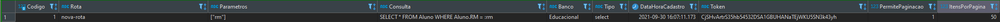
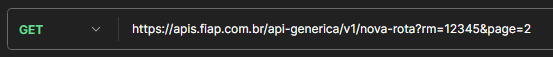

#API Genérica

É comum durante o desenvolvimento de alguma aplicação que necessitemos
de algumas rotas específicas para que o projeto funcione corretamente.

Entretanto, algumas vezes, é necessário criar uma API inteira para utilizar
apenas uma ou duas rotas, o que demanda muito tempo.

Para evitar este problema, foi desenvolvida uma API Genérica, que executa
consultas armazenadas numa tabela com base na rota e nos parâmetros informados.

##Como utilizar

###Cadastro da rota

No banco webadm, existe uma tabela chamada "APIGenerica", nela estão cadastradas
todas as rotas e suas respectivas configurações.

Para cadastrar uma nova rota, basta rodar um INSERT informando os dados necessários.

####Rota
O nome da sua rota que será informado para consumi-la. Exemplo, caso o nome da
sua rota seja "nova-rota", você deverá acessar:

> https://apis.fiap.com.br/api-generica/v1/nova-rota

####Parametros
Os parâmetros necessários para rodar a sua consulta, são informados via GET.

> https://apis.fiap.com.br/api-generica/v1/nova-rota?rm=Teste

*Se um parâmetro informado no momento do consumo da API não estiver cadastrado neste
campo, ele será desconsiderado.*

*Se algum dos parâmetros cadastrados não for informado, a API irá retornar um erro.*

####Consulta
A consulta que será executada ao acessar a sua rota. Caso ela necessite de parâmetros,
cadastre-os na consulta como no exemplo abaixo:

```sql
SELECT * FROM Aluno WHERE Aluno.RM = :rm
``` 

e no get, adicione o "rm".

####Banco
Em qual banco sua consulta deve ser executada.

*Atualmente a API oferece suporte apenas para consultas nos bancos Educacional,
Shift, site_fiap e webadm.*

####Tipo
O tipo de consulta a ser executada: select, insert, update ou delete.

*Atualmente a API oferece suporte apenas para consultas SELECT, INSERT e UPDATE.*

####Token
Authorization que deverá ser informado para que a aplicação consuma a rota.

####PermitePaginacao
Algumas vezes, queremos que os dados retornados por uma rota sejam paginados: tanto para
usabilidade quanto para evitar o erro "Request Entity Too Large".

Para isso, informamos aqui se queremos que nosso retorno seja paginado.

*Na requisição, adicione o parametro page*

**Obs.: No SQL Server, para que os dados sejam paginados, é OBRIGATÓRIO que seja informado
um ORDER BY**

###ItensPorPagina
Ainda seguindo a ideia de paginação, caso **PermitePaginacao** esteja marcado como 1,
neste campo deverá ficar quantos itens por página devem ser retornados.

###Consumindo a rota

Após realizar o cadastro, basta acessar a rota no seguinte formato:

> https://apis.fiap.com.br/api-generica/v1/{rota}?param=teste&param2=teste2

E caso tenha adicionado paginação:

> https://apis.fiap.com.br/api-generica/v1/{rota}?param=teste&param2=teste2&page=3

Exemplo:

A rota


*Lembrando que o tipo = "select" subentende-se que é um método GET*

É consumida da seguinte forma:


