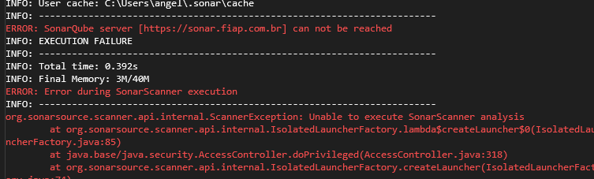

# Sonarqube para projetos .NET no ambiente Linux

As instruções abaixo demonstram como configurar o Sonarqube em ambiente Linux.

**Observação**: Dado que aplicações .NET Framework não são compatíveis com o ambiente Linux, a configuração especificada nessa documentação funciona apenas para aplicações .NET Core.

## Configurando a máquina

1 -  Primeiro, será necessário instalar o Java. Para isso, basta seguir os comandos abaixo no terminal:

```sh
# Atualizar repositórios apt
sudo apt update

# Instalar JRE
sudo apt install default-jre

# Conferir se foi instalado
java -version

# Instalar JDK
sudo apt install default-jdk

# Conferir se foi instalado
javac -version
```

2 - Após isso, será necessário adicionar o Sonarqube da FIAP no arquivo hosts. Para isso, primeiro você deve alterar esse arquivo:

```sh
sudo nano /etc/hosts
```

Incluir a linha abaixo:

```sh
192.168.11.3 sonar.fiap.com.br
```

3 - Em seguida, você deve acessar o <a href="https://sonar.fiap.com.br/projects" target="_blank">SonarQube</a>, autenticar-se e gerar um token de autorização. Para isso, vá até o avatar do seu usuário e siga o caminho `My Account` > `Security` e gere o token. Guarde o valor dele. 


4 - Após isso, será necessário criar as variáveis de ambiente do Java e do token de autorização via terminal. Para isso:
 
Primeiro, alterar o arquivo `bash.bashrc`

```sh
sudo nano /etc/bash.bashrc
``` 

Incluir as linhas abaixo:

```sh
export JAVA_HOME=/usr/lib/jvm/java-17-openjdk-amd64
export PATH=$PATH:$JAVA_HOME/bin
export SONAR_TOKEN=seu_token
```

Depois, aplicar a persistência das variáveis e resetar o terminal:

```sh
sudo -s

source /etc/bash.bashrc

exit
```

Após isso, você pode conferir os valores das variáveis de ambiente:

```sh
env | grep -E "^(JAVA_HOME|PATH|SONAR_TOKEN)"
```

## Configurando o projeto

1 - Para configurar o projeto .NET Core com o Sonarqube, primeiro você deve instalar as dependências de Coverage e do Sonarscanner com os seguintes comandos:

```sh
dotnet tool install --global dotnet-sonarscanner

dotnet tool install --global dotnet-coverage
```

2 - Após isso, você deve criar uma pasta com o nome `.sonarqube` na raiz no projeto. Depois disso, incluir no arquivo `.gitignore` a pasta criada, bem como o arquivo `coverage.xml`, que é gerado após os testes serem executados pelo Sonarqube.

3 - Ainda na raiz do projeto, criar um arquivo shell script com o nome `sonar.sh`:

```sh
nano sonar.sh
```

Em seguida, adicionar o conteúdo do script abaixo ao arquivo:

```sh
#!/bin/bash

PARENT_DIR=$(pwd)
PARENT_DIR=${PARENT_DIR//\// }

LAST_WORD=$(echo $PARENT_DIR | awk '{print $NF}')

echo "dotnet:$LAST_WORD"

SONAR_HOST_URL="https://sonar.fiap.com.br"
SONAR_TOKEN=$SONAR_TOKEN

if [ -z "$SONAR_TOKEN" ]; then
    echo "Erro SONAR_TOKEN: variável de ambiente do token de acesso não foi definida"
    exit 1
fi

dotnet sonarscanner begin /k:"dotnet:$LAST_WORD" /d:sonar.host.url="$SONAR_HOST_URL" /d:sonar.login="$SONAR_TOKEN" /d:sonar.cs.vscoveragexml.reportsPaths=coverage.xml

dotnet build -no-incremental

dotnet-coverage collect "dotnet test" -f xml -o "coverage.xml"

dotnet sonarscanner end /d:sonar.login="$SONAR_TOKEN"
```

4 - Com o arquivo criado, dar as permissões para torná-lo executável:

```sh
chmod +x ./sonar.sh
```

5 - Por fim, rodar o shell script utilizando o arquivo criado:

```sh
./sonar.sh
```

## Erro de SSL

Caso ocorra algum erro de ssl conforme o da figura abaixo:



Baixar o certificado necessário para executar o Sonarqube conforme o passo-a-passo presente na documentação <a href="http://conhecimento.fiap.com.br/devops/sonarqube-dotnet-windows/" target="_blank">SonarQube no ambiente Windows</a>. Em seguida, executar o comando abaixo:

```sh
sudo keytool -import -alias myServerCert -file "${sua_pasta}/fiap-com-br-chain.pem" -keystore "$JAVA_HOME/lib/security/cacerts" -storepass changeit
```

Após isso, rodar novamente o arquivo `sonar.sh` e verificar se o Sonarqube foi executado com sucesso.