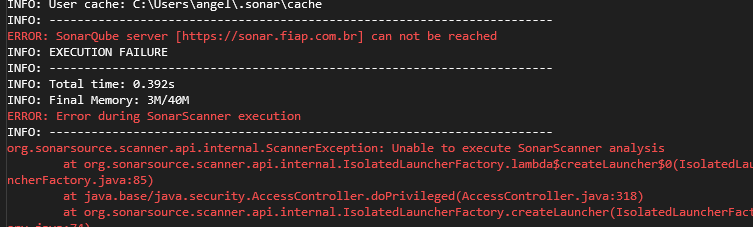
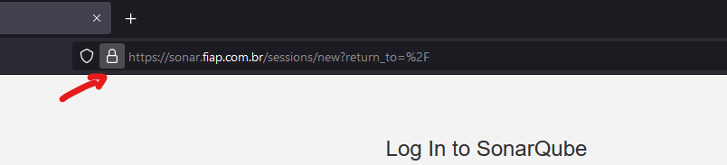
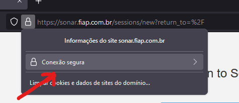
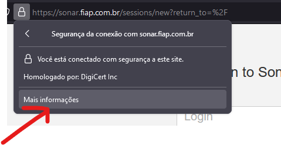
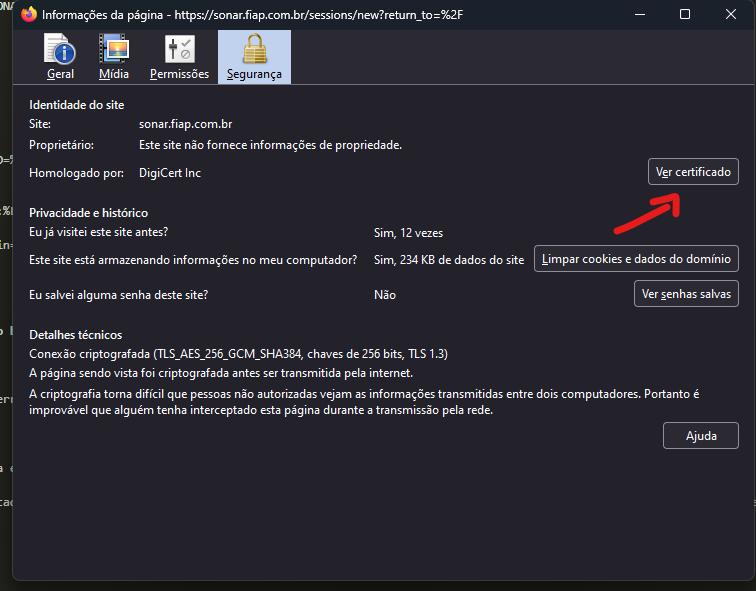
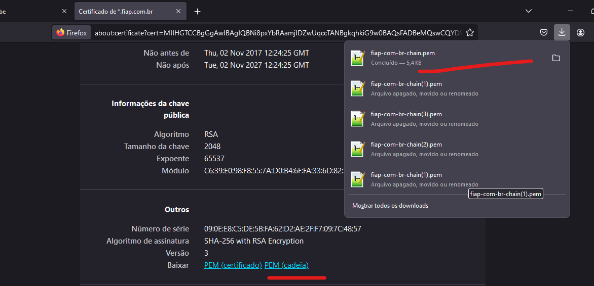

# Sonarqube para projetos .NET no ambiente Windows

## Configurando a máquina

* ### Configurando o Java JDK
    * Baixar <a href="https://www.oracle.com/java/technologies/javase/jdk17-archive-downloads.html" target="_blank">Java JDK 17</a> para o SonarScanner;
    * Localize o diretório de instalação do Java;
        ```html
        Se você não alterou o caminho durante a instalação, ele será parecido com isso 
        C:\Program Files\Java\jdk-x.x.x
        ```
    * Agora Adicionaremos o <b>Java</b> como variavel de ambiente;
    * Vá para <b>Painel de controle > Sistema > Configurações avançadas do sistema</b>;
    * Clique no botão <b>Variáveis de ambiente > Variáveis do sistema > Novo </b>;
    * No campo <b>Nome da variável</b> insira:
        * JAVA_HOME 
    * No campo <b>Valor da variável</b>, insira o seu caminho da instalação do JDK:
        ```html
        Caminho escolhido na instalação ou o caminho padrao: 
        C:\Program Files\Java\jdk-x.x.x
        ```
    * Depois em <b>OK</b> para salvar, após isso adicione outra variavel de ambiente;
    * Clique em <b> Variáveis do sistema > Path > Novo </b>;
        ```html
        %JAVA_HOME%\bin
        ```

* ### Configurando o MSBuild
    * Localize o diretório de instalação do <b>VisualStudio</b> e procure pela pasta do MSBuild
      ```html
      Se você não alterou o caminho durante a instalação, ele será parecido com isso 
      C:\Program Files\Microsoft Visual Studio\2022\Community\MSBuild\Current\Bin
      ```
    * Agora Adicionaremos o <b>MSBuild</b> como variavel de ambiente;
    * Vá para <b>Painel de controle > Sistema > Configurações avançadas do sistema</b>;
    * Clique no botão <b>Variáveis de ambiente > Variáveis do sistema > Path > Novo </b>;
      ```html
      C:\Program Files\Microsoft Visual Studio\2022\Community\MSBuild\Current\Bin
      ```
* ### Configurando o SonarScanner
    * Baixar <a href="https://docs.sonarqube.org/latest/analysis/scan/sonarscanner-for-msbuild/" target="_blank">DLL do SonarScanner</a> para o .NET Framework e instalar o .NET Core Global Tool para aplicações CORE+;
    * Criar pasta para a DLL no C:\\ (Caminho padrão: ```C:\sonarqube\sonar-scanner-net-framework```);
    * Adicionar SonarQube no **"C:\Windows\System32\drivers\etc\hosts"** ```192.168.11.3  sonar.fiap.com.br```;
    * Acessar <a href="https://sonar.fiap.com.br/projects" target="_blank">SonarQube</a> e criar Token para utilização;
    * Adicionar Token nas variáveis de ambiente com o nome de SONAR_TOKEN;
    * Adicionar na variável de ambiente PATH o caminho do diretório aonde está o executável instalado acima.

## Configurando o projeto

* Criar projeto no SonarQube;
* Adicionar o trecho a seguir no .gitignore do projeto
> ```gitignore
> # SonarQube
> .sonarqube/
> ```
* Adicionar o arquivo **sonar.bat** na pasta principal do projeto de acordo com a versão do .NET.


### .NET Core

> ```sh
> call set PARENT_DIR=%CD%
> set PARENT_DIR=%PARENT_DIR:\= %
> set LAST_WORD=
> for %%i in (%PARENT_DIR%) do set LAST_WORD=%%i
> echo dotnet:%LAST_WORD%
> 
> dotnet sonarscanner begin /k:"dotnet:%LAST_WORD%" /d:sonar.host.url="https://sonar.fiap.com.br"  /d:sonar.login=%SONAR_TOKEN%
> dotnet build
> dotnet sonarscanner end /d:sonar.login=%SONAR_TOKEN%
> ```

### .NET Framework

> ```sh
> call set PARENT_DIR=%CD%
> set PARENT_DIR=%PARENT_DIR:\= %
> set LAST_WORD=
> for %%i in (%PARENT_DIR%) do set LAST_WORD=%%i
> echo dotnet:%LAST_WORD%
> 
> SonarScanner.MSBuild.exe begin /k:"dotnet:%LAST_WORD%" /d:sonar.host.url="https://sonar.fiap.com.br" /d:sonar.login=%SONAR_TOKEN% 
> MSBuild.exe /t:Rebuild
> SonarScanner.MSBuild.exe end /d:sonar.login=%SONAR_TOKEN% 
> ```

## Executando

> **Depois de configurar tudo, basta rodar o bat pelo CMD e sucesso!**

## Erros

Se após rodar o bat pelo CMD apresentar um erro igual a esse da imagem



É possivel que o certificado do sonar esteja expirado na sua máquina. Para soluncionar temos a seguinte solução:

Primeiramente é necessário baixar o certificado atualizado acessando <a href="https://sonar.fiap.com.br/projects" target="_blank">SonarQube</a> pelo navegador **Firefox**. 

Clique no símbolo de cadeado 



Em seguida, clique em conexão segura



E em seguida, clique em Mais informações



Abrirá essa janela. Clique em Ver certificados



Na aba **Thawte TLS RSA CA G1** baixe o arquivo **PEM (cadeia)**. O arquivo baixado terá o nome de **fiap-com-br-chain.pem**



Após esse processo, preciso fazer com que o jdk do java reconheça o certificado atualizado. Para isso vamos rodar o seguinte comando.

**No Windows**

keytool -import -alias myServerCert2 -file "caminho de onde você deixou o arquivo fiap-com-br-chain.pem" -keystore "caminho onde o java está instalado na sua maquina" -storepass changeit

- Exemplo 

```html
keytool -import -alias myServerCert -file "C:\CertificadoSonar\fiap-com-br-chain.pem" -keystore "C:\Program Files\Java\jdk-17\lib\security\cacerts" -storepass changeit
```

Se não houver erros ao rodar esse comando, você poderá rodar o arquivo sonar.bat novamente que irá compilar o projeto e irá mandar para o <a href="https://sonar.fiap.com.br/projects" target="_blank">SonarQube</a> e assim pesquisando pelo projeto que você acaba de subir, poderá verificar a qualidade do código do projeto.


