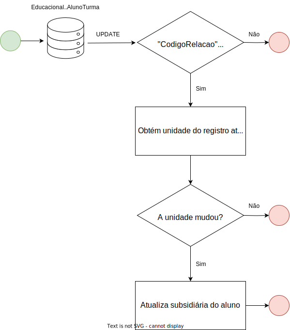
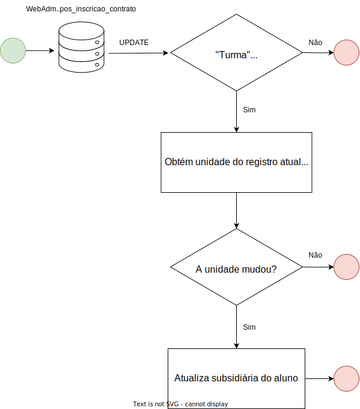

# C. Cenários de atualização de subsidiária

Na plataforma da NetSuite existem `Subsidiárias`, referente à empresa (nesse caso a FIAP e Módulo) a ser vinculada ao cliente e, consequentemente, ao pedido de venda. Desse modo, existem alguns tipos de subsidiária já cadastrados na plataforma:

- VSTP EDUCACAO S.A. - Lins de Vasconcelos
- VSTP EDUCACAO S.A. - Paulista
- VSTP EDUCACAO S.A. - Fidencio Ramos
- MD EDUCACIONAL LTDA
- VSTP EDUCACAO S.A.

Essas subsidiárias são definidas na importação do aluno e do pedido de venda, isso é feito a partir do RM e da turma do aluno. A partir dos [ranges de RM](http://conhecimento.fiap.com.br/outros/rms/#range-de-rms) e também pela turma do aluno (em caso de curso presencial).

Também existem cenários para monitorar a troca de subsidiária, que ocorre, por exemplo, em casos de troca de turma. Assim como nos [cenários de importação de pedido de venda](), também existem estratégias diferentes para cada cenário de atualização de subsidiária. Ambos estão descritos nos tópicos abaixo.

## Troca de subsidiária de graduação e colégio

**Strategy**: UpdateGraduateSchoolSubsidiaryStrategy

**Consumer**: UpdateGraduateSchoolSubsidiaryConsumer

O cenário para troca de subsidiária de graduação e colégio está ilustrado no fluxograma abaixo.

## Troca de subsidiária de pós-graduação

**Strategy**: UpdatePostGraduateSubsidiaryStrategy

**Consumer**: UpdatePostGraduateSubsidiaryConsumer

O cenário para troca de turmas de pós-graduação está ilustrado no fluxograma abaixo.

