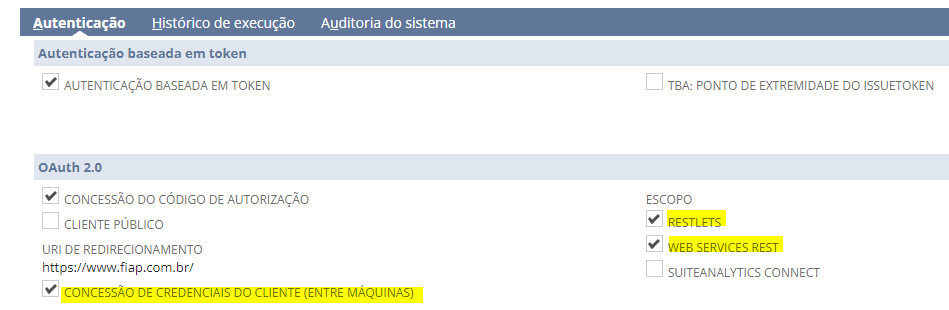
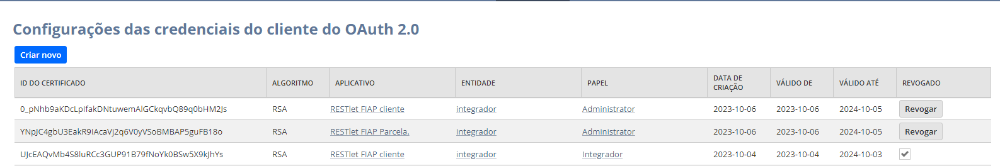

# E. Integrações

Esta documentação especifica todas as integrações utilizadas no consumo da API da NetSuite. Estão descritos como consumir cada uma das APIs (Autenticação, Cliente, Pedido de Venda e Agendamento de Débitos).

### Autenticação

A NetSuite possui dois métodos para autenticar as integrações presentes dentro da plataforma, ambos baseados em OAuth2. São eles: `Authorization Code Grant` e `Machine to Machine (M2M)`. Uma vez que o método `Authorization Code Grant` não é automatizado, pois necessita de intervenção do usuário, apenas o método `Machine to Machine` foi utilizado no projeto. Esse método está documentado no tópico seguinte.

#### Machine to Machine (ou Client Credentials Flow)
O método de autenticação Machine to Machine (M2M), especificado na documentação [OAuth 2.0 Client Credentials Flow](https://docs.oracle.com/en/cloud/saas/netsuite/ns-online-help/section_162730264820.html#OAuth-2.0-Client-Credentials-Flow), é destinado a interações entre máquinas e não requer nenhuma interação do usuário. Ele se baseia no upload e revogação de certificados para cada uma das integrações cadastradas na plataforma da NetSuite. Por ser automatizado, esse foi o método utilizado para autenticar as integrações, visto que o intuito deste projeto é sincronizar o fluxo de importação de débitos da FIAP dentro da plataforma da NetSuite de forma automatizada.


##### Habilitando a autenticação Machine to Machine
Para habilitar o método de autenticação `Machine to Machine (M2M)` é necessário ir até as páginas das integrações desejadas. Para isso, basta seguir o caminho `Configuração > Integração > Gerenciar Integrações`. Após isso, selecione a respectiva integração. Por fim, ao abrir a página da integração, clique no botão "Editar" e, em sequência, vá até o menu "Autenticação" e habilite as opções em destaque na figura abaixo.



Ainda nessa página, será importante coletar um parâmetro chamado "Chave do Consumidor". Esse parâmetro é necessário para consumir a API de autenticação empregada no método M2M (descrito nos tópicos posteriores). Ele é exibido na seção "Credenciais de cliente", na parte inferior da página. Caso ele não apareça, clique em "Redefinir Credenciais". Guarde esse valor para cada uma das integrações necessárias, pois serão utilizados nos passos seguintes.


#####  Geração dos certificados

Conforme mencionado anteriormente, esse método se baseia na geração e upload de certificados de integração. A geração de um certificado deve ser feita a partir do [openssl](https://www.openssl.org/source/). Para isso, basta executar o comando abaixo, que gera um certificado criptografado com o algoritmo RSA. É necessário instalar o `openssl` e rodar o comando no terminal (ou no PowerShell, caso esteja no Windows). Também é possível executar o comando via Git Bash.


```bash
openssl req -x509 -newkey rsa:3072 -keyout ${nome}_key.pem -out ${nome}_cert.pem -days ${dias} -nodes
```

**Observações**:

`nome` se refere ao prefixo do nome dos arquivos de certificado que serão gerados

`dias` se refere à validade do certificado em dias. A **validade máxima do certificado é de dois anos**. Se o certificado for válido por um período mais longo, a NetSuite reduz automaticamente a validade para dois anos.

Após executar o comando, serão gerados dois arquivos, `${nome}_key.pem` e `${nome}_cert.pem` um refente à chave do certificado e outro ao certificado assinado em si, respectivamente.

É importante ressaltar que **cada integração deverá possuir o seu próprio certificado**.

Mais detalhes podem ser obtidos na documentação [OAuth 2.0 Client Credentials Setup](https://docs.oracle.com/en/cloud/saas/netsuite/ns-online-help/section_162686838198.html#OAuth-2.0-Client-Credentials-Setup).

##### Importando certificados

Após gerar os certificados, será necessário importá-los na plataforma da NetSuite. Para fazer isso vá até ela e siga o caminho `Configuração > Integração > Configurações das credenciais do cliente do OAuth 2.0`. Será exibida a tela abaixo com todos os certificados já importados.



Para importar um novo certificado, clique em "Criar Novo". Será aberto um modal para a inserção dos dados do certificado. No campo "Entidade", selecione o usuário "Integrador"; no campo "Papel", selecione a role "Administrator"; no campo "Aplicativo", selecione a integração desejada. Por fim, faça o upload do arquivo do certificado (`${nome}_cert.pem`) no campo "Certificado" e salve. Após importado, guarde o **id do certificado** para cada uma das integrações, pois ele será usado nos passos seguintes.

##### Endpoint de autenticação

Após importar os certificados, será necessário consumir o endpoint da NetSuite responsável por gerar o token de acesso para autenticar as integrações. Esse endpoint está presente na requisição `Get Access Token (Generate JWT)`, documentada na collection do Postman `Secure - OAuth 2.0 REST Client Credentials`.

Conforme a [documentação da NetSuite](https://docs.oracle.com/en/cloud/saas/netsuite/ns-online-help/section_162755359851.html#Request-to-the-Token-Endpoint-and-the-Access-Token-Response), será necessário gerar um JSON Web Token (JWT) para consumir o endpoint em questão. A request `Get Access Token (Generate JWT)`, mencionada anteriormente, mostra como fazer isso na seção `Pre-request script` do Postman, que possui um script em JavaScript para gerar esse token. 

Especificações do token JWT:

- `issuer`: esse header deverá conter o valor do parâmetro `CHAVE DO CONSUMIDOR` da respectiva integração.

- Deverá ser assinado de acordo com a chave do certificado gerado (contida no arquivo ${nome}_key.pem) e com o **id do certificado** da respectiva integração na plataforma da NetSuite.


Demais informações sobre como consumir esse endpoint e sobre como gerar o token JWT podem ser encontradas na [documentação da NetSuite](https://docs.oracle.com/en/cloud/saas/netsuite/ns-online-help/section_162755359851.html#Request-to-the-Token-Endpoint-and-the-Access-Token-Response).


Após consumir esse endpoint, o `access_token`, necessário para consumir a integração desejada, será gerado. Basta informá-lo no header "Authorization" dessa integração com o schema "Bearer", uma vez que se trata de um token JWT.

**Observação**: Todo o processo de consumo dessa API, incluindo a geração do JWT, já foi implementado no projeto .NET.

### Cliente

Os endpoints referentes à integração de Cliente estão presentes na collection do Postman `RESTlet FIAP cliente`. Será necessário seguir os passos de autenticação descritos no tópico de "Autenticação", sendo necessário gerar os certificados e o token JWT para a integração de Cliente.

Exemplo de corpo de requisição para criação de um cliente (TODO: Verificar a necessidade de colocar isso aqui, visto que já existe na collection):
```json
{
   "action":"create",
   "isperson":"T",
   "email":"teste_cria@gmail.com",
   "phone":"44657893",
   "mobilephone":"(11)999658251",
   "custentity_rsc_rm":"1111",
   "subsidiaria":"VSTP EDUCACAO S.A. - paulista",
   "category":"2",
   "firstname":"Teste",
   "lastname":"Integração",
   "companyname":"",
   "legalname":"",
   "ienum":"",
   "im":"",
   "emailmarketing":true,
   "custentity_psg_br_cpf":"42353024858",
   "address":[
      {
         "line":0,
         "label":"Endereço",
         "defaultbilling":true,
         "defaultshipping":true,
         "zip":"09631-090",
         "addr1":"Rua Almirante Tamandaré",
         "custrecord_sit_address_i_numero":55,
         "custrecord_sit_address_complemento":"KDM",
         "custrecord_sit_address_t_bairro":"Rudge Ramos",
         "city_name":"Rio de Janeiro - RJ",
         "state":"SP"
      }
   ]
}
```

### Pedido de Venda

Os endpoints referentes à integração de Pedido de Venda estão presentes na collection do Postman `RESTlet FIAP SO`. Será necessário seguir os passos de autenticação descritos no tópico de "Autenticação", sendo necessário gerar os certificados e o token JWT para a integração de Pedido de Venda.

(TODO: Quando forem definidos os payloads de POST e PUT, descrever os campos utilizados aqui)

Exemplo de corpo de requisição para criação de um pedido de venda (TODO: Verificar a necessidade de colocar isso aqui, visto que já existe na collection):
```json
{
   "subsidiaria":"VSTP EDUCACAO S.A. - Paulista",
   "date_so":"24/05/2023",
   "status":"Pending Approval",
   "custbody_o2s_transaction_l_tip_doc_fis":"4",
   "rm":"1111",
   "custbody_register":true,
   "custbody_coursetype":"1",
   "custbody_installment_x":10,
   "custbody_rsc_full_value":40000.00,
   "item":[
      {
         "item":"1527",
         "valor_matricula":250.00
      }
   ]
}
```

### Agendamento de Débitos

Os endpoints referentes à integração de Agendamento de Débitos estão presentes na collection do Postman `RESTlet FIAP Agendamento de Débitos`. Será necessário seguir os passos de autenticação descritos no tópico de "Autenticação", sendo necessário gerar os certificados e o token JWT para a integração de Agendamento de Débitos.

(TODO: Quando forem definidos os payloads de POST e PUT, descrever os campos utilizados aqui)

Exemplo de corpo de requisição para criação de um agendamento de débito (TODO: Verificar a necessidade de colocar isso aqui, visto que já existe na collection):
```json
{
   "name":"teste",
   "date_invoice":"27/08/2023",
   "custrecord_value":"2500.98",
   "custrecord_rsc_rm":"1111",
   "custrecord_external_id_fiap":"123456",
   "schedule_stats":"ABERTO"
}
```

### Collections do Postman

Cada umas das integrações com a API da NetSuite estão presentes nas collections do Postman abaixo:

- `RESTlet FIAP cliente`: Criação, seleção e exclusão de Cliente
- `RESTlet FIAP SO`: Criação, seleção e exclusão de Pedido de Venda
- `RESTlet FIAP Agendamento de Débitos`: Criação, seleção e exclusão de Agendamento de Débitos
- `Secure - OAuth 2.0 REST Client Credentials`: Geração de token de acesso (Machine to Machine)

O download das collections pode ser feito [aqui](./collections.zip).