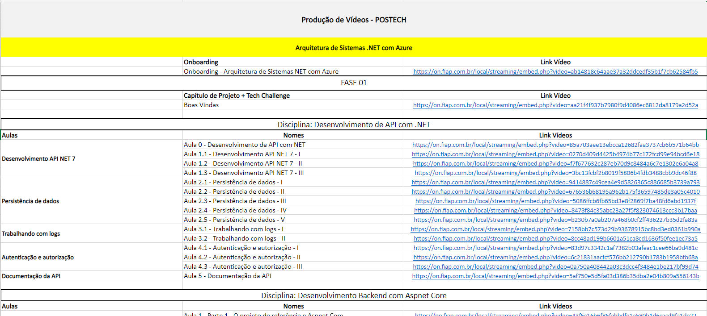
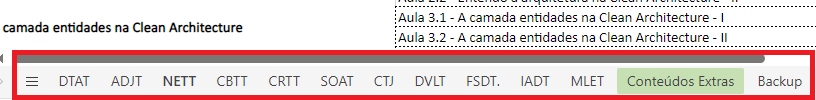
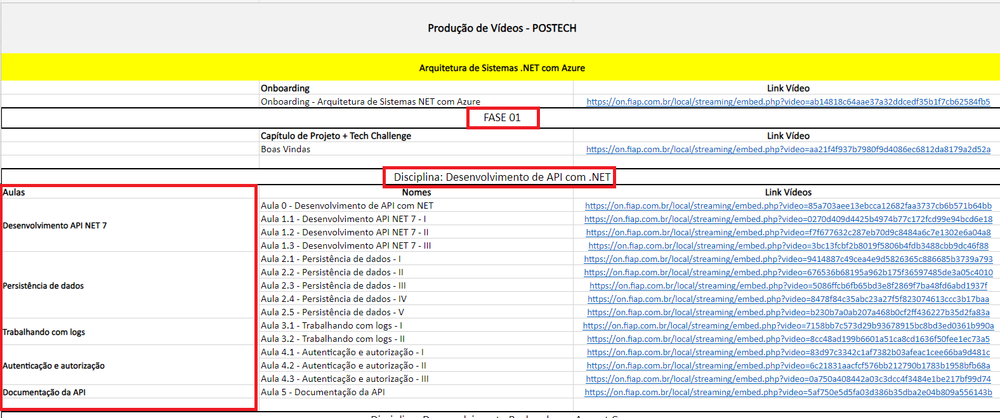
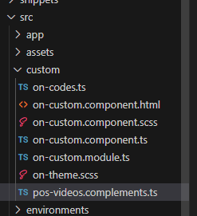
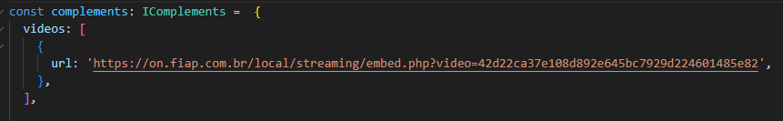
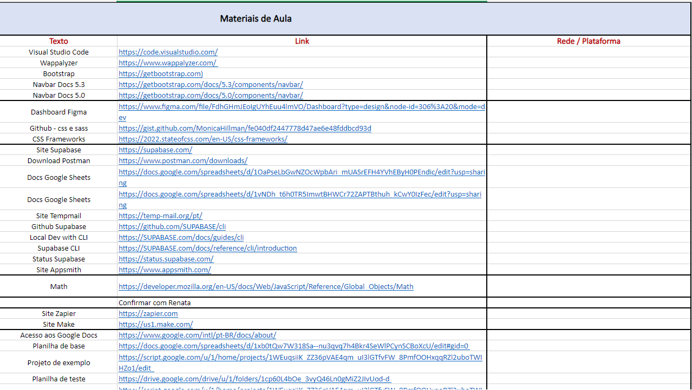

# Pós-Tech

Seja bem-vindo(a) a documentação de Pós-Tech! Aqui iremos demonstrar os passos para você começar a desenvolver no ambiente de pós graduação da FIAP!

## Passos iniciais

1. Verifique se você está utilizando os npm-modules para Pós-Tech. Caso não tenha, você pode acessar ele [por aqui](https://gitlab.fiap.com.br/ead/outros/node-modules).

2. Insira os [snippets de código](https://gitlab.fiap.com.br/ead/on-template-pos/-/tree/main/snippets) para Pós-tech.

3. Clone a [template de Pós-Tech](https://gitlab.fiap.com.br/ead/on-template-pos).

4. Veja o [Figma](https://www.figma.com/file/ujRD4IsV4zz2fdLWsbPt2y/(ANTIGOS)-Senha%3A-fiap2023-Template-FIAP-ON-P%C3%B3s-Tech?type=design&mode=design) de pós-tech para ver o exemplo de como deve ser o padrão de design de Pos-Tech.
(Lembrete, a senha é "fiap2023").

A partir disso, você está pronto para entender o funcionamento de Pós-Tech, e então começar a fazer capítulos desta área!

## Diferenças entre Graduação e Pós-Tech

### Arquivos novos

Aqui em Pós-Tech temos alguns arquivos a mais do que em graduação. 

## Esteira de produção

### HTML2

### HTML3

### QA

### HTML4 

Agora que você viu como montar a estrutura e a inserir as imagens de um capítulo de Pós-Tech, nesta estapa do HTML 4, veremos como colocaremos os vídeos. 

#### Acessando à planilha de alocação

Assim como na graduação, o link dos vídeos é disponibilizado por uma planilha no Sharepoint descrito como: ['Produção de Vídeos - POSTECH'](https://fiapcom.sharepoint.com/:x:/s/TimePSTECH/EV1sCpcA6rBKlFSWbjworaABfleWMne6S-k4N8wJmzGoPQ?e=5Havad).

#### Alocando vídeos

Para encontrar os links referentes do capítulo necessário, no canto inferior da planilha está localizado as siglas dos cursos.

No curso selecionado, localize: a **fase** em que está sendo feito o capítulo, a **disciplina** e a **aula** em questão.

Após isso, no HTML, na pasta 'src' teremos o arquivo 'pos-video.complements.ts'

Dentro desse componente, os links dos vídeos são inseridos dentro do array de 'vídeos' na varíavel 'complements'

> OBS: Caso a aula possua mais de um vídeo, lembre-se de abrir um nova chave com o nome 'url:'

#### Material Complementar

O material complementar encontra-se na planilha ['Repositório de Conteúdos - Aulas'](https://fiapcom-my.sharepoint.com/:x:/r/personal/eduardo_bortoli_fiap_com_br/_layouts/15/Doc.aspx?sourcedoc=%7BBE9C8673-0AD8-4EF3-92EE-98D3E3314025%7D&file=Reposit%25u00f3rio%20de%20Conte%25u00fados%20-%20Aulas.xlsx&action=default&mobileredirect=true) e são links que o professor gostaria de compartilhar com os alunos.

Assim como nos vídeos, os materiais complementares são inseridos como um objeto no array do 'complementary_material', sendo necessário colocar como 'reference' o texto referente ao link.

#### Transcrições

As transcrições contêm o texto, as imagens e os códigos do que é dito no vídeo.

### Enviar para Plataforma

### Nomenclatura das turmas

| Curso  | Sigla |
| ------------- | ------------- |
| ADJT  | Arquitetura e Desenvolvimento JAVA  |
| CBTT  | Defensive Cyber Security - Blue Team Operations  |
| CRTT |  Offensive Cyber Security - Red Team Operations  |
| CTJT  | Coding & Tech Journey  |
| NETT  | Arquitetura de Sistemas .NET com Azure  |
| SOAT  | Software Architecture  |
| DTAT  | Data Analytics  |

