# Produtividade no ambiente de desenvolvimento dos Devs de Conteúdo

Neste guia, você aprenderá a otimizar sua produtividade ao criar atalhos de teclado, usar extensões e macros para simplificar as tarefas realizadas pela equipe de desenvolvimento do FIAP ON.

## Abreviação do comando 'Git'

Neste processo, você aprenderá a criar um alias para simplificar a utilização do comando 'Git', tornando a execução de tarefas mais ágil e eficiente.

Comece por abrir o arquivo de configuração do seu shell do Git. O nome deste arquivo pode variar dependendo do sistema operacional que você está usando, podendo ser `.bashrc`, `.zshrc`, ou outro.

O caminho para o arquivo, se você tiver seguido a instalação padrão, provavelmente será encontrado em `C:\Program Files\Git\etc`.

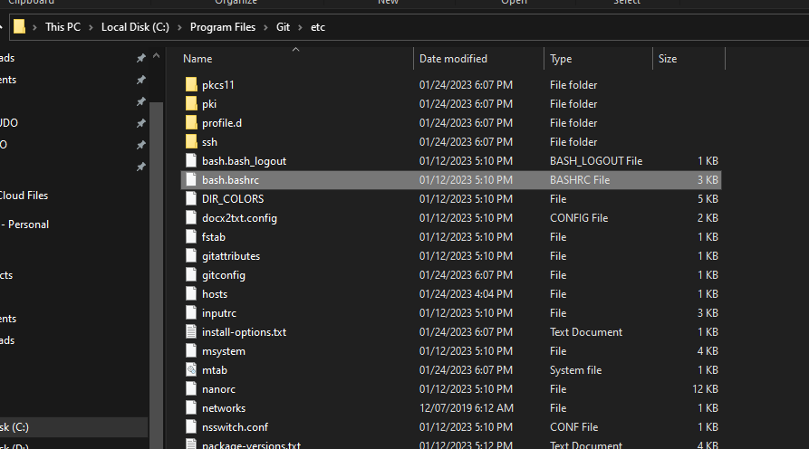

Abra o arquivo com o Notepad (ou qualquer editor de texto de sua escolha) como administrador para que você possa salvar as alterações que faremos.

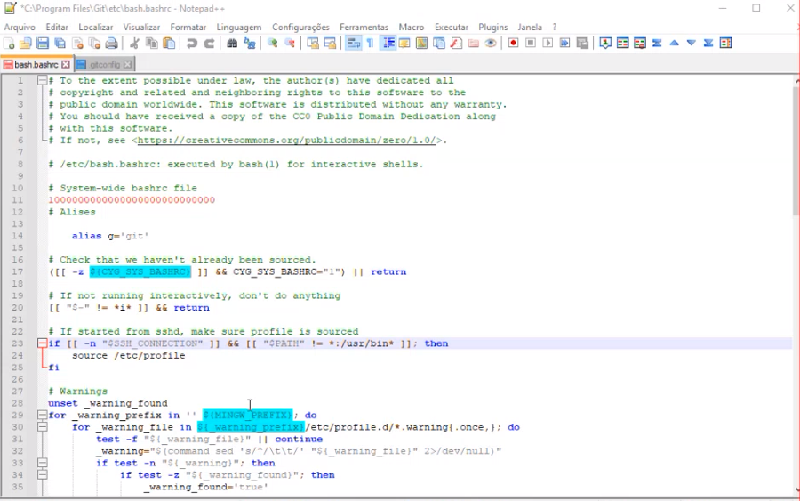

Dentro do arquivo de configuração, adicione um comentário explicando sua intenção de criar aliases para abreviar comandos, semelhante ao que foi feito na linha 12 da imagem anterior. Isso ajudará a manter o arquivo organizado e compreensível.

```bash
# Aliases
```

Agora, defina seu alias. Para criar um alias, utilize o seguinte formato: `alias novo_comando='comando_original'`. Em nosso caso, substituiremos `novo_comando` por `g` e `comando_original` pelo comando `git`.

```bash
alias g='git'
```

Deve ficar assim:


Após salvar as alterações no arquivo de configuração, reinicie o shell (caso esteja aberto) para carregar a modificação.

A partir de agora, você poderá utilizar o comando `g` em vez de `git` para executar todos os comandos que desejar!

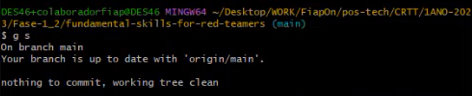

## Criação de aliases para comandos Git

Neste processo, vamos explorar a criação de aliases específicos no Git para aprimorar a eficiência de uso da ferramenta.

Para começar, abra o arquivo de configuração dos comandos do Git, denominado `.gitconfig`, localizado na pasta raiz do seu perfil de usuário, tipicamente em `C:\Users\{seu_usuario}`.

Para fazer isso, siga os passos a seguir:

Abra o arquivo `.gitconfig` com um editor de texto em modo administrador:

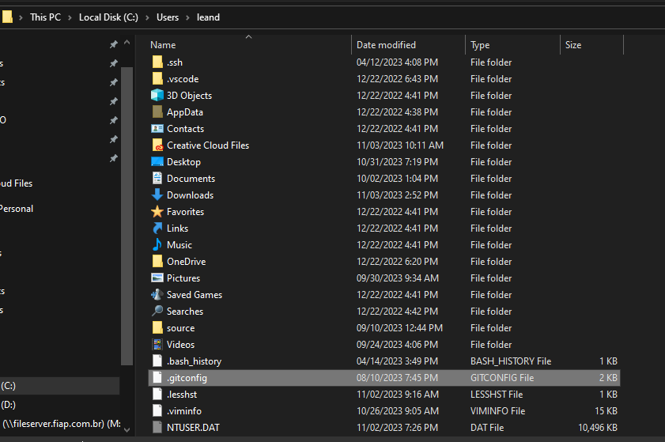

Caso seu arquivo `.gitconfig` ainda não contenha a seção de aliases, denominada `alias`, você pode adicioná-la da seguinte maneira:


Dentro da seção `alias`, você pode inserir os aliases para abreviar os comandos do Git. Por exemplo:

```bash
alias s = 'status'
alias p = 'pull'
```

É fundamental manter a formatação correta para evitar problemas com as abreviações, como demonstrado a seguir:

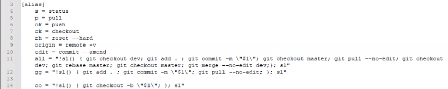

Após salvar as alterações no arquivo, reinicie o terminal (caso esteja aberto) para que as modificações entrem em vigor.

Para visualizar todos os aliases que você configurou, você pode utilizar o seguinte comando:

```bash
git config --get-regexp ^alias
```

Isso exibirá uma lista dos aliases configurados, como ilustrado na imagem abaixo:

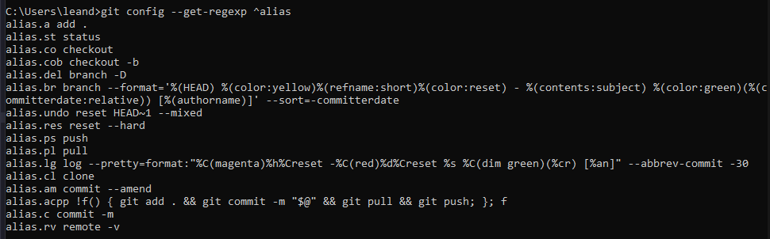

Dessa forma, agora você pode utilizar seus aliases do Git para abreviar os comandos, tornando as tarefas mais eficientes. Aqui estão alguns exemplos de uso:

```bash
$ g s      # Executa 'git status'
$ g p      # Executa 'git pull'
$ g origin # Executa 'git remote -v'
```

Confira o exemplo de utilização de um dos aliases na imagem a seguir:

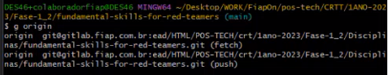

## Extensões

Neste processo, você aprenderá a usar extensões para manipular texto, incluindo formatação, quebra de linhas e organização. Considere usar macros e extensões para realizar ações em texto, como reorganizar listas, copiar e colar em massa ou formatar código. 

Abaixo estão algumas sugestões de extensões do VSCode que poderão te ajudar em relação a isso.  

### Macros (por Geddski)

"Traz suporte simples e poderoso a macros personalizadas para o VS Code."


Link para repositório no Github: https://github.com/geddski/macros

#### Criando um macro

Crie seus próprios macros personalizados adicionando-os ao seu `settings.json` (Code|File > Preferences > User Settings)

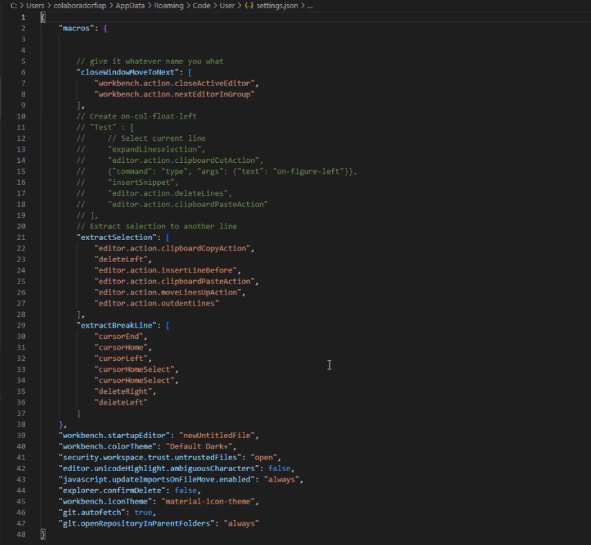

Por exemplo, vamos criar um macro que cópia a linha atual, comenta a linha original e move o cursor para baixo para a cópia:

```json
"macros": {
    "commentDown": [
        "editor.action.copyLinesDownAction",
        "cursorUp",
        "editor.action.addCommentLine",
        "cursorDown"
    ]
}
```

Dentro da seção `macros`, você deve atribuir um nome ao seu macro - como no exemplo, `commentDown` - e, em seguida, criar uma matriz (array) que contém uma sequência de ações que o seu macro executará.

Sua lista de macros ficará assim: 

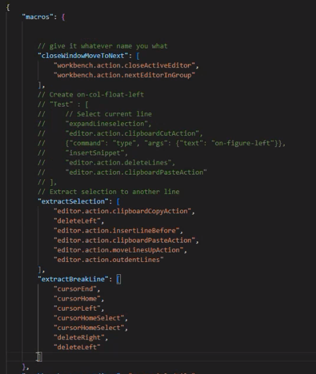

Você executar qualquer ação embutida no VS Code e até ações de outras extensões. Para ver todos os nomes das possíveis ações que o VS Code pode executar, consulte `Default Keyboard Shortcuts` (Code|File > Preferences > Keyboard Shortcuts) 

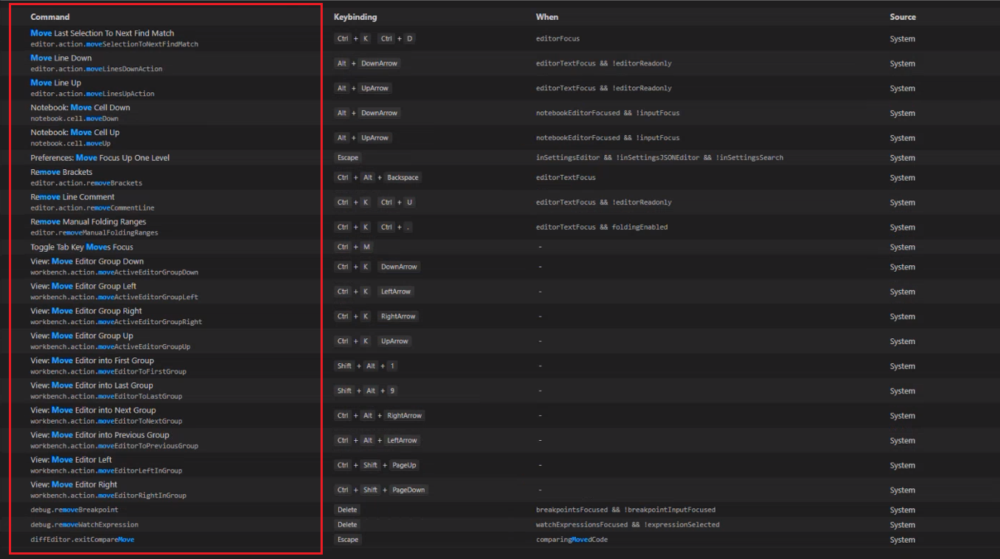

#### Adicionar atalhos de teclado para executar seus macros

Em `keybindings.json` (Code|File > Preferences > Keyboard Shortcuts), adicione atalhos para seus macros:

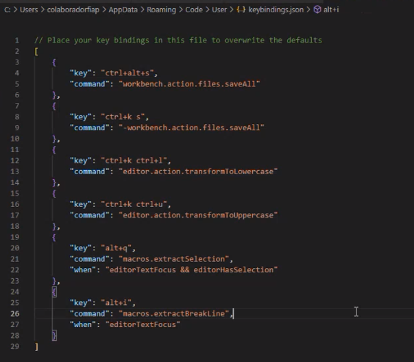

```json
{
  "key": "ctrl+cmd+/",
  "command": "macros.commentDown"
}
```

Observe que dentro de `command`, o nome deve corresponder ao que você atribuiu ao seu macro. Siga o padrão `macros.{nome_do_seu_macro}`.

#### Passando argumentos para comandos

Muitos comandos aceitam argumentos, como o comando "type", que permite inserir texto no editor. Para esses casos, use um objeto em vez de uma string ao especificar o comando a ser chamado em seu `settings.json`:

```json
"macros": {
  "addSemicolon": [
    "cursorEnd",
      {"command": "type", "args": {"text": ";"}}
  ]
}
```

#### Executando snippets como parte de um macro

Os macros também podem executar qualquer um de seus snippets, o que é muito útil. Basta inserir o mesmo texto que você digitaria normalmente para o snippet, seguido do comando `insertSnippet`:

```json
"macros": {
  "doMySnippet": [
    {"command": "type", "args": {"text": "mySnippetPrefixHere"}},
    "insertSnippet"
  ]
}
```

### HTMLTagWrap (por Brad Gashler)

"Envolve sua seleção em tags HTML. Pode envolver uma seleção inline ou uma seleção de várias linhas."

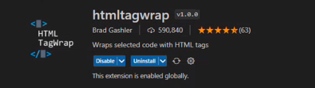

Link para repositório no Github: https://github.com/microsoft/vscode-htmltagwrap

#### Como utilizar?

Selecione um bloco de texto ou uma sequência de texto. Pressione **Alt + W** ou **Option + W** para Mac. Digite o nome da tag que você deseja e ela preencherá automaticamente a tag de abertura e de fechamento.

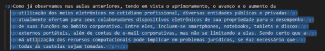

Esta extensão funciona melhor em arquivos que usam espaços ou tabulações para a formatação. Pode não funcionar tão bem em arquivos que usam uma mistura de espaços e tabulações.