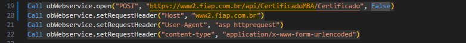
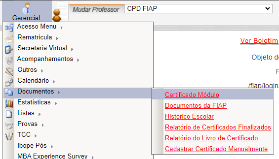
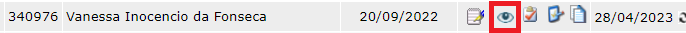
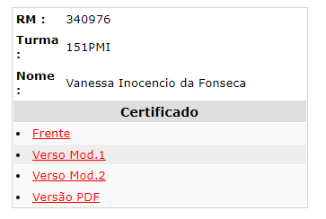
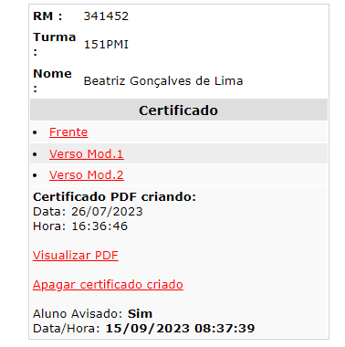
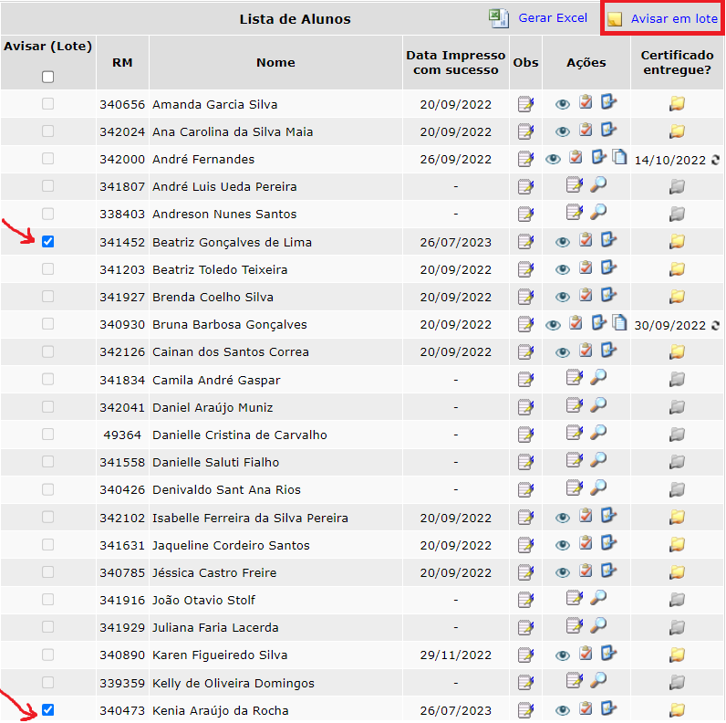
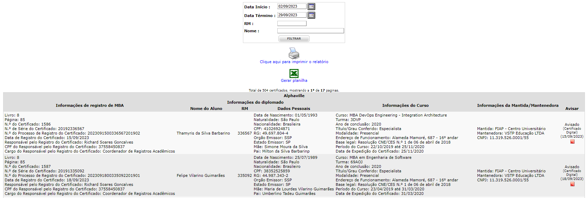

# Emissão de Certificado MBA

## Introdução

Esta documentação descreve o sistema de emissão de certificados de conclusão de cursos digitais de MBA, o qual está integrado ao Portal do Professor. A seguir, serão explicados os passos necessários para configurá-lo, acessá-lo e utilizá-lo.

## Configuração inicial

Antes de acessar o sistema de emissão de certificados MBA, é importante realizar algumas configurações iniciais:

**Configuração do portal do professor:** 

A configuração do Portal do Professor está detalhada na documentação [Adicionar PortalDes ASP no IIS](http://conhecimento.fiap.com.br/portal-do-professor/configuracao-iis/). Certifique-se de seguir as instruções dessa documentação para configurar o portal em sua máquina.

**Configuração da API de certificado MBA:**

 O sistema utiliza a API [Api.CertificadoMBA](https://gitlab.fiap.com.br/dotnet/api.certificadomba) para a geração do PDF do certificado, upload desse PDF na Amazon S3 e o seu cadastro no [Portal de Consulta de Documentos](https://gitlab.fiap.com.br/dotnet/ConsultaDocumento). Siga os passos abaixo para configurar a API:

   - Clone o [repositório](https://gitlab.fiap.com.br/dotnet/api.certificadomba) da API Api.CertificadoMBA.
   - Configure as variáveis de ambiente do Windows apontando para o [banco de dados de homologação](http://conhecimento.fiap.com.br/processos/alternar-banco-testes-fiap-modulo/alternar-banco-testes-fiap-modulo/). Isso é necessário porque a API utiliza as funções SysCriptCrip e SysCriptDcrip, que estão atualizadas no banco de dados de homologação.
   - Execute a API com o IIS Express.

#### Detalhe importante: 

Em ambiente de desenvolvimento, é crucial lembrar de configurar a URL da API para apontar para o endereço local em que ela está sendo executada em sua máquina. Para fazer isso, você precisará acessar o arquivo localizado no caminho `Fiap2\fiap\login\professor_2004\certificadoModuloPos\geraPdfCertificado.asp` e alterar as linhas destacadas na figura abaixo, substituindo a URL pela versão local da API.

## Acesso ao sistema de emissão de certificados MBA

Após a configuração inicial, você pode acessar o sistema de emissão de certificados MBA seguindo os passos abaixo:

1. Acesse o Portal do Professor.

2. No menu "Gerencial", vá até o submenu "Documentos".

3. Selecione a opção "Certificado Módulo".

4. Você será redirecionado para o sistema de emissão de certificados MBA.

   

## Geração do certificado de um aluno

Para gerar o certificado de um aluno, siga estas etapas:

1. Selecione a turma do aluno para o qual deseja gerar o certificado.

2. Na página da turma, localize o aluno desejado e clique no ícone destacado, conforme mostrado na imagem a seguir:

    

3. O sistema irá redirecionar para a página da figura a seguir. Após isso, para gerar o certificado digitalmente, basta selecionar a opção `Versão PDF`:

    

4. Ao clicar nessa opção, será feita uma requisição para a rota `/Certificado` da API mencionada previamente. São fornecidos os seguintes parâmetros no corpo dessa requisição (todos criptografados conforme a função SysCriptCrip):
   - **Ano**: Ano de conclusão para emissão do certificado
   - **Nome**: Nome do aluno.
   - **Turma**: Nome da turma.
   - **VersaoFrente**: Representa o arquivo ASP que servirá como modelo para o PDF da frente do certificado do aluno. Possui um valor fixo, que se refere ao nome do arquivo de modelo da frente, `SomenteFrente.asp`
   - **VersaoVerso**: Representa o arquivo ASP que servirá como modelo para o PDF do verso do certificado do aluno. Possui um valor fixo, que se refere ao nome do arquivo de modelo do verso, `SomenteVerso.asp`
   - **Rm**: RM do aluno.
   - **Tipo**: Sempre terá o valor "Certificado".

`Observação`: quaisquer eventuais alterações solicitadas no layout do certificado digital MBA deverão ser feitas em todos os arquivos de modelo do PDF citados na descrição dos parâmetros "VersaoFrente" e "VersaoVerso".

#### Visualização do certificado gerado

Após a geração do certificado por meio da requisição feita à API via sistema, o registro do aluno aparecerá da seguinte forma, possibilitando visualizar o certificado digital gerado e apagá-lo:

## Aviso sobre emissão de certificado

Após a conclusão da geração e emissão dos certificados digitais, descritas nos tópicos anteriores, é necessário informar os alunos sobre essa emissão. Para realizar isso, existem checkboxes que permitem escolher um grupo de alunos que já estejam com os seus certificados digitais emitidos. Ao marcar todos os alunos por meio desses checkboxes e clicar no botão "Avisar em lote", todos eles receberão um e-mail de notificação informando sobre a conclusão da emissão de seus certificados.

## Relatório do Livro de Certificado

Ainda no mesmo sistema, também existe um relatório com as informações dos certificados que foram emitidos. Esse relatório possui informações gerais do registro do certificado, do diplomado, do curso, se o aluno já foi avisado sobre a emissão e também do tipo de emissão (se foi digital ou não), bem como da data em que ela ocorreu. Para chegar até esse relatório basta seguir o caminho `Gerencial > Documentos > Relatório do Livro de Certificado`.

