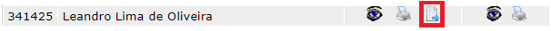

# Emissão de Histórico MBA

## Introdução

Esta documentação descreve o sistema de emissão de históricos digitais para cursos de MBA. Diferentemente do [sistema de histórico digital de graduação](http://conhecimento.fiap.com.br/fluxos/Hist%C3%B3rico-Digital/Fluxo-HistoricoDigital/), que está disponível na Intranet, o sistema de emissão de históricos MBA está integrado ao Portal do Professor. A seguir, serão explicados os passos necessários para configurar, acessar e utilizar esse sistema.

## Configuração inicial

Antes de acessar o sistema de emissão de históricos MBA, é importante realizar algumas configurações iniciais:

**Configuração do portal do professor:** 

A configuração do Portal do Professor está detalhada na documentação [Adicionar PortalDes ASP no IIS](http://conhecimento.fiap.com.br/portal-do-professor/configuracao-iis/). Certifique-se de seguir as instruções dessa documentação para configurar o portal em sua máquina.

**Configuração da API de certificado MBA:**

 O sistema utiliza a API [Api.CertificadoMBA](https://gitlab.fiap.com.br/dotnet/api.certificadomba) para a geração do PDF do histórico, upload desse PDF na Amazon S3 e o seu cadastro no [Portal de Consulta de Documentos](https://gitlab.fiap.com.br/dotnet/ConsultaDocumento). Siga os passos abaixo para configurar a API:

   - Clone o [repositório](https://gitlab.fiap.com.br/dotnet/api.certificadomba) da API Api.CertificadoMBA.
   - Configure as variáveis de ambiente do Windows apontando para o [banco de dados de homologação](http://conhecimento.fiap.com.br/processos/alternar-banco-testes-fiap-modulo/alternar-banco-testes-fiap-modulo/). Isso é necessário porque a API utiliza as funções SysCriptCrip e SysCriptDcrip, que estão atualizadas no banco de dados de homologação.
   - Execute a API com o IIS Express.

#### Detalhe importante: 

Em ambiente de desenvolvimento, é crucial lembrar de configurar a URL da API para apontar para o endereço local em que ela está sendo executada em sua máquina. Para fazer isso, você precisará acessar o arquivo localizado no caminho `FIAP.Fiap2\fiap\login\professor_2004\historicoPos\geraPdfHistorico.asp` e alterar as linhas destacadas na figura abaixo, substituindo a URL pela versão local da API.

## Acesso ao sistema de emissão de históricos MBA

Após a configuração inicial, você pode acessar o sistema de emissão de históricos MBA seguindo os passos abaixo:

1. Acesse o Portal do Professor.

2. No menu "Gerencial", vá até o submenu "Documentos".

3. Selecione a opção "Histórico Escolar".

4. Você será redirecionado para o sistema de emissão de históricos MBA.

   

## Geração do histórico de um aluno

Para gerar o histórico de um aluno, siga estas etapas:

1. Selecione a turma do aluno para o qual deseja gerar o histórico.

2. Na página da turma, localize o aluno desejado e clique no ícone destacado, conforme mostrado na imagem a seguir:

    

3. Ao clicar nesse ícone, será feita uma requisição para a rota `/Historico` da API mencionada previamente. São fornecidos os seguintes parâmetros no corpo dessa requisição (todos criptografados conforme a função SysCriptCrip):

   - **Nome**: Nome do aluno.
   - **Turma**: Nome da turma.
   - **Versao**: Representa o arquivo ASP que servirá como modelo para o PDF do histórico do aluno. Pode ter quatro valores:
       - `verCorporate.asp`: Modelo para alunos corporate.
       - `verON.asp`: Modelo para alunos que cursam EAD.
       - `ver2009.asp`: Modelo para alunos com ano de conclusão superior ou igual a 2009.
       - `ver.asp`: Modelo para alunos com ano de conclusão inferior a 2009.
   - **Rm**: RM do aluno.
   - **Tipo**: Sempre terá o valor "Histórico".

`Observação`: quaisquer eventuais alterações solicitadas no layout do histórico digital MBA deverão ser feitas em todos os arquivos de modelo do PDF citados na descrição do parâmetro "Versao".

## Visualização do histórico gerado

Após a geração do histórico por meio da requisição feita à API via sistema, o registro do aluno aparecerá da seguinte forma, possibilitando visualizar o histórico digital gerado e apagá-lo:

