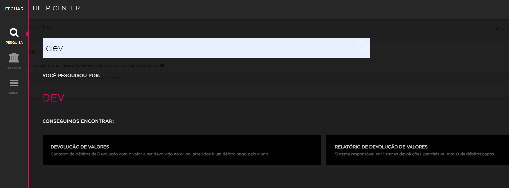
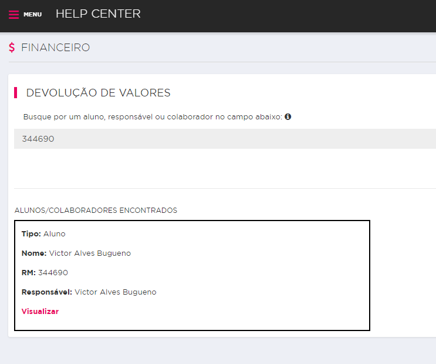
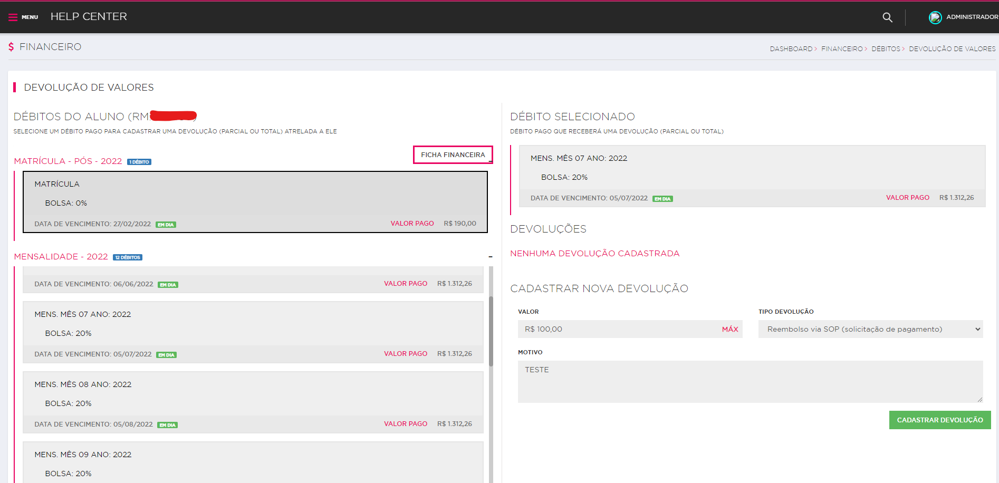
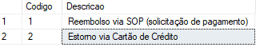
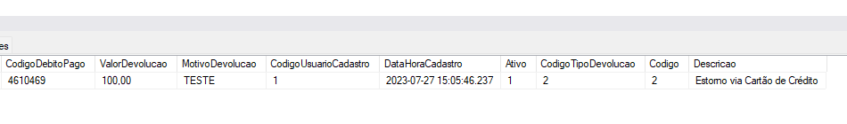

# Devolução de Valores

Cadastro de débitos de Devolução com o valor a ser devolvido ao aluno, atrelado à um débito pago pelo aluno.

## Sistemas que possuem essa funcionalidade

- Intranet FIAP
- Módulo

## Caminho no sistema

**Intranet**>**Help Center** (na barra de pesquina do Helper Center, digitar dev)>**Devolução de Valores**>Buscar pelo RM a ser devolvido valor do débito>Selecionar o Débito>Realizar a Devolução









## Projeto que gerencia essa funcionalidade 

- Negociação

Repositorio ->  https://gitlab.fiap.com.br/dotnet/Intranet.Negociacao

Obs: Caso não possua acesso ao repositório desse sistema, entrar em contato com Victor Alves - <victor.bugueno@fiap.com.br> 
([Chat do Teams](https://teams.microsoft.com/l/chat/0/?users=victor.bugueno@fiap.com.br))

## Controller responsável

- DevolucaoValoresController

## Tabelas principais

- FNDebitos
- FNDevolucao

 ## Scripts principais

- Lista os débitos
```
                        SELECT
							FNDebitos.Codigo,
							FNDebitos.RM,
							FNDebitos.DescricaoDebito,
							FNDebitos.DataVencimento,
							FNDebitos.ValorDebito,
							FNDebitos.ValorPago,
							FNDebitos.DataPagamento,
							FNDebitos.QtDiasAtrasado,
							FNDebitos.Tipo,
							FNDebitos.SPC,
							FNDebitos.Nser,
							FNDebitos.LCur,
							FNDebitos.LSer,
							FNDebitos.Externa,
							FNDebitos.Bolsa,
							FNDebitos.Ano,
							FNDebitos.Mes
						FROM
							FNDebitos WITH (NOLOCK)
						WHERE
							FNDebitos.RM = @rm
							AND FNDebitos.Visivel = 1
							AND FNDebitos.Excluido = 0
							AND FNDebitos.Abonado = 0
							AND ISNULL(FNDebitos.ValorPago, 0) > 0
							AND FNDebitos.DebitoEmAcordo = 0
							AND FNDebitos.Tipo NOT IN
							(
								'Agente Financiador',
								'Repasse Fies'
							)
```

- Lista as devoluções
```
                            SELECT	
								FNDevolucao.Codigo,
								FNDevolucao.RM,
								FNDevolucao.CodigoDebitoPago,
								FNDevolucao.ValorDevolucao,
								FNDevolucao.MotivoDevolucao,
								FNDevolucao.CodigoUsuarioCadastro,
								Pessoa.Nome AS 'NomeUsuarioCadastro',
								FNDevolucao.DataHoraCadastro,
								FNDevolucao.Ativo,
								FNDebitos.ValorPago,
								FNDebitos.DataPagamento,
								FNDevolucao.CodigoTipoDevolucao,
								FNTipoDevolucao.Descricao As 'DescricaoDevolucao'
							FROM
								FNDevolucao WITH (NOLOCK)
								INNER JOIN Usuario WITH (NOLOCK)
									ON FNDevolucao.CodigoUsuarioCadastro = Usuario.Codigo
								INNER JOIN Pessoa WITH (NOLOCK)
									ON Usuario.CodigoPessoa = Pessoa.Codigo
								INNER JOIN FNDebitos WITH (NOLOCK)
									ON FNDevolucao.CodigoDebitoPago = FNDebitos.Codigo
								LEFT JOIN FNTipoDevolucao  WITH (NOLOCK) 
									ON FNTipoDevolucao.Codigo = FNDevolucao.CodigoTipoDevolucao
							WHERE
								FNDevolucao.CodigoDebitoPago = @codigoDebito
								AND FNDevolucao.Ativo = 1
							ORDER BY
								FNDevolucao.DataHoraCadastro
```

## Campos obrigatórios para a devolução

**Valor** - Numeral monetário de valor entre R$ 0,01 e R$ 1.312,26;

**Motivo** - Descrição do Motivo da Devolução

**Tipo Devolução** - Numeral inteiro que representa o tipo da devolução

## Tipo Devolução

Implementado em 26/07/2023, diante de uma necessidade que o financeiro tinha de especificar se a devolução estava sendo realizado via SOP (solicitação de pagamento) ou Estorno via Cartão de Crédito (ticket 93041). Até o presente momento dessa documentação (27/07/2023), exite apenas essas duas opções cadastrados na base.

#### Base

BaseEducacional (FIAP e Modulo) - _SELECT *FROM BaseEducacional..FNTipoDevolucao_

#### Tabela

**FNTipoDevolucao** - Criada em 26/07/2023 para a segregar os tipos de devolução caso futuramente, seja solicitado a adição de mais tipos.



#### Colunas

**Codigo** - Número inteiro, identificador e único (identity).

**Descricao** - Breve descrição do tipo de débito (VARCHAR (50) NOT NULL).

#### Relacionamento 

A tabela **FNDevolucao** é a tabela pai que armazena as devoluções feitas aos débitos do aluno. No dia 26/07/2023, foi adicionado o relacionamento com a tabela **FNTipoDevolucao** através da coluna **CodigoTipoDevolucao** (INT NULL) para o armazenamento e histórico dos tipos de devolução feito pra cada débito.





