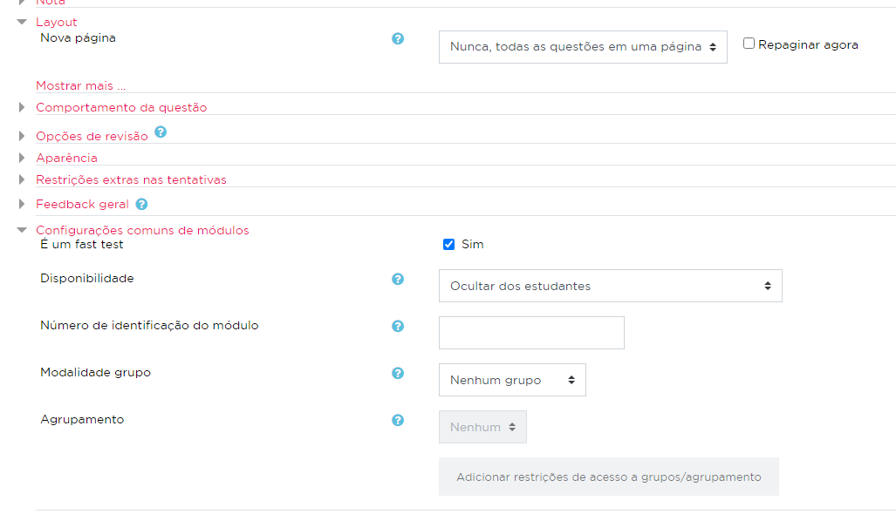
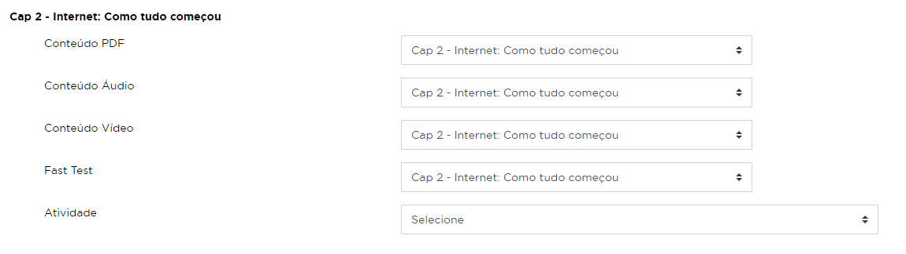

# Fast Test

## O que são
Os fast tests são questionários disponibilizados dentro de alguns
capítulos (Conteúdos HTML) com questões referentes ao conteúdo
estudado, com o propósito de testar o que o aluno aprendeu de forma
rápida e ajudar a fixar o conhecimento.

## Como configurar
Ao se cadastrar um questionário que será disponibilizado como fast test,
algumas ações devem ser feitas para que ele funcione corretamente.

### 1. Marcar como tipo fast test
No cadastro do quiz, na seção **Configurações comuns de módulos**, é
necessário marcar a opção *É um fast test*, que irá setar o tipo do
quiz como fast test, além de ocultar dos estudantes (para que não seja
exibido na página do curso) e selecionar o layout *Nova página: Nunca,
todas as questões em uma página*.

### 2. Relacionar com um capítulo
Após salvar o quiz com as configurações acima, é preciso informar em
qual capítulo o fast test será disponibilizado.

Para isso, basta acessar a página de *Relacionar conteúdos*, onde serão
listados todos os capítulos do curso e seus conteúdos relacionados.

Na opção *Fast Test*, o quiz criado deve estar relacionado com o capítulo
desejado.

##Importação de questões
As questões cadastradas em quizzes do tipo fast test são importadas na
plataforma por meio de um excel.

Para realizar essa importação, acesse
[https://on.fiap.com.br/local/importadorfasttest/admin/import_csv.php](https://on.fiap.com.br/local/importadorfasttest/admin/import_csv.php)
e envie um arquivo no formato .CSV separado por vírgula.

Nesta página, também estão disponíveis arquivos nos formatos .xlsx e csv
com modelos de planilha para a importação.

Caso a importação ocorra corretamente, as questões serão adicionadas em
categorias no formato "Curso > Disciplina > Capítulo X" para MBA ou
"Curso > Fase > Disciplina > Capítulo" para Graduação.