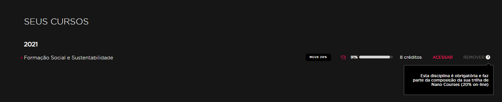

#Nano Courses

Os Nano Courses são pequenos cursos disponibilizados inicialmente para alunos
de Graduação Presencial para cumprimento dos 20% das matérias feitas de forma
On-Line. Posteriormente, esses cursos foram disponibilizados para todas as
modalidades de ensino da FIAP, bem como colaboradores e também alguns para
qualquer pessoa que se interessem, por meio do Eu Capacito (antigo Movimento
Brasil Digital).

##Visualização
Para visualizar um nano course, o aluno deve possuir o codrelacao relacionado com
o nano na plataforma, o qual vem por meio do importador no caso de alunos de
Graduação, MBA e Colégios. No caso de usuários de parceiros e corporate, existem
codrelacao pré-definidos que eles ganham acesso ao se cadastrarem.

Essa relação fica na tabela **fiapead_fiap_user_relacao**, onde é armazenado o
usuário, o codrelacao que ele pode ver, o ano em que o usuário começou a ver os nanos
do codrelacao, a regra e se o registro está ativo ou não.

Após o término do ano em que o aluno ganhou a visualização para o nano, ele pode
continuar a visualizar o curso e todos os seus conteúdos por mais dois anos.

###Graduação Presencial
A relação de codrelacoes de Graduação Presencial com os Nano Courses na plataforma
é atualmente realizado de forma manual, com o script abaixo (futuramente deve ser
desenvolvida uma ferramenta).

```sql
SET @ano         = ano atual
SET @category_id = categoria dos nanos do ano atual
SET @sigla_turma = sigla da turma que está sendo relacionada com os nanos

INSERT INTO fiapead_moodle_relacao2004 (category, course, codrelacao, turma, ano, coddisciplina, codcurso, desccurso, sigla, ch, tipo)
SELECT
    @category_id,
    fiapead_course.id
    fiapead_relacao_2004.codrelacao,
    fiapead_relacao_2004.turma,
    fiapead_relacao_2004.ano,
    fiapead_relacao_2004.coddisciplina,
    fiapead_relacao_2004.codcurso,
    fiapead_relacao_2004.curso,
    fiapead_relacao_2004.sigla,
    fiapead_relacao_2004.ch,
    fiapead_relacao_2004.tipo
FROM fiapead_relacao_2004
LEFT JOIN fiapead_course
	ON fiapead_relacao_2004.disciplina = fiapead_course.fullname
    AND fiapead_course.category = @category_id
WHERE fiapead_relacao_2004.turma = @sigla_turma
	AND fiapead_relacao_2004.ano = @ano
    AND fiapead_relacao_2004.nanocourse = 1;
```


Obs.: Na SELECT acima é utilizado o LEFT JOIN com **fiapead_course** porque o nome da disciplina no codrelacao
pode estar com o nome diferente do curso. Nestes casos, a coluna **fiapead_course.id** irá retornar **NULL**.
Quando isso acontecer, deve ser tratado manualmente com **CASE WHEN** baseado no coddisciplina. Exemplo:


```sql
...
SELECT
    @category_id,
    CASE
        WHEN fiapead_relacao_2004.coddisciplina = 3813
        THEN 6393
        ELSE fiapead_course.id
    END AS course_id,
    fiapead_relacao_2004.codrelacao,
    ...
```
<sup> Exemplo utilizado para disciplina "Governança em TI" do ano de 2022. </sup>

##Certificação

###Regras por período do ano

####Período regular (durante o calendário escolar)
Para conseguir uma certificação em um nano course, o aluno deve:

- Visualizar ao menos 75% do conteúdo;
- Acertar, no mínimo, 70% da prova.

Caso o aluno tenha tentado a certificação e não obtido sucesso, ele pode tentar
novamente num período de 15 dias após a primeira tentativa.

**Obs. Caso o nano course seja obrigatório para o aluno, não existe um intervalo
obrigatório entre as tentativas. Por isso, ele pode realizar a prova novamente logo
em seguida, quantas vezes desejar**.

####Período de bloqueio
A prova de certificação não é disponibilizada para alunos que ainda não completaram
os 20 créditos anuais. Para o restante dos alunos, as regras são as mesmas do período regular.

####Período de exame
Para alunos que ainda não completaram os 20 créditos anuais, no período de exame, para conseguir
uma certificação em um nano course, o aluno deve:

- Acertar, no mínimo, 70% da prova.

Neste período, todas as provas de nano courses são liberadas independente da porcentagem
do conteúdo vista, porém, o aluno possui somente uma tentativa em cada nano course.

###Regras gerais
Caso o aluno tenha realizado a prova de certificação e obtido sucesso num ano
anterior, ele não pode mais realizar a prova num curso equivalente a este.

Todas as provas de certificação possuem uma chave de validação, que pode ser
encontrada:

- Na listagem de certificados do aluno;
- Na base do certificado;
- Na tabela fiapead_certificados_nanocourse.

Com essa chave, é possível verificar se um certificado é válido ou não,
através da URL
[https://on.fiap.com.br/local/nanocourses/validar-certificado/](https://on.fiap.com.br/local/nanocourses/validar-certificado/)

##Envio de nota para boletim
Para alunos de graduação presencial, as provas de certificação também valem nota
para a disciplina de nano course. Num ano letivo, alunos sem DP em nano courses
devem completar 20 créditos para sejam aprovados, já os que possuem DP, 40
créditos.

Para que a nota seja enviada ao boletim, o aluno deve:

- Acertar no mínimo 60% da prova;
- Realizar a prova de certificação em um nano course que seja do ano atual, no período regular ou de exame;
- Não ter completado os 20 (ou 40) créditos em provas com nota final maior ou
  igual a 6;

**Obs1. Caso o aluno possua uma disciplina obrigatória, enquanto ele não realizá-la
a nota não será publicada**.

**Obs2. Em período de exame, a nota é enviada para a coluna *exame* ao invés da coluna
*m1* e *m2***.

Para verificar quantos créditos o aluno possui em um ano, execute a query abaixo
```sql
SET @ano      = ano do nano;
SET @regra_id = 14 para nano regular, 29 para nano de DP;
SET @rm       = rm do aluno, com 'rm' na frente;

SELECT
    fiapead_course.id,
    fiapead_course.fullname AS 'Nano Course',
    fiapead_user.username AS 'RM',
    fiapead_fiap_course_credito.credito AS 'Credito',
    (ROUND((fiapead_grade_grades.finalgrade / fiapead_grade_grades.rawgrademax * 10), 2)) AS 'Nota',
    FROM_UNIXTIME(fiapead_grade_grades.timemodified, '%d/%m/%Y %H:%i') AS 'Data'
FROM fiapead_fiap_regras_course
INNER JOIN fiapead_course
    ON fiapead_fiap_regras_course.courseid = fiapead_course.id
INNER JOIN fiapead_course_categories_resume
    ON fiapead_course.category = fiapead_course_categories_resume.categorieid
    AND fiapead_course_categories_resume.nivel3 = @ano
INNER JOIN fiapead_course_modules
    ON fiapead_course.id = fiapead_course_modules.course
    AND fiapead_course_modules.module = 17
INNER JOIN fiapead_grade_items
    ON fiapead_course.id = fiapead_grade_items.courseid
    AND fiapead_grade_items.iteminstance = fiapead_course_modules.instance
    AND fiapead_grade_items.itemmodule = 'quiz'
INNER JOIN fiapead_grade_grades
    ON fiapead_grade_items.id = fiapead_grade_grades.itemid
    AND fiapead_grade_grades.aggregationstatus = 'used'
INNER JOIN fiapead_user
    ON fiapead_grade_grades.userid = fiapead_user.id
    AND fiapead_user.username = @rm
INNER JOIN fiapead_fiap_course_credito
    ON fiapead_grade_items.courseid = fiapead_fiap_course_credito.courseid
LEFT JOIN fiapead_fiap_quiz_config
    ON fiapead_grade_items.iteminstance = fiapead_fiap_quiz_config.quizid
    AND fiapead_fiap_quiz_config.configname = 'fast_test'
WHERE fiapead_fiap_regras_course.regraid = @regra_id
    AND (ROUND((fiapead_grade_grades.finalgrade / fiapead_grade_grades.rawgrademax * 10), 2)) >= 6
    AND fiapead_fiap_quiz_config.id IS NULL;
```


##Nano obrigatório
Nano courses obrigatórios são nanos que os alunos devem cursar para serem aprovados
na disciplina de Nano Course. Caso o aluno possua um nano obrigatório, a nota dele
não será publicada até que ele realize a prova de certificação com sucesso, mesmo que
ele já tenha completado os 20 créditos.

Diferentemente dos outros nano courses, os obrigatórios não possuem limite de tentativas,
nem intervalo de 15 dias entre elas. Dessa forma, o aluno pode tentar realizar o questionário
quantas vezes forem necessárias para a sua aprovação.

Atualmente, eles estão habilitados apenas para alunos do primeiro ano de graduação
presencial, no nano "Formação Social e Sustentabilidade".

Para verificar se um aluno possui algum nano obrigatório, existem duas maneiras:

*Via query*
```sql
SELECT *
FROM fiapead_fiap_user_relacao
WHERE fiapead_fiap_user_relacao.userid = @user_id
  AND fiapead_fiap_user_relacao.ano = YEAR()
  AND fiapead_fiap_user_relacao.ativo = 1
  AND fiapead_fiap_user_relacao.obrigatorio = 1;
```

*Via plataforma*

Acesse a plataforma com o login do aluno, pela ferramenta "Acessar como", localizada no menu
ferramentas ou diretamente pelo perfil do aluno. (Caso não possua acesso à produção ou a permissão
de "Acessar como", acesse a plataforma localmente com o rm do aluno).

Em seguida, acesse a listagem dos nano courses. Se o aluno possuir algum nano obrigatório, este
estará no topo da listagem dos nanos em que o aluno está inscrito, com a tarja de "MEUS 20%" e
com a opção de remover o curso desabilitada.



##Corporate aTip e eu Capacito
São iniciativas onde a FIAP oferece alguns nano courses para qualquer pessoa que deseje cursá-los.

Para isso, o usuário apenas necessita se cadastrar em
[https://on.fiap.com.br/programaeucapacito](https://on.fiap.com.br/programaeucapacito)
ou em [https://on.fiap.com.br/local/corporate/parceiros/atip](https://on.fiap.com.br/local/corporate/parceiros/atip)

Após se cadastrar, o aluno irá receber um e-mail para que ele confirme que o e-mail
dele é válido e ativar a conta na plataforma. Até que ele faça isso, a conta
dele é marcada como suspensa e ele não terá acesso, mesmo que informe a senha correta.
