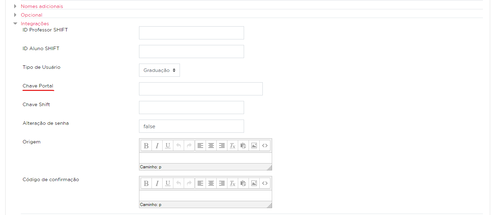
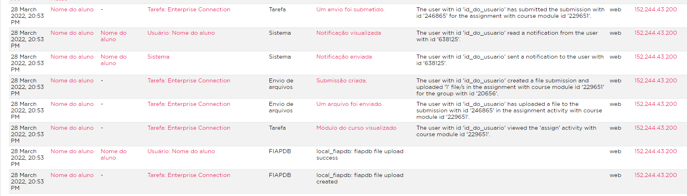
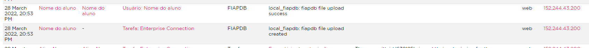
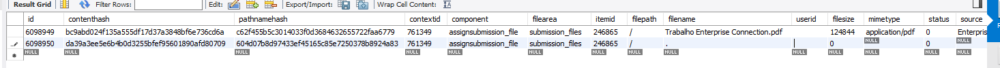
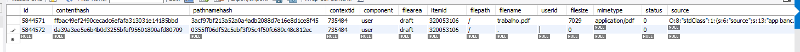
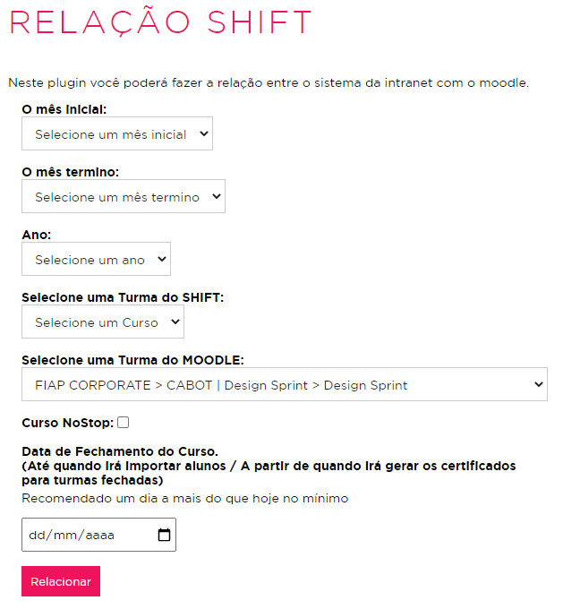

# Problemas comuns

Esta página tem como finalidade registrar a solução para os principais problemas no Moodle.

## Chaves de acesso

Para alunos de Graduação ou MBA Presencial, a integração com o Portal do Aluno ocorre por uma
chave de acesso cadastrada no perfil do usuário. Caso essa chave não esteja cadastrada corretamente,
o aluno não consegue acessar a plataforma pelo portal do aluno.

Essa chave fica cadastrada no SQL Server, para acessá-la, basta rodar o script abaixo.

```sql
USE Carreiras;

SELECT
    usuario.nome,
    usuario.codigoID --Chave de acesso
FROM usuario
WHERE usuario.usuario = @rm;
```

*A chave do usuário também está disponível para consulta no importador do presencial.*

### Como identificar

Ao clicar em "Sala Virtual" no Portal do Aluno, ele deveria ser redirecionado para dentro da plataforma.
Porém, nestes casos, o login não ocorre e ele é redirecionado para a página de login da plataforma.

É possível verificar se a chave existe no perfil do aluno de duas formas:

*Via query*
```sql
SELECT fiapead_user_info_data.data
FROM fiapead_user_info_data
INNER JOIN fiapead_user_info_field
    ON fiapead_user_info_data.fieldid = fiapead_user_info_field.id
WHERE fiapead_user_info_field.shortname = 'chaveportal'
    AND fiapead_user_info_data.userid = @userId;
```

*Via plataforma*

https://on.fiap.com.br/user/profile.php?id=idDoUsuario


### Como resolver

Caso a chave não exista, basta criar o registro replicando a chave que está no SQL Server
para o moodle, que pode ser feito de duas maneiras:

*Via query*
```sql
INSERT INTO fiapead_user_info_data (
    userid,
    fieldid,
    data,
    dataformat
) VALUES (@userId, 5, @chavePortal, 0);
```

*Via plataforma*

https://on.fiap.com.br/user/editadvanced.php?course=1&returnto=profile&id=@idDoUsuario


## Entrega em atividade "sumiu"

Para que uma entrega seja feita corretamente numa atividade, o aluno deve realizar o upload do arquivo
e clicar no botão "Salvar mudanças". Quando o aluno não clica nesse botão, pode gerar a impressão
de que a entrega "sumiu", quando, na verdade, não foi finalizada.

### Como identificar

Quando uma entrega é finalizada, os logs gerados se parecem com esses:



Porém, quando o usuário seleciona um arquivo e não salva a entrega, os logs gerados se parecem com
esses:



Além dos logs, uma diferença entre uma entrega finalizada e não finalizada também pode ser observada
na tabela files. Caso a entrega tenha sido finalizada corretamente, são gerados registros do componente
"assignsubmission_file", onde o itemid é o id da submissão do aluno:



Já uma entrega que não foi finalizada gera apenas registros de draft (rascunho), onde o itemid é o id
do formulário no momento em que o usuário fez o upload:



### Como resolver
Para resolver este caso, precisamos criar manualmente a entrega do aluno, utilizando o registro do draft
gerado no momento do upload como base.

**1. Alterando status de entrega para submitted**
```sql
UPDATE fiapead_assign_submission
SET
	fiapead_assign_submission.status = 'submitted'
WHERE fiapead_assign_submission.userid = @user_id
	AND fiapead_assign_submission.assignment = @assign_id
```

**2. Criando registro de entrega do arquivo**
```sql
INSERT INTO fiapead_assignsubmission_file (
    assignment,
    submission,
    numfiles
) VALUES (@assign_id, @submission_id, @quantidade_de_arquivos_enviados)
```

**3. Criando arquivo de entrega**
```sql
SET @context_id    = 0;
SET @submission_id = 0;

INSERT INTO fiapead_files (contenthash, pathnamehash, contextid, component, filearea, itemid, filepath, filename, userid, filesize, mimetype, status, source, author, license, timecreated, timemodified, sortorder, referencefileid)
SELECT
    fiapead_files.contenthash,
    SHA1(CONCAT('/', @context_id, '/assignsubmission_file/submission_files/', @submission_id, fiapead_files.filepath, fiapead_files.filename)),
    @context_id,
    'assignsubmission_file',
    'submission_files',
    @submission_id,
    fiapead_files.filepath,
    fiapead_files.filename,
    fiapead_files.userid,
    fiapead_files.filesize,
    fiapead_files.mimetype,
    fiapead_files.status,
    fiapead_files.source,
    fiapead_files.author,
    fiapead_files.license,
    fiapead_files.timecreated,
    fiapead_files.timemodified,
    fiapead_files.sortorder,
    fiapead_files.referencefileid
FROM fiapead_files
WHERE fiapead_files.id IN (@id_dos_arquivos_de_draft_em_files);
```

Após realizar estes passos, a entrega já deve estar disponível para o aluno e para avaliação.

## Itens no menu não aparecem
Alguns itens do menu do lado na plataforma são exibidos conforme a regra ou com o curso selecionado.
Caso o aluno não esteja dentro de um curso que exibe o item desejado, pode dar a impressão de que ele
não possui o item no menu.

Para resolver isto, basta que o aluno troque de curso pelo menu para um que exiba o item que ele deseja
visualizar.

### Itens por curso


- Boletim: Exibidos apenas em cursos da modalidade on-line. O boletim exibido para o aluno é de acordo com o curso selecionado;


- Projetos Startup One: Exibidos apenas em cursos que possuem a configuração "Criação de grupos por alunos" habilitada.

### Itens por regra


- Certificados Econnection/Qualified: Exibidos apenas para cursos com a regra de Graduação On-line;


- Certificados Nano Course: Exibidos apenas para cursos com a regra de Nano Course;


- Certificados SHIFT: Exibidos apenas para cursos com a SHIFT;

## Importação

### SHIFT

Diferentemente de alunos de outras modalidades, que são importados durante todo
o período do curso, alunos do SHIFT são importados apenas no período estipulado na relação
entre uma turma do SHIFT e um curso na plataforma.

Os alunos começam a ser importados 10 minutos após a relação ser criada até a data de
fechamento definida. Caso um aluno se inscreva após esta, ele não será importado na
plataforma.

Neste caso, é necessário alterar a data de fechamento ou criar uma relação, com data
de fechamento maior que a atual.

*Via query*
```sql
SELECT fiapead_moodle_relacaoshift.datafechamento
FROM fiapead_moodle_relacaoshift
WHERE fiapead_moodle_relacaoshift.course = @id_do_curso_da_plataforma;
```

*Via plataforma*

https://on.fiap.com.br/local/importadoralunos/index.php


**Obs.: Relações que já foram fechadas não podem ser apagadas da plataforma por questões de segurança.
Neste caso, a alteração só pode ser realizada via query.**

Caso a data de fechamento já seja maior que a atual e mesmo assim nenhum aluno tenha sido importado
no curso, é possível que não exista nenhuma compra para esta turma do SHIFT. Para verificar os alunos
desta turma, conecte-se ao banco do SHIFT e execute o seguinte comando:

```sql
SELECT
    Aluno.RM,
    CONCAT(Aluno.Nome, Aluno.Sobrenome) AS Nome,
    Aluno.CPF,
    Aluno.Email,
    AlunoCompra.DataHoraCompra,
    StatusCompra.Descricao AS StatusCompra
FROM AlunoTurma
INNER JOIN AlunoCompra
    ON AlunoTurma.CodigoAlunoCompra =AlunoCompra.Codigo
INNER JOIN Aluno
    ON AlunoCompra.CodigoAluno = Aluno.Codigo
INNER JOIN StatusCompra
    ON AlunoCompra.CodigoStatusCompra =StatusCompra.Codigo
WHERE AlunoTurma.CodigoTurma = @cursoSHIFT
ORDER BY
    Aluno.Nome,
    Aluno.Sobrenome;
```

## Login

Problemas no login podem acontecer por diversos fatores, como problema de conexão no servidor LDAP, 
aluno esquecer a senha ou aluno não colocar o RM no formato **`rmXXXXX`**.

### Reset de senha

O reset de senha depende do tipo do login que o aluno está utilizando, 
o que pode ser: `fiapldap` ou `manual` (Consultar a coluna `auth` na tabela `fiapead_user`).

Para `auth == 'manual'`, o reset da senha pode ser realizado pelo painel administrativo da 
plataforma pelos admins ou pela base de dados inserindo uma nova senha em MD5.

No caso de `auth == 'fiapldap'`, o reset deve ser feito pela equipe de **Help Desk** no 
servidor AD.

### Usuário logando no APP com RM e visualizando cursos do SHIFT
Esse caso acontece quando um aluno possui dois usuários na plataforma: um do SHIFT e um
para o MBA/Graduação, e o cadastro dele no banco do SHIFT está com o RM.

#### Como identificar
Ao tentar acessar o APP do FIAP ON com o RM, o aluno é redirecionado para os cursos do SHIFT
que realizou, e não os cursos atrelados ao RM.

Isso acontece porque, observando o processo de [Login no APP do FIAP ON](/processos/mobile/login-fiapon),
como o usuário é de MBA/Graduação, o passo 7 (Verificar se existe usuário SHIFT com RM) acontece antes do passo 4 (Informar usuário e senha
para logar diretamente na plataforma).

Por isso, ao invés de ser autenticado com o RM informado, ele é autenticado com o usuário
do SHIFT, que não possui os cursos do usuário do RM.

Para verificar se o usuário do SHIFT do aluno possui RM, execute o comando abaixo no banco
do SHIFT:
```sql
SELECT *
FROM Aluno
WHERE Aluno.RM = :rm
    OR Aluno.RM = :rm
```

Para encontrar o usuário na plataforma que está atrelado à chave do SHIFT, execute o comando
abaixo no banco do moodle com a chave retornada na consulta acima:
```sql
SELECT fiapead_user.*
FROM fiapead_user_info_data
INNER JOIN fiapead_user
    ON fiapead_user_info_data.userid = fiapead_user.id
WHERE fiapead_user_info_data.data = :chave
  AND fiapead_user_info_data.fieldid = 9
```

#### Como resolver
Para resolver este problema, é necessário [Unificar o usuário do SHIFT](/processos/plataforma/unificar-usuario-shift)