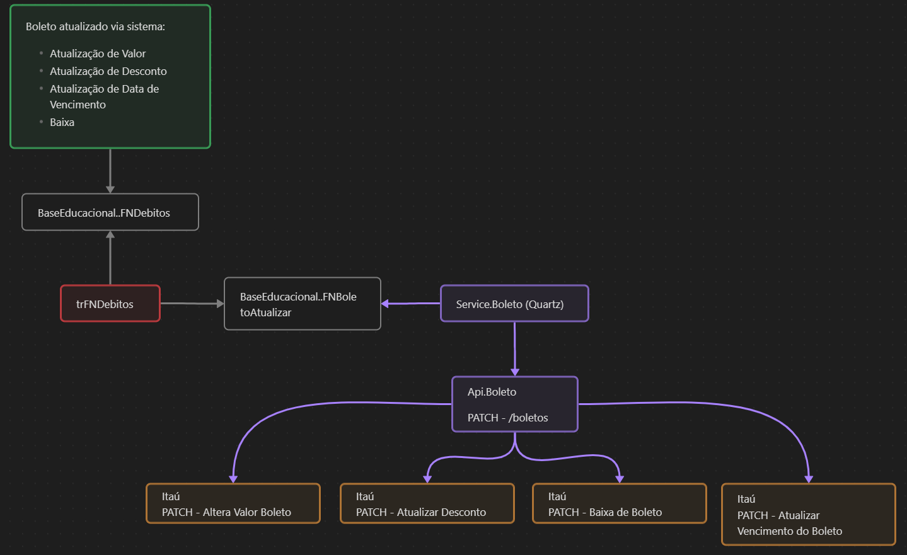

# Service.Boleto e Api.PayHub

!!! info "Última modificação"
    **05-12-2023**   Victor Alves Bugueno


Estes sistemas foram criados com a proposta de **centralizar pagamentos**.
Estes pagamentos podem ser realizados via:

- **Pix**
- **Cartão de Crédito**
- **Boleto Bancário**

A **Api.Boleto** é responsável por **atualizar boletos** de carteira **112 já emitidos**, sempre que ocorrer uma alteração de **valores, datas ou baixa** do débito vinculado.

## Fluxo da Atualização de Boletos



### Etapas do processo:

1. Quando ocorre uma **alteração** de valor, data ou baixa no **débito** (via sistema ou manualmente), a **Trigger** da tabela **BaseEducacional..FNDebitos**
   (**trFNDebitos**) identifica esta alteração e **grava este débito** na tabela de processamento **BaseEducacional..FNBoletoAtualizar**.

2. A **cada 1 minuto** o **Service.Boleto** realiza uma requisição para a **Api.Boleto**, a fim de atualizar o **lote de boletos** marcados para serem processados. O **Service.Boleto** também é responsável por gravar **logs de erro** na tabela **BaseEducacional..FNBoletoLogService**, caso necessário.
3.  A rota de [**Atualização de Boletos em Lote**](#rota-atualizacao-boletos-lote) da **Api.Boleto** recupera a lista de débitos da tabela **BaseEducacional..FNBoletoAtualizar** (cujo boleto deve ser atualizado), identifica qual **tipo de atualização** que deve ser feita para cada um dos boletos, e realiza as devidas requisições para a [**Api de Boletos do Itaú**](#portal-desenvolvedor-itau).
4.  Conforme as respostas das **requisições para o Itaú**, é atualizado o status do processamento daquele boleto de acordo com a tabela **BaseEducacional..FNBoletoStatusProcessamento**, informando se o processamento foi bem sucedido ou se ocorreu algum erro.

## Configuração do Certificado

Baixe os arquivos [certificado.crt](Arquivos/certificado.crt) e [ARQUIVO_CHAVE_PRIVADA.key](Arquivos/ARQUIVO_CHAVE_PRIVADA.key) e armazene na pasta **C:/Certificados/Boleto/**.

No arquivo **appsettings.Development.json** da **Api.Boleto**, certifique-se que as variáveis **CaminhoCertificadoCrt** e **CaminhoArquivoChavePrivadaKey** estejam apontando para os caminhos configurados.

## Configuração do IIS

!!! warning "Atenção - Bloco desatualizado"
    Esta configuração IIS está de acordo com a **Api.Boleto**, e não com a 
    Api.PayHub. Ao **implantar a Api.PayHub** este trecho deverá ser 
    **atualizado**.


O sistema da Api.Boleto deve estar configurado no caminho **Sites** > **PortalAluno** > **api** > **boleto** > **v1**.

- Application **PortalAluno**:

```plaintext
Application Pool:   PortalAluno
Alias:              PortalAluno
Physical Path:      E:\PortalAluno
Host Name:          portaldes.fiap.com.br
```

- Virtual Directory **api**:

```plaintext
Alias:          api
Physical Path:  E:\FIAP2\api
```

- Pasta **boleto**, já existente no diretório **E:\FIAP2\api**:
- Application **v1**:

```plaintext
Alias:          v1
Physical Path:  E:\FIAP2\api\boleto
```

Será necessário criar um **Application Pool** específico para a **Api.Boleto**, por conta desta Api estar em **Core**.

OBS.: Arquivos como **PEM**, **CRT** e **KEY**, que requerem recursos do Windows exigem um **Application Pool** com **Identity: LocalSystem**;

Quando você configura um **pool de aplicativos no IIS** e atribui a identidade **LocalSystem** a esse pool, o IIS executará o aplicativo associado a esse pool com os **privilégios da conta LocalSystem**. Isso significa que o aplicativo terá **acesso a recursos** do sistema local, como **arquivos, registro e outros recursos** do sistema operacional.

## Configurando Postman

Para **manipular boletos do Itaú**, primeiramente inclua os arquivos do [certificado.crt](Arquivos/certificado.crt) e da [ARQUIVO_CHAVE_PRIVADA.key](Arquivos/ARQUIVO_CHAVE_PRIVADA.key) em **todas as requisições** diretas para o Itaú. 

No Postman, adicione os certificados em:
**Engrenagem** > **Settings** > **Certificates** > **Add Certificate...**:

```plaintext
HOST:      api.itau.com.br
CRT file:  C:/Certificados/Boleto/certificado.crt
KEY file:  C:/Certificados/Boleto/ARQUIVO_CHAVE_PRIVADA.key

HOST:      secure.api.cloud.itau.com.br
CRT file:  C:/Certificados/Boleto/certificado.crt
KEY file:  C:/Certificados/Boleto/ARQUIVO_CHAVE_PRIVADA.key

HOST:      sts.itau.com.br
CRT file:  C:/Certificados/Boleto/certificado.crt
KEY file:  C:/Certificados/Boleto/ARQUIVO_CHAVE_PRIVADA.key
```

Importe os arquivos de Coleção de Rotas e Variáveis de Ambiente no Postman:

- [Coleção de Rotas](./Arquivos/api-boleto.postman_collection.json);
- [Variáveis de Ambiente - LocalHost](./Arquivos/api.boleto-dev.postman_environment.json);
- [Variáveis de Ambiente - Produção](./Arquivos/api-boleto-prod.postman_environment.json);

<h2 id="portal-desenvolvedor-itau">Portal do Desenvolvedor do Itaú</h2>

Para **auxiliar nas implementações** e requisições para a API, o **Itaú** disponibiliza o [**Portal do Desenvolvedor**](https://devportal.itau.com.br/login).

Acesse o [**Link**](https://devportal.itau.com.br/login) e realize o login:

| E-mail            | Senha    |
|-------------------|----------|
| andre@fiap.com.br | Fiap1234 |

## Rotas Diretas do Itaú (Produção)

Realize a emissão de um **Token Itaú**, e então utilize-o em **todas** as demais requisições diretas  para a **Api de Boletos do Itaú**.

<h3 id="gerar-token-itau">Gerar Token Itaú</h3>

Emissão do **Token de acesso do Itaú** para as demais rotas.

- **Método**: POST
- **Rota**: https://sts.itau.com.br/api/oauth/token
- **Body** (x-www-form-urlencoded):

   | Nome          | Tipo   | Valor                                |
   |---------------|--------|--------------------------------------|
   | grant_type    | string | client_credentials                   |
   | client_id     | string | c497f31c-fe5d-4fae-abc1-414e434217d6 |
   | client_secret | string | 0bc96e32-dd7b-4242-9197-e67b9bcb73da |

<h3 id="configuracoes-comuns-itau">Configurações Comuns Itaú - Utilizadas nas rotas diretas para a Api do Itaú</h3>

Algumas configurações comuns a diversas rotas.

#### Authorization

| Tipo         | Descrição                                               |
|--------------|---------------------------------------------------------|
| Bearer Token | [Token Itaú](#gerar-token-itau), gerado na rota inicial |

#### Headers

| Nome                 | Tipo   | Descrição                                                                                                |
|----------------------|--------|----------------------------------------------------------------------------------------------------------|
| x-itau-apikey        | string | **client_id** com o mesmo valor informado na requisição para emissão do [Token Itaú](#gerar-token-itau). |
| x-itau-correlationID | string | Guid para identificar **correlações** entre requisições de um **mesmo recurso**.                         |
| x-itau-flowID        | string | Guid para identificar requisições realizadas numa **mesma execução**.                                    |

### Rotas Itaú utilizadas

Todas as rotas usam as mesmas configurações de **authorization** e de **headers** - [configuração comum do Itaú](#configuracoes-comuns-itau)

| Ação | Método | Rota | Link para doc |
|------|--------|------|---------------|
| Retornar Boleto | GET | https://secure.api.cloud.itau.com.br/boletoscash/v2/boletos | 
| Alterar Valor do Boleto | PATCH | https://secure.api.cloud.itau.com.br/boletoscash/v2/boletos/{id_boleto}/valor_nominal |
| Alterar Vencimento do Boleto | PATCH | https://secure.api.cloud.itau.com.br/boletoscash/v2/boletos/{id_boleto}/data_vencimento |
| Atualizar Desconto do Boleto | PATCH | https://secure.api.cloud.itau.com.br/boletoscash/v2/boletos/{id_boleto}/desconto |
| Baixar Boleto | PATCH | https://secure.api.cloud.itau.com.br/boletoscash/v2/boletos/{id_boleto}/baixa |

#### :id_boleto:

Se refere à concatenação das seguintes informações:

- **Id do Beneficiário** (12 dígitos): **Agência** (4 dígitos), **Conta** (7 dígitos) e **Dígito da Conta** (1 dígito). Caso a informação não ocupe a quantidade de dígitos desejada, complete com zeros à esquerda. Exemplo: Agência 167 fica 0167, e conta 12345 fica 0012345;
- **Número da Carteira** (3 dígitos);
- **Nosso Número** (8 dígitos);

## Rotas da Api.Boleto (Independente do Ambiente, sempre acessa a Api de Produção do Itaú)

### [GET] Retornar Boleto via Chave

Buscando **Boleto Itaú** com base na **chave** vinculada na base **BMRemessa**.

- **Método**: GET
- **Rota**: {{base_url}}/key/:chave
- **Params**: 
    | Param | Tipo   | Descrição                         |
    |-------|--------|-----------------------------------|
    | chave | string | chave vinculada na base BMRemessa |

- **Headers**: Mesmos valores da [configuração comum da Api.Boleto](#configuracoes-comuns-api-payhub)


### [PATCH] Atualizar Boletos listados para Processar em Lote - Baixar ou Atualizar Valores e Datas</h3>

Realiza atualização de boletos Itaú em lote de acordo com a lista de débitos **NÃO PROCESSADOS** na tabela **BaseEducacional..FNBoletoAtualizar**

As possíveis atualizações de dados do boleto podem ser: 
    
- Baixa,
- Atualização de Valor Nominal,
- Atualização de Desconto
- Atualização de Data de Vencimento

Esse endpoint é chamado pelo **Service.Boleto** desenvolvido utilizando Quartz.

- **Método**: PATCH
- **Rota**: {{base_url}}/boletos
- **Headers**: Mesmos valores da [configuração comum da Api.Boleto](#configuracoes-comuns-api-payhub)

<h3 id="configuracoes-comuns-api-payhub">Configurações comuns Api.Boleto - Utilizadas nas rotas para a nossa Api.Boleto</h3>

Algumas configurações comuns a diversas rotas.

#### Headers

| Nome                | Tipo   | Descrição                                                                                                                                                                                      |
|---------------------|--------|------------------------------------------------------------------------------------------------------------------------------------------------------------------------------------------------|
| token-authorization | string | Guid gerado de acordo com o timestamp da última hora fechada para validar que a requisição é segura. Utilize este [Gerador de Token](https://dotnetfiddle.net/tC3Tpp) para realizar os testes. |

#### Params

| Nome           | Tipo   | Descrição                                                                                                                |
|----------------|--------|--------------------------------------------------------------------------------------------------------------------------|
| idBeneficiario | string | Concatenação das seguintes informações: **Agência** (4 dígitos), **Conta** (7 dígitos) e **Dígito da Conta** (1 dígito). Caso a informação não ocupe a quantidade de dígitos desejada, complete com zeros à esquerda. Exemplo: Agência 167 fica 0167, e conta 12345 fica 0012345. |
| codigoCarteira | string | **Número da Carteira** (3 dígitos), normalmente 112.                                                                     |
| nossoNumero    | string | **Nosso Número** (8 dígitos), identificador do boleto.                                                                   |

## Emitindo Certificados (secret_key.txt e certificado.crt)

Primeiramente, realize a emissão dos arquivos **ARQUIVO_CHAVE_PRIVADA.key** e
**ARQUIVO_REQUEST_CERTIFICADO.csr** no **Git Bash**.

```powershell
# Comando explicativo
openssl req -new -subj "//CN={client_id}\OU={nosso_identificador}\L={nome_cidade}\ST={sigla_estado}\C={sigla_pais}" -out {arquivo_para_request_postman}.csr -nodes -sha512 -newkey rsa:2048 -keyout {arquivo_para_chave_privada}.key

# Comando preenchido
openssl req -new -subj "//CN=c497f31c-fe5d-4fae-abc1-414e434217d6\OU=FIAP\L=SAO PAULO\ST=SP\C=BR" -out ARQUIVO_REQUEST_CERTIFICADO.csr -nodes -sha512 -newkey rsa:2048 -keyout ARQUIVO_CHAVE_PRIVADA.key
```

**Obs.**: O arquivo **ARQUIVO_REQUEST_CERTIFICADO.csr** precisa ter exatamente
**17 linhas**. Caso necessário, **desconsidere** a última **quebra de linha** 
do conteúdo do arquivo gerado.

### Obter Certificado

Gerando **Certificado** com base no **Token Temporário de 7 dias** e no arquivo
**ARQUIVO_REQUEST_CERTIFICADO.csr**.

- **Método**: POST
- **Rota**: https://sts.itau.com.br/seguranca/v1/certificado/solicitacao
- **Authorization**:

| Tipo         | Descrição                                      |
|--------------|------------------------------------------------|
| Bearer Token | {Token temporário de 7 dias, recebido do Itaú} |

- **Headers**:

| Key                  | Value      |
|----------------------|------------|
| Content-Type         | text/plain |
| x-itau-flowID        | 1          |
| x-itau-correlationID | 2          |

- **Body** (raw > Text):

```plaintext
{Conteúdo do arquivo ARQUIVO_REQUEST_CERTIFICADO.csr de 17 linhas, emitido via linha de comando no Git Bash}
```

- **Settings**: **Desabilitar** opção **Enable SSL certificate verification**;
- **Retorno esperado**:

```plaintext
Secret: {conteúdo do arquivo secret_key.txt}
{conteúdo do arquivo certificado.crt}
```
